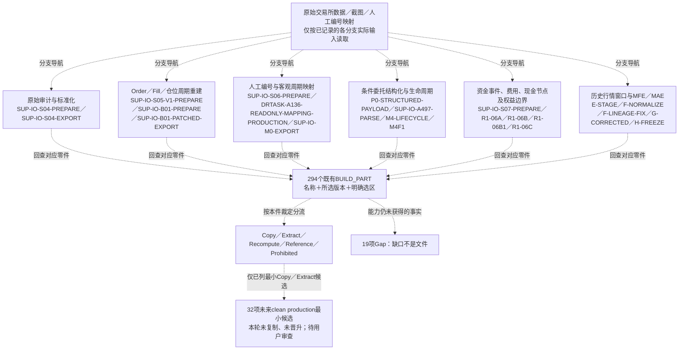

# 客观内容×具体构建输入×生产血缘联合映射

状态：STAGE1_PREK01_LANE_A = FROZEN_CLOSED

**当前Stage1业务基线已由USER全局确认并正式冻结。** 本文件由同目录机器索引映射，不是新的事实源；读取、候选准入仍不授予复制、资产晋升或下游执行权限。

<!-- STAGE1-FREEZE-STATUS-BEGIN -->
USER_ACCEPTANCE = ACCEPTED_FOR_STAGE1_FROZEN_BASELINE

本次为全局Stage1验收确认，不是32条分别发送的USER消息。 不表示USER逐行审查机器索引、逐个核对SHA或源码，也不承担数值或单元格技术复算。

冻结仅限PRE-K01 Stage1基线；19项真实缺口和UNKNOWN继续保留。候选准入不等于执行准入；当前没有复制、抽取到生产、晋升或下游授权，Stage2和Stage3仍须新的明确授权。

验收记录：`STAGE1-USER-ACCEPTANCE-msg_01a049fb-3558-7bd3-bb82-7c60b2ed03f2`；冻结记录：`STAGE1-FINAL-FREEZE-01a049fb-2cc2-7b30-89b9-67c404ee1b2b`。七项最终身份统一登记在[04A](/Users/luodaluo/Desktop/交易复盘_AI正式接管入口/04_任务与问题/04A_当前任务授权.md#stage1-final-identities)，本文件不写入自身最终SHA。

既有validation_status、ai_validation_status、root_adjudication_status及旧回执内的PENDING或freeze=false保留当时技术验证与执行状态，不提高验证等级；当前用户验收以新验收记录为准。原G01—G32和RCA-G01—G22是冻结前历史检查，不是本次重新执行。
<!-- STAGE1-FREEZE-STATUS-END -->

核心事实映射身份：`cefda39c8ec5496ad0619d57ec2c27e77b925f5a61c3cd21912f39152021389a`。机器记录是核查主入口；本目录保留同一Stage1成果，不另立v3。

三种关系分别核对：高层425，能力—零件207，生产血缘6915。下面按组件显示，不制造几十列大表。

## 用户可视化总览

先按下面六条分支找内容，再看18类交易过程和32组件。所有名称／过程标识来自同一机器索引；图是导览，不重定义历史任务。

### 不依赖Mermaid的文字流程图

以下与图中使用相同分支；虚线箭头都是**导览关系**，不表示每件经过所有步骤，不把并列阶段说成前后依赖：

- 原始交易所数据／截图／人工编号映射 → **原始审计与标准化**〔SUP-IO-S04-PREPARE（PROC-5ded3e2ffe6588f2）；SUP-IO-S04-EXPORT（PROC-64d237b51bec5763）〕 → 回查本分支对应BUILD_PART。
- 原始交易所数据／截图／人工编号映射 → **Order／Fill／仓位周期重建**〔SUP-IO-S05-V1-PREPARE（PROC-f4d193fe72da478a）；SUP-IO-B01-PREPARE（PROC-ad659e994633cfd2）；SUP-IO-B01-PATCHED-EXPORT（PROC-d34130d66403880e）〕 → 回查本分支对应BUILD_PART。
- 原始交易所数据／截图／人工编号映射 → **人工编号与客观周期映射**〔SUP-IO-S06-PREPARE（PROC-ac917ff7e76602da）；DRTASK-A136-READONLY-MAPPING-PRODUCTION（PROC-a0d76915a5838fb6）；SUP-IO-M0-EXPORT（PROC-854c14b39c7b1d61）〕 → 回查本分支对应BUILD_PART。
- 原始交易所数据／截图／人工编号映射 → **条件委托结构化与生命周期**〔P0-STRUCTURED-PAYLOAD（PROC-5b6c2e14acb72137）；SUP-IO-A497-PARSE（PROC-d4541469be265d42）；M4-LIFECYCLE（PROC-b529bc8178a51fbb）；M4F1（PROC-fdc88a19ed41ea03）〕 → 回查本分支对应BUILD_PART。
- 原始交易所数据／截图／人工编号映射 → **资金事件、费用、现金节点及权益边界**〔SUP-IO-S07-PREPARE（PROC-b1cd9607dddc2ad4）；R1-06A（PROC-d09708b849381add）；R1-06B（PROC-78b465f425095885）；R1-06B1（PROC-48a6bf51e639667b）；R1-06C（PROC-14542d289267e01d）〕 → 回查本分支对应BUILD_PART。
- 原始交易所数据／截图／人工编号映射 → **历史行情窗口与MFE／MAE**〔E-STAGE（PROC-99698c07f3167eff）；F-NORMALIZE（PROC-3064cc12ff0f5aa9）；F-LINEAGE-FIX（PROC-491cb25761d757bf）；G-CORRECTED（PROC-d2fa3540ed9d786a）；H-FREEZE（PROC-8bc5da0d966daf9a）〕 → 回查本分支对应BUILD_PART。
- 294个既有BUILD_PART → 按各自裁定分流为Copy／Extract／Recompute／Reference／Prohibited。
- 只有已列的32项最小Copy／Extract候选 → 未来clean production候选；本轮没有复制、晋升。
- 已有零件仍未覆盖的能力 → 19项Gap；缺口不是文件。

要核验真实多步生产链，请按BP查stage_mapping、producer／consumer、SELECTED_PART_PRODUCTION_LINEAGE_TRACE；下方逐件说明保留原始源、具体输出和版本。不能把上图当数值因果图或全部阶段的时间顺序。

### 18类交易过程视图

这是按用户阅读顺序组织的**导航**，不是新的交易算法、阶段顺序或能力裁定。每行直接回到已有能力；一个过程可能只覆盖所述动作的一部分，未获证的部分仍按对应gap保留。

| 用户能理解的交易过程 | 对应组件／能力 | PRE-K01生产阶段链或分支 | 该阶段产出的具体数据／零件 | 当前复用方式 | 仍有限制或缺口 |
| --- | --- | --- | --- | --- | --- |
| 账户、钱包、合约和交易身份（PV01） | [账户与钱包边界（C01-CAP-01）](#capability-C01-CAP-01) [合约、持仓方向与周期身份（C01-CAP-02）](#capability-C01-CAP-02) [跟单项目原文身份（C01-CAP-03）](#capability-C01-CAP-03) [StableID及Order/Fill/条件ID命名空间（C20-CAP-01）](#capability-C20-CAP-01) [完整长整数与同名版本身份（C20-CAP-02）](#capability-C20-CAP-02) | 07_账户资金与权益重建〔来源目录标签〕；过程标识 SUP-IO-S07-EXPORT；M0_现行编号映射冻结〔来源目录标签〕；过程标识 SUP-IO-M0-EXPORT；实际多步链见下方逐件血缘，不将并列生产者排序为因果链 | [21614 canonical资金事实（BP-804fd311a49ebf42）](#part-BP-804fd311a49ebf42)〔本处对应：[账户与钱包边界（C01-CAP-01）](#capability-C01-CAP-01)〕 [07_内部划转配对结果.xlsx（BP-543c808eebf93897）](#part-BP-543c808eebf93897)〔本处对应：[账户与钱包边界（C01-CAP-01）](#capability-C01-CAP-01)〕 [148稳定周期与136/12范围（BP-87435e20b22f85d3）](#part-BP-87435e20b22f85d3)〔本处对应：[合约、持仓方向与周期身份（C01-CAP-02）](#capability-C01-CAP-02)、[StableID及Order/Fill/条件ID命名空间（C20-CAP-01）](#capability-C20-CAP-01)、[完整长整数与同名版本身份（C20-CAP-02）](#capability-C20-CAP-02)〕 | Extract：只可取已列选区 | 没有新增缺口判断；沿用各能力详细卡的证据等级、范围和UNKNOWN |
| 开仓前的委托尝试（PV02） | [已捕获基础委托与终态（C03-CAP-01）](#capability-C03-CAP-01) [部分成交后取消与未成交取消分开（C03-CAP-02）](#capability-C03-CAP-02) [首仓以前的限价尝试（C03-CAP-04）](#capability-C03-CAP-04) [交易所级绝对全量捕获（C03-CAP-07）](#capability-C03-CAP-07) [取消、替换、到期的实际原因（C03-CAP-08）](#capability-C03-CAP-08) [委托尝试分类及计数（C09-CAP-02）](#capability-C09-CAP-02) | 04_字段标准化与时间统一〔来源目录标签〕；过程标识 SUP-IO-S04-EXPORT；05_交易事件与仓位链重建〔来源目录标签〕；过程标识 SUP-IO-S05-SUPPLEMENT-EXPORT；另1个过程见零件详细定位；实际多步链见下方逐件血缘，不将并列生产者排序为因果链 | [04_合约订单历史_标准化.xlsx verified fields（BP-7e415e901bf377fa）](#part-BP-7e415e901bf377fa)〔本处对应：[已捕获基础委托与终态（C03-CAP-01）](#capability-C03-CAP-01)〕 [743取消或过期候选（BP-9b0b81615d901553）](#part-BP-9b0b81615d901553)〔本处对应：[已捕获基础委托与终态（C03-CAP-01）](#capability-C03-CAP-01)、[部分成交后取消与未成交取消分开（C03-CAP-02）](#capability-C03-CAP-02)、[首仓以前的限价尝试（C03-CAP-04）](#capability-C03-CAP-04)、[委托尝试分类及计数（C09-CAP-02）](#capability-C09-CAP-02)〕 [05_V2_Order与Fill归属表.xlsx Fill归属（BP-5d04b1fe447e322e）](#part-BP-5d04b1fe447e322e)〔本处对应：[部分成交后取消与未成交取消分开（C03-CAP-02）](#capability-C03-CAP-02)〕 [R1既有Order级尝试与实际动作算法：仅复用有证部分（BP-b168317b269d4e55）](#part-BP-b168317b269d4e55)〔本处对应：[首仓以前的限价尝试（C03-CAP-04）](#capability-C03-CAP-04)、[委托尝试分类及计数（C09-CAP-02）](#capability-C09-CAP-02)〕 | Extract：只可取已列选区；Recompute：已定上游／旧算法，本轮不重算；重算入口（本轮不运行）：R1既有Order级尝试与实际动作算法：仅复用有证部分／原始源身份：直接权威原始源未单列，UNKNOWN（上游身份／读入组，不等于逐字段数值父项）／已声明上游零件：1100原始捕获Order全集、743取消或过期候选、P3现行372委托：已有聚合数值与前后仓位、148稳定周期与136/12范围（原始与派生选区分开，声明不等于已证完整直接源链）／明确历史算法：R1_10笔成品原型〔来源目录标签〕；过程标识 R1-B（PROC-f0efa762f42412c2）；其他同脚本过程只作实现上下文 | C03-CAP-07／CAPGAP-a9423cf4e817c88c：已捕获内部集合可闭合，但截图没有交易所总数证明不能宣称所有历史尝试都捕获。 C03-CAP-08／CAPGAP-ef2fbe0936949aa5：RAW状态和关联证据不等于用户主动取消、修改或平仓导致失效的因果确认。 |
| 正式首仓委托和首仓成交（PV03） | [逐笔真实Fill（C04-CAP-01）](#capability-C04-CAP-01) [同Order多Fill聚合（C04-CAP-02）](#capability-C04-CAP-02) [首仓与最终归零（C05-CAP-02）](#capability-C05-CAP-02) [买卖方向和持仓侧分离（C06-CAP-01）](#capability-C06-CAP-01) | M1_阶段00-09技术底座升级〔来源目录标签〕；过程标识 SUP-IO-M1-EXPORT；H0-E_136笔客观仓位阶段冻结〔来源目录标签〕；过程标识 E-EXPORT；另1个过程见零件详细定位；实际多步链见下方逐件血缘，不将并列生产者排序为因果链 | [05_V2_Order与Fill归属表.xlsx Fill归属（BP-5d04b1fe447e322e）](#part-BP-5d04b1fe447e322e)〔本处对应：[逐笔真实Fill（C04-CAP-01）](#capability-C04-CAP-01)〕 [8239主动Fill精确数量均价状态（BP-1a6ff758f9dad608）](#part-BP-1a6ff758f9dad608)〔本处对应：[逐笔真实Fill（C04-CAP-01）](#capability-C04-CAP-01)、[首仓与最终归零（C05-CAP-02）](#capability-C05-CAP-02)、[买卖方向和持仓侧分离（C06-CAP-01）](#capability-C06-CAP-01)〕 [P3现行372委托：已有聚合数值与前后仓位（BP-c09b270fa49dbdb2）](#part-BP-c09b270fa49dbdb2)〔本处对应：[同Order多Fill聚合（C04-CAP-02）](#capability-C04-CAP-02)、[首仓与最终归零（C05-CAP-02）](#capability-C05-CAP-02)〕 | Extract：只可取已列选区；Copy：已纳入Stage1全局验收，仍须另行授权原样复制 | 没有新增缺口判断；沿用各能力详细卡的证据等级、范围和UNKNOWN |
| 持仓期间的加仓尝试（PV04） | [持仓期加仓尝试与实际加仓（C03-CAP-05）](#capability-C03-CAP-05) [委托尝试分类及计数（C09-CAP-02）](#capability-C09-CAP-02) | 05_交易事件与仓位链重建〔来源目录标签〕；过程标识 SUP-IO-S05-SUPPLEMENT-EXPORT；M5_全项目最终验收与现行版本切换〔来源目录标签〕；过程标识 M5-COPY；另1个过程见零件详细定位；实际多步链见下方逐件血缘，不将并列生产者排序为因果链 | [743取消或过期候选（BP-9b0b81615d901553）](#part-BP-9b0b81615d901553)〔本处对应：[持仓期加仓尝试与实际加仓（C03-CAP-05）](#capability-C03-CAP-05)、[委托尝试分类及计数（C09-CAP-02）](#capability-C09-CAP-02)〕 [P3现行372委托：已有聚合数值与前后仓位（BP-c09b270fa49dbdb2）](#part-BP-c09b270fa49dbdb2)〔本处对应：[持仓期加仓尝试与实际加仓（C03-CAP-05）](#capability-C03-CAP-05)〕 [06C成熟限价减平尝试CSV（BP-b41f3be5be938e5c）](#part-BP-b41f3be5be938e5c)〔本处对应：[委托尝试分类及计数（C09-CAP-02）](#capability-C09-CAP-02)〕 **本行仅作为C09-CAP-02的共用分类参考；本件为减仓／平仓委托数据，不证明加仓行为。** [R1既有Order级尝试与实际动作算法：仅复用有证部分（BP-b168317b269d4e55）](#part-BP-b168317b269d4e55)〔本处对应：[持仓期加仓尝试与实际加仓（C03-CAP-05）](#capability-C03-CAP-05)、[委托尝试分类及计数（C09-CAP-02）](#capability-C09-CAP-02)〕 | Extract：只可取已列选区；Recompute：已定上游／旧算法，本轮不重算；重算入口（本轮不运行）：R1既有Order级尝试与实际动作算法：仅复用有证部分／原始源身份：直接权威原始源未单列，UNKNOWN（上游身份／读入组，不等于逐字段数值父项）／已声明上游零件：1100原始捕获Order全集、743取消或过期候选、P3现行372委托：已有聚合数值与前后仓位、148稳定周期与136/12范围（原始与派生选区分开，声明不等于已证完整直接源链）／明确历史算法：R1_10笔成品原型〔来源目录标签〕；过程标识 R1-B（PROC-f0efa762f42412c2）；其他同脚本过程只作实现上下文 | 没有新增缺口判断；沿用各能力详细卡的证据等级、范围和UNKNOWN |
| 实际加仓成交（PV05） | [逐Fill前后持仓数量（C07-CAP-01）](#capability-C07-CAP-01) [动作层首仓/加仓/减仓/平仓数量（C07-CAP-02）](#capability-C07-CAP-02) [首仓及各次加仓减仓的成交均价（C08-CAP-01）](#capability-C08-CAP-01) [已执行动作分类（C09-CAP-01）](#capability-C09-CAP-01) | H0-E_136笔客观仓位阶段冻结〔来源目录标签〕；过程标识 E-EXPORT；M5_全项目最终验收与现行版本切换〔来源目录标签〕；过程标识 M5-COPY；实际多步链见下方逐件血缘，不将并列生产者排序为因果链 | [8239主动Fill精确数量均价状态（BP-1a6ff758f9dad608）](#part-BP-1a6ff758f9dad608)〔本处对应：[逐Fill前后持仓数量（C07-CAP-01）](#capability-C07-CAP-01)、[已执行动作分类（C09-CAP-01）](#capability-C09-CAP-01)〕 [P3现行372委托：已有聚合数值与前后仓位（BP-c09b270fa49dbdb2）](#part-BP-c09b270fa49dbdb2)〔本处对应：[动作层首仓/加仓/减仓/平仓数量（C07-CAP-02）](#capability-C07-CAP-02)、[首仓及各次加仓减仓的成交均价（C08-CAP-01）](#capability-C08-CAP-01)、[已执行动作分类（C09-CAP-01）](#capability-C09-CAP-01)〕 | Copy：已纳入Stage1全局验收，仍须另行授权原样复制；Extract：只可取已列选区 | 没有新增缺口判断；沿用各能力详细卡的证据等级、范围和UNKNOWN |
| 减仓尝试和实际减仓（PV06） | [减仓及平仓尝试（C03-CAP-06）](#capability-C03-CAP-06) [只减仓与反向开仓分开（C06-CAP-02）](#capability-C06-CAP-02) [已执行动作分类（C09-CAP-01）](#capability-C09-CAP-01) | 30天复盘原始数据〔来源目录标签〕；过程标识 R1-06C；05_交易事件与仓位链重建〔来源目录标签〕；过程标识 SUP-IO-S05-SUPPLEMENT-EXPORT；另1个过程见零件详细定位；实际多步链见下方逐件血缘，不将并列生产者排序为因果链 | [06C成熟限价减平尝试CSV（BP-b41f3be5be938e5c）](#part-BP-b41f3be5be938e5c)〔本处对应：[减仓及平仓尝试（C03-CAP-06）](#capability-C03-CAP-06)、[只减仓与反向开仓分开（C06-CAP-02）](#capability-C06-CAP-02)〕 [743取消或过期候选（BP-9b0b81615d901553）](#part-BP-9b0b81615d901553)〔本处对应：[减仓及平仓尝试（C03-CAP-06）](#capability-C03-CAP-06)〕 [P3现行372委托：已有聚合数值与前后仓位（BP-c09b270fa49dbdb2）](#part-BP-c09b270fa49dbdb2)〔本处对应：[减仓及平仓尝试（C03-CAP-06）](#capability-C03-CAP-06)、[只减仓与反向开仓分开（C06-CAP-02）](#capability-C06-CAP-02)、[已执行动作分类（C09-CAP-01）](#capability-C09-CAP-01)〕 | Extract：只可取已列选区 | 没有新增缺口判断；沿用各能力详细卡的证据等级、范围和UNKNOWN |
| 平仓尝试和最终归零（PV07） | [减仓及平仓尝试（C03-CAP-06）](#capability-C03-CAP-06) [首仓与最终归零（C05-CAP-02）](#capability-C05-CAP-02) [跨零反手与普通减仓分开（C06-CAP-03）](#capability-C06-CAP-03) [最终退出方式的证据等级（C09-CAP-03）](#capability-C09-CAP-03) [相邻反向交易的客观衔接（C27-CAP-01）](#capability-C27-CAP-01) | 30天复盘原始数据〔来源目录标签〕；过程标识 R1-06C；05_交易事件与仓位链重建〔来源目录标签〕；过程标识 SUP-IO-S05-SUPPLEMENT-EXPORT；另1个过程见零件详细定位；实际多步链见下方逐件血缘，不将并列生产者排序为因果链 | [06C成熟限价减平尝试CSV（BP-b41f3be5be938e5c）](#part-BP-b41f3be5be938e5c)〔本处对应：[减仓及平仓尝试（C03-CAP-06）](#capability-C03-CAP-06)、[最终退出方式的证据等级（C09-CAP-03）](#capability-C09-CAP-03)〕 [743取消或过期候选（BP-9b0b81615d901553）](#part-BP-9b0b81615d901553)〔本处对应：[减仓及平仓尝试（C03-CAP-06）](#capability-C03-CAP-06)〕 [P3现行372委托：已有聚合数值与前后仓位（BP-c09b270fa49dbdb2）](#part-BP-c09b270fa49dbdb2)〔本处对应：[减仓及平仓尝试（C03-CAP-06）](#capability-C03-CAP-06)、[首仓与最终归零（C05-CAP-02）](#capability-C05-CAP-02)、[最终退出方式的证据等级（C09-CAP-03）](#capability-C09-CAP-03)〕 | Extract：只可取已列选区 | 没有新增缺口判断；沿用各能力详细卡的证据等级、范围和UNKNOWN |
| 止损设置、修改候选、取消、过期和触发（PV08） | [止损设置、终态与触发执行（C10-CAP-01）](#capability-C10-CAP-01) [止损价格数量演变与替换候选（C10-CAP-02）](#capability-C10-CAP-02) [止损覆盖仓位及失效原因边界（C10-CAP-03）](#capability-C10-CAP-03) [条件单到基础单及Fill连接（C12-CAP-01）](#capability-C12-CAP-01) [条件单到周期的置信层级（C12-CAP-02）](#capability-C12-CAP-02) [字段本身的来源层级（C12-CAP-03）](#capability-C12-CAP-03) [A497截图到条件ID的来源桥（C24-CAP-01）](#capability-C24-CAP-01) [条件ID到周期审计映射（C24-CAP-02）](#capability-C24-CAP-02) | M5_全项目最终验收与现行版本切换〔来源目录标签〕；过程标识 M5-COPY；实际多步链见下方逐件血缘，不将并列生产者排序为因果链 | [543条件生命周期有时区契约子表（BP-4366e8d163fc6210）](#part-BP-4366e8d163fc6210)〔本处对应：[止损设置、终态与触发执行（C10-CAP-01）](#capability-C10-CAP-01)、[止损价格数量演变与替换候选（C10-CAP-02）](#capability-C10-CAP-02)、[条件单到基础单及Fill连接（C12-CAP-01）](#capability-C12-CAP-01)、[字段本身的来源层级（C12-CAP-03）](#capability-C12-CAP-03)、[A497截图到条件ID的来源桥（C24-CAP-01）](#capability-C24-CAP-01)〕 [543条件至周期关联分层字段（BP-6dd776771cf8a389）](#part-BP-6dd776771cf8a389)〔本处对应：[止损设置、终态与触发执行（C10-CAP-01）](#capability-C10-CAP-01)、[条件单到基础单及Fill连接（C12-CAP-01）](#capability-C12-CAP-01)、[条件单到周期的置信层级（C12-CAP-02）](#capability-C12-CAP-02)、[字段本身的来源层级（C12-CAP-03）](#capability-C12-CAP-03)、[A497截图到条件ID的来源桥（C24-CAP-01）](#capability-C24-CAP-01)、[条件ID到周期审计映射（C24-CAP-02）](#capability-C24-CAP-02)〕 [136周期条件有效时间覆盖及503区间（BP-2e17bf7a309edb71）](#part-BP-2e17bf7a309edb71)〔本处对应：[止损价格数量演变与替换候选（C10-CAP-02）](#capability-C10-CAP-02)〕 | Extract：只可取已列选区 | C10-CAP-02／CAPGAP-9eb747e04fe533c4：确认两次独立条件委托确属同一次用户修改/替换及其原因的权威关系未获证明；已存328相邻候选保留为REFERENCE，不假称不存在候选文件。 C10-CAP-03／CAPGAP-061213a2d0954cbb：已知数量可限定覆盖比例；缺失ClosePosition或历史仓位证据不得补全覆盖、自动失效原因。 |
| 止盈设置、修改候选、取消、过期和触发（PV09） | [止盈设置、终态与触发执行（C11-CAP-01）](#capability-C11-CAP-01) [止盈价格数量演变与替换候选（C11-CAP-02）](#capability-C11-CAP-02) [止盈覆盖与自动失效边界（C11-CAP-03）](#capability-C11-CAP-03) [条件单到基础单及Fill连接（C12-CAP-01）](#capability-C12-CAP-01) [条件单到周期的置信层级（C12-CAP-02）](#capability-C12-CAP-02) [字段本身的来源层级（C12-CAP-03）](#capability-C12-CAP-03) [A497截图到条件ID的来源桥（C24-CAP-01）](#capability-C24-CAP-01) [条件ID到周期审计映射（C24-CAP-02）](#capability-C24-CAP-02) | M5_全项目最终验收与现行版本切换〔来源目录标签〕；过程标识 M5-COPY；实际多步链见下方逐件血缘，不将并列生产者排序为因果链 | [543条件生命周期有时区契约子表（BP-4366e8d163fc6210）](#part-BP-4366e8d163fc6210)〔本处对应：[止盈设置、终态与触发执行（C11-CAP-01）](#capability-C11-CAP-01)、[止盈价格数量演变与替换候选（C11-CAP-02）](#capability-C11-CAP-02)、[条件单到基础单及Fill连接（C12-CAP-01）](#capability-C12-CAP-01)、[字段本身的来源层级（C12-CAP-03）](#capability-C12-CAP-03)、[A497截图到条件ID的来源桥（C24-CAP-01）](#capability-C24-CAP-01)〕 [543条件至周期关联分层字段（BP-6dd776771cf8a389）](#part-BP-6dd776771cf8a389)〔本处对应：[止盈设置、终态与触发执行（C11-CAP-01）](#capability-C11-CAP-01)、[条件单到基础单及Fill连接（C12-CAP-01）](#capability-C12-CAP-01)、[条件单到周期的置信层级（C12-CAP-02）](#capability-C12-CAP-02)、[字段本身的来源层级（C12-CAP-03）](#capability-C12-CAP-03)、[A497截图到条件ID的来源桥（C24-CAP-01）](#capability-C24-CAP-01)、[条件ID到周期审计映射（C24-CAP-02）](#capability-C24-CAP-02)〕 [136周期条件有效时间覆盖及503区间（BP-2e17bf7a309edb71）](#part-BP-2e17bf7a309edb71)〔本处对应：[止盈价格数量演变与替换候选（C11-CAP-02）](#capability-C11-CAP-02)〕 | Extract：只可取已列选区 | C11-CAP-02／CAPGAP-4fc9786dc50f3c13：确认两次独立条件委托确属同一次用户修改/替换及其原因的权威关系未获证明；已存328相邻候选保留为REFERENCE，不假称不存在候选文件。 C11-CAP-03／CAPGAP-cbf0c93e8df29cf2：无法判明的覆盖或失效原因显式不确定，不以空白当未设置。 |
| Order与Fill拆分、聚合和归属（PV10） | [逐笔真实Fill（C04-CAP-01）](#capability-C04-CAP-01) [同Order多Fill聚合（C04-CAP-02）](#capability-C04-CAP-02) [原始Order和Fill归属与无孤儿检查（C23-CAP-01）](#capability-C23-CAP-01) [周期数量守恒及相邻边界（C23-CAP-02）](#capability-C23-CAP-02) [同时间排序的技术性（C23-CAP-03）](#capability-C23-CAP-03) | M1_阶段00-09技术底座升级〔来源目录标签〕；过程标识 SUP-IO-M1-EXPORT；H0-E_136笔客观仓位阶段冻结〔来源目录标签〕；过程标识 E-EXPORT；另1个过程见零件详细定位；实际多步链见下方逐件血缘，不将并列生产者排序为因果链 | [05_V2_Order与Fill归属表.xlsx Fill归属（BP-5d04b1fe447e322e）](#part-BP-5d04b1fe447e322e)〔本处对应：[逐笔真实Fill（C04-CAP-01）](#capability-C04-CAP-01)、[原始Order和Fill归属与无孤儿检查（C23-CAP-01）](#capability-C23-CAP-01)〕 [8239主动Fill精确数量均价状态（BP-1a6ff758f9dad608）](#part-BP-1a6ff758f9dad608)〔本处对应：[逐笔真实Fill（C04-CAP-01）](#capability-C04-CAP-01)、[周期数量守恒及相邻边界（C23-CAP-02）](#capability-C23-CAP-02)、[同时间排序的技术性（C23-CAP-03）](#capability-C23-CAP-03)〕 [P3现行372委托：已有聚合数值与前后仓位（BP-c09b270fa49dbdb2）](#part-BP-c09b270fa49dbdb2)〔本处对应：[同Order多Fill聚合（C04-CAP-02）](#capability-C04-CAP-02)、[同时间排序的技术性（C23-CAP-03）](#capability-C23-CAP-03)〕 | Extract：只可取已列选区；Copy：已纳入Stage1全局验收，仍须另行授权原样复制 | 没有新增缺口判断；沿用各能力详细卡的证据等级、范围和UNKNOWN |
| 仓位数量变化（PV11） | [逐Fill前后持仓数量（C07-CAP-01）](#capability-C07-CAP-01) [动作层首仓/加仓/减仓/平仓数量（C07-CAP-02）](#capability-C07-CAP-02) [成交名义价值与成本口径仓位规模（C07-CAP-03）](#capability-C07-CAP-03) | H0-E_136笔客观仓位阶段冻结〔来源目录标签〕；过程标识 E-EXPORT；M5_全项目最终验收与现行版本切换〔来源目录标签〕；过程标识 M5-COPY；实际多步链见下方逐件血缘，不将并列生产者排序为因果链 | [8239主动Fill精确数量均价状态（BP-1a6ff758f9dad608）](#part-BP-1a6ff758f9dad608)〔本处对应：[逐Fill前后持仓数量（C07-CAP-01）](#capability-C07-CAP-01)〕 [P3现行372委托：已有聚合数值与前后仓位（BP-c09b270fa49dbdb2）](#part-BP-c09b270fa49dbdb2)〔本处对应：[动作层首仓/加仓/减仓/平仓数量（C07-CAP-02）](#capability-C07-CAP-02)〕 [405持仓技术阶段（BP-2d95100fbec582bf）](#part-BP-2d95100fbec582bf)〔本处对应：[成交名义价值与成本口径仓位规模（C07-CAP-03）](#capability-C07-CAP-03)〕 | Copy：已纳入Stage1全局验收，仍须另行授权原样复制；Extract：只可取已列选区 | 没有新增缺口判断；沿用各能力详细卡的证据等级、范围和UNKNOWN |
| 成交价格和加权均价（PV12） | [首仓及各次加仓减仓的成交均价（C08-CAP-01）](#capability-C08-CAP-01) [加减仓前后的持仓加权均价（C08-CAP-02）](#capability-C08-CAP-02) [最大持仓数量及均价口径（C08-CAP-03）](#capability-C08-CAP-03) | M5_全项目最终验收与现行版本切换〔来源目录标签〕；过程标识 M5-COPY；P3_148个真实仓位全量中文交易链构建〔来源目录标签〕；过程标识 P3-PAYLOAD；另1个过程见零件详细定位；实际多步链见下方逐件血缘，不将并列生产者排序为因果链 | [P3现行372委托：已有聚合数值与前后仓位（BP-c09b270fa49dbdb2）](#part-BP-c09b270fa49dbdb2)〔本处对应：[首仓及各次加仓减仓的成交均价（C08-CAP-01）](#capability-C08-CAP-01)〕 [P3原载荷346主动委托：已有加减仓前后均价（BP-105b71e434e9329a）](#part-BP-105b71e434e9329a)〔本处对应：[加减仓前后的持仓加权均价（C08-CAP-02）](#capability-C08-CAP-02)〕 [8239主动Fill精确数量均价状态（BP-1a6ff758f9dad608）](#part-BP-1a6ff758f9dad608)〔本处对应：[加减仓前后的持仓加权均价（C08-CAP-02）](#capability-C08-CAP-02)、[最大持仓数量及均价口径（C08-CAP-03）](#capability-C08-CAP-03)〕 | Extract：只可取已列选区；Copy：已纳入Stage1全局验收，仍须另行授权原样复制 | 没有新增缺口判断；沿用各能力详细卡的证据等级、范围和UNKNOWN |
| 手续费、资金费、返佣和毛／净结果（PV13） | [Fill与周期已实现毛盈亏（C14-CAP-01）](#capability-C14-CAP-01) [成交手续费与方向符号（C15-CAP-01）](#capability-C15-CAP-01) [资金费及其周期归属（C15-CAP-02）](#capability-C15-CAP-02) [返佣及未分配账户费用（C15-CAP-03）](#capability-C15-CAP-03) [历史净结果的组成和范围（C15-CAP-04）](#capability-C15-CAP-04) | M1_阶段00-09技术底座升级〔来源目录标签〕；过程标识 SUP-IO-M1-EXPORT；H0-E_136笔客观仓位阶段冻结〔来源目录标签〕；过程标识 E-EXPORT；实际多步链见下方逐件血缘，不将并列生产者排序为因果链 | [05_V2_Order与Fill归属表.xlsx Fill归属（BP-5d04b1fe447e322e）](#part-BP-5d04b1fe447e322e)〔本处对应：[Fill与周期已实现毛盈亏（C14-CAP-01）](#capability-C14-CAP-01)、[成交手续费与方向符号（C15-CAP-01）](#capability-C15-CAP-01)〕 [05_V2_148个真实仓位周期主表.xlsx 148周期主表（BP-f6f617d03de85cc6）](#part-BP-f6f617d03de85cc6)〔本处对应：[Fill与周期已实现毛盈亏（C14-CAP-01）](#capability-C14-CAP-01)〕 [8239主动Fill精确数量均价状态（BP-1a6ff758f9dad608）](#part-BP-1a6ff758f9dad608)〔本处对应：[Fill与周期已实现毛盈亏（C14-CAP-01）](#capability-C14-CAP-01)〕 | Extract：只可取已列选区；Copy：已纳入Stage1全局验收，仍须另行授权原样复制 | 没有新增缺口判断；沿用各能力详细卡的证据等级、范围和UNKNOWN |
| 入金、划转、Earn、跟单等非交易资金事件（PV14） | [账户现金事件去重与来源（C16-CAP-01）](#capability-C16-CAP-01) [外部入金出金和跨钱包划转（C16-CAP-02）](#capability-C16-CAP-02) [跟单划转及资金费（C16-CAP-03）](#capability-C16-CAP-03) [主动与跟单周期/成交分区（C18-CAP-01）](#capability-C18-CAP-01) [跟单仅作为账户资金影响（C18-CAP-02）](#capability-C18-CAP-02) | 07_账户资金与权益重建〔来源目录标签〕；过程标识 SUP-IO-S07-EXPORT；实际多步链见下方逐件血缘，不将并列生产者排序为因果链 | [21614 canonical资金事实（BP-804fd311a49ebf42）](#part-BP-804fd311a49ebf42)〔本处对应：[账户现金事件去重与来源（C16-CAP-01）](#capability-C16-CAP-01)、[外部入金出金和跨钱包划转（C16-CAP-02）](#capability-C16-CAP-02)、[跟单划转及资金费（C16-CAP-03）](#capability-C16-CAP-03)、[跟单仅作为账户资金影响（C18-CAP-02）](#capability-C18-CAP-02)〕 [21470排除镜像的来源身份与去重对应桥（BP-c927c595a85fd41d）](#part-BP-c927c595a85fd41d)〔本处对应：[账户现金事件去重与来源（C16-CAP-01）](#capability-C16-CAP-01)〕 [07_内部划转配对结果.xlsx（BP-543c808eebf93897）](#part-BP-543c808eebf93897)〔本处对应：[账户现金事件去重与来源（C16-CAP-01）](#capability-C16-CAP-01)、[外部入金出金和跨钱包划转（C16-CAP-02）](#capability-C16-CAP-02)〕 | Extract：只可取已列选区 | 没有新增缺口判断；沿用各能力详细卡的证据等级、范围和UNKNOWN |
| 开仓前、持仓中、平仓后资金节点与真实缺口（PV15） | [每日总账户快照（C17-CAP-01）](#capability-C17-CAP-01) [已确认资金事件滚动值（C17-CAP-02）](#capability-C17-CAP-02) [未分配快照差额与显示资格（C17-CAP-03）](#capability-C17-CAP-03) [开仓前/平仓后真实总账户资产或权益（C17-CAP-04）](#capability-C17-CAP-04) [开仓前/平仓后真实合约余额或权益（C17-CAP-05）](#capability-C17-CAP-05) [名义仓位或盘中亏损占同刻真实权益比例（C17-CAP-06）](#capability-C17-CAP-06) | 07_账户资金与权益重建〔来源目录标签〕；过程标识 SUP-IO-S07-EXPORT；30天复盘原始数据〔来源目录标签〕；过程标识 R1-06B1；另1个过程见零件详细定位；实际多步链见下方逐件血缘，不将并列生产者排序为因果链 | [38 daily screenshot date/path and image-checked USDT amounts — selected six fields, R numeric-only（BP-537bce541e2a2d96）](#part-BP-537bce541e2a2d96)〔本处对应：[每日总账户快照（C17-CAP-01）](#capability-C17-CAP-01)〕 [06B1已确认现金与快照差额：37个区间的数值部分（BP-34823c3206d314cd）](#part-BP-34823c3206d314cd)〔本处对应：[已确认资金事件滚动值（C17-CAP-02）](#capability-C17-CAP-02)、[未分配快照差额与显示资格（C17-CAP-03）](#capability-C17-CAP-03)〕 [06C十样本已确认现金滚动展示CSV（BP-0b77a242859de4ce）](#part-BP-0b77a242859de4ce)〔本处对应：[已确认资金事件滚动值（C17-CAP-02）](#capability-C17-CAP-02)、[未分配快照差额与显示资格（C17-CAP-03）](#capability-C17-CAP-03)〕 [136关键节点确认现金滚动可重算能力（BP-92c3a8650c0121d9）](#part-BP-92c3a8650c0121d9)〔本处对应：[已确认资金事件滚动值（C17-CAP-02）](#capability-C17-CAP-02)〕 | Extract：只可取已列选区；Recompute：已定上游／旧算法，本轮不重算；重算入口（本轮不运行）：136关键节点确认现金滚动可重算能力／原始源身份：Binance-合约交易流水-a.xlsx（上游身份／读入组，不等于逐字段数值父项）／已声明上游零件：21614 canonical资金事实、38 daily screenshot date/path and image-checked USDT amounts — selected six fields, R numeric-only、148稳定周期与136/12范围、05_V2_Order与Fill归属表.xlsx Fill归属、06B1已确认现金与快照差额：37个区间的数值部分（原始与派生选区分开，声明不等于已证完整直接源链）／明确历史算法：30天复盘原始数据〔来源目录标签〕；过程标识 R1-06B（PROC-78b465f425095885）；30天复盘原始数据〔来源目录标签〕；过程标识 R1-06B1（PROC-48a6bf51e639667b）；30天复盘原始数据〔来源目录标签〕；过程标识 R1-06C（PROC-14542d289267e01d）；其他同脚本过程只作实现上下文 | C17-CAP-04／CAPGAP-c18ae7d59b5e339e：缺关键节点完整估值/未实现盈亏源，不能用滚动值称真实equity。 C17-CAP-05／CAPGAP-ca3248726e8d6b1b：日度钱包截图不足以证明任一交易节点合约余额。 C17-CAP-06／CAPGAP-8fa175c49bc6184c：缺真实同时点权益，不能以日度总资产或估计替代而称精确比例。 |
| 保证金模式、杠杆、强平和风险状态（PV16） | [原始保证金模式Cross（C13-CAP-01）](#capability-C13-CAP-01) [用户设置杠杆（C13-CAP-02）](#capability-C13-CAP-02) [交易所实际或有效杠杆（C13-CAP-03）](#capability-C13-CAP-03) [初始保证金（C13-CAP-04）](#capability-C13-CAP-04) [维持保证金（C13-CAP-05）](#capability-C13-CAP-05) [风险限额或风险档位（C13-CAP-06）](#capability-C13-CAP-06) [精确强平价（C13-CAP-07）](#capability-C13-CAP-07) [权威强平或ADL事件（C13-CAP-08）](#capability-C13-CAP-08) [开仓时实际风险状态（C13-CAP-09）](#capability-C13-CAP-09) [持仓期间实际风险状态变化（C13-CAP-10）](#capability-C13-CAP-10) [实际保证金及保证金占权益比（C13-CAP-11）](#capability-C13-CAP-11) | 原始／未单列生成过程，见详细来源；实际多步链见下方逐件血缘，不将并列生产者排序为因果链 | [136原始仓位保证金模式Cross（BP-1752a58cce6a15a2）](#part-BP-1752a58cce6a15a2)〔本处对应：[原始保证金模式Cross（C13-CAP-01）](#capability-C13-CAP-01)〕 | Extract：只可取已列选区 | C13-CAP-02／CAPGAP-758643906060539d：没有直接历史设置记录，不能由成本/资金比反推。 C13-CAP-03／CAPGAP-b256538e9645ef4b：实际历史口径/权益分母不足，辅助倍数不可更名。 C13-CAP-04／CAPGAP-8aa4d25c3c4d75aa：历史权威保证金字段未找到。 C13-CAP-05／CAPGAP-0548e92d2fb43abb：历史权威字段与风险档位未找到。 C13-CAP-06／CAPGAP-845db206a892c88a：不能用今天规则或其他合约档位代替历史。 C13-CAP-07／CAPGAP-29610f4065baf5d6：缺完整历史保证金、风险档位与同时持仓等源。 C13-CAP-08／CAPGAP-200b9978179e9a5d：普通市价/条件退出和亏损不是权威强平事件。 C13-CAP-09／CAPGAP-dbc99447c8f83a3b：多个必要历史输入不可得，不以08:00快照等同开仓瞬间。 C13-CAP-10／CAPGAP-7a5ae0a673612fe8：源时序不足，保留不可得，不建连续风险曲线。 C13-CAP-11／CAPGAP-204bf75b19fddd8d：实际保证金和同刻权益均未获权威证据，不由成交金额补算。 |
| 周期和持仓阶段MFE／MAE（PV17） | [周期最大浮盈浮亏（C25-CAP-01）](#capability-C25-CAP-01) [有加减仓的持仓阶段浮盈浮亏（C25-CAP-02）](#capability-C25-CAP-02) [多空方向、价格口径与精度等级（C25-CAP-03）](#capability-C25-CAP-03) [历史行情原始身份和窗口（C26-CAP-01）](#capability-C26-CAP-01) [窗口筛选覆盖与边界（C26-CAP-02）](#capability-C26-CAP-02) | H0-H_全量终验与客观行情指标冻结〔来源目录标签〕；过程标识 H-FREEZE；H0-E_136笔客观仓位阶段冻结〔来源目录标签〕；过程标识 E-EXPORT；实际多步链见下方逐件血缘，不将并列生产者排序为因果链 | [H0H冻结客观行情接口（BP-1b9d425b59ac3191）](#part-BP-1b9d425b59ac3191)〔本处对应：[周期最大浮盈浮亏（C25-CAP-01）](#capability-C25-CAP-01)〕 [H0H冻结客观行情接口（BP-a58850af5a3cedb6）](#part-BP-a58850af5a3cedb6)〔本处对应：[有加减仓的持仓阶段浮盈浮亏（C25-CAP-02）](#capability-C25-CAP-02)〕 [405持仓技术阶段（BP-2d95100fbec582bf）](#part-BP-2d95100fbec582bf)〔本处对应：[有加减仓的持仓阶段浮盈浮亏（C25-CAP-02）](#capability-C25-CAP-02)〕 | Copy：已纳入Stage1全局验收，仍须另行授权原样复制 | 没有新增缺口判断；沿用各能力详细卡的证据等级、范围和UNKNOWN |
| 证据等级、UNKNOWN、版本和禁用范围（PV18） | [委托、成交、仓位和现金事件时间（C02-CAP-01）](#capability-C02-CAP-01) [可证先后与同时间并列（C02-CAP-02）](#capability-C02-CAP-02) [持仓开始、结束与持续时间（C02-CAP-03）](#capability-C02-CAP-03) [StableID及Order/Fill/条件ID命名空间（C20-CAP-01）](#capability-C20-CAP-01) [完整长整数与同名版本身份（C20-CAP-02）](#capability-C20-CAP-02) [原始字段、推导字段和用户原话分层（C21-CAP-01）](#capability-C21-CAP-01) [UNKNOWN与负面边界保留（C21-CAP-02）](#capability-C21-CAP-02) [UTC与北京时间的具体转换契约（C22-CAP-01）](#capability-C22-CAP-01) [毫秒、秒、分钟原始精度分开（C22-CAP-02）](#capability-C22-CAP-02) [更正、替代和冻结接口的具体版本（C28-CAP-01）](#capability-C28-CAP-01) [复合产品和内部数据分开裁定（C28-CAP-02）](#capability-C28-CAP-02) [同字节副本及原始源完整性（C28-CAP-03）](#capability-C28-CAP-03) | 04_字段标准化与时间统一〔来源目录标签〕；过程标识 SUP-IO-S04-EXPORT；07_账户资金与权益重建〔来源目录标签〕；过程标识 SUP-IO-S07-EXPORT；另1个过程见零件详细定位；实际多步链见下方逐件血缘，不将并列生产者排序为因果链 | [04_合约订单历史_标准化.xlsx verified fields（BP-7e415e901bf377fa）](#part-BP-7e415e901bf377fa)〔本处对应：[委托、成交、仓位和现金事件时间（C02-CAP-01）](#capability-C02-CAP-01)、[StableID及Order/Fill/条件ID命名空间（C20-CAP-01）](#capability-C20-CAP-01)、[原始字段、推导字段和用户原话分层（C21-CAP-01）](#capability-C21-CAP-01)〕 [21614 canonical资金事实（BP-804fd311a49ebf42）](#part-BP-804fd311a49ebf42)〔本处对应：[委托、成交、仓位和现金事件时间（C02-CAP-01）](#capability-C02-CAP-01)〕 [543条件生命周期有时区契约子表（BP-4366e8d163fc6210）](#part-BP-4366e8d163fc6210)〔本处对应：[委托、成交、仓位和现金事件时间（C02-CAP-01）](#capability-C02-CAP-01)、[StableID及Order/Fill/条件ID命名空间（C20-CAP-01）](#capability-C20-CAP-01)、[UNKNOWN与负面边界保留（C21-CAP-02）](#capability-C21-CAP-02)、[UTC与北京时间的具体转换契约（C22-CAP-01）](#capability-C22-CAP-01)、[更正、替代和冻结接口的具体版本（C28-CAP-01）](#capability-C28-CAP-01)〕 | Extract：只可取已列选区 | 没有新增缺口判断；沿用各能力详细卡的证据等级、范围和UNKNOWN |

### 32组件白话总览

本次为全局Stage1验收确认，不是32条分别发送的USER消息。 下列勾选仅映射同一次全局验收，不是32次独立签字。

只从原有最小候选／关键支撑中作导航展示：候选按既有能力记录内的零件顺序去重列出前三，不新增首选排名。每件后标明它在本处实际对应的能力，不能将整行能力都算给每件。完整候选与Reference／Prohibited范围均在下方组件卡和零件目录；未删减机器中的294件。任务名缺失时只展示过程标识及明确标注的目录标签，不将其当完整历史任务名。

| 组件 | 一句话白话作用 | 主要PRE-K01任务阶段／生产者 | 主要定位零件（完整范围见卡） | 文件或Sheet | 复用状态 | 真实缺口 | 用户验收 |
| --- | --- | --- | --- | --- | --- | --- | --- |
| [交易、账户与合约身份（C01）](#component-C01) | 回答这是谁的哪个账户、哪个钱包或子账户、哪个合约/品种上的哪一笔过程。 | 07_账户资金与权益重建〔来源目录标签〕；过程标识 SUP-IO-S07-EXPORT；M0_现行编号映射冻结〔来源目录标签〕；过程标识 SUP-IO-M0-EXPORT | [21614 canonical资金事实（BP-804fd311a49ebf42）](#part-BP-804fd311a49ebf42)〔本处对应：[账户与钱包边界（C01-CAP-01）](#capability-C01-CAP-01)〕 [07_内部划转配对结果.xlsx（BP-543c808eebf93897）](#part-BP-543c808eebf93897)〔本处对应：[账户与钱包边界（C01-CAP-01）](#capability-C01-CAP-01)〕 [148稳定周期与136/12范围（BP-87435e20b22f85d3）](#part-BP-87435e20b22f85d3)〔本处对应：[合约、持仓方向与周期身份（C01-CAP-02）](#capability-C01-CAP-02)〕 其余3件见组件详细卡 | 07_统一资金事件总表.xlsx／Sheet「重建数据」；A4:AJ43088；数据行21614 07_内部划转配对结果.xlsx／Sheet「配对结果」；A4:X87；数据行83 M0_02_148周期统一编号映射.xlsx／Sheet「148周期统一映射」；A4:Y152；数据行148 | Extract候选；Reference 4件，见详细目录 | 本组件未单列缺口；仍须保留详细卡UNKNOWN／限定 | ☑ 认可（依据USER对当前Stage1整体成果的明确全局验收） |
| [事件时间与先后顺序（C02）](#component-C02) | 保留每个订单、成交、仓位、资金和截图事件何时发生，以及同时间事件的可证顺序。 | 04_字段标准化与时间统一〔来源目录标签〕；过程标识 SUP-IO-S04-EXPORT；07_账户资金与权益重建〔来源目录标签〕；过程标识 SUP-IO-S07-EXPORT；另1个过程见零件详细定位 | [04_合约订单历史_标准化.xlsx verified fields（BP-7e415e901bf377fa）](#part-BP-7e415e901bf377fa)〔本处对应：[委托、成交、仓位和现金事件时间（C02-CAP-01）](#capability-C02-CAP-01)〕 [21614 canonical资金事实（BP-804fd311a49ebf42）](#part-BP-804fd311a49ebf42)〔本处对应：[委托、成交、仓位和现金事件时间（C02-CAP-01）](#capability-C02-CAP-01)〕 [543条件生命周期有时区契约子表（BP-4366e8d163fc6210）](#part-BP-4366e8d163fc6210)〔本处对应：[委托、成交、仓位和现金事件时间（C02-CAP-01）](#capability-C02-CAP-01)〕 其余4件见组件详细卡 | 04_合约订单历史_标准化.xlsx／Sheet「标准化数据」；A4:FH1104；数据行1100 07_统一资金事件总表.xlsx／Sheet「重建数据」；A4:AJ43088；数据行21614 M4-F1_543条条件委托生命周期主表.xlsx／Sheet「生命周期主表」；A4:AD547、AG4:AI547、AK4:AQ547；数据行543 | Extract候选；Reference 9件，见详细目录 | 本组件未单列缺口；仍须保留详细卡UNKNOWN／限定 | ☑ 认可（依据USER对当前Stage1整体成果的明确全局验收） |
| [可证委托尝试与完整生命周期（C03）](#component-C03) | 对已捕获且可回源的基础单与条件委托，保留创建、未成交、部分成交、取消、过期、触发和成交等对象与终态；RAW交易所状态与未成功尝试语义严格分开。 | 04_字段标准化与时间统一〔来源目录标签〕；过程标识 SUP-IO-S04-EXPORT；05_交易事件与仓位链重建〔来源目录标签〕；过程标识 SUP-IO-S05-SUPPLEMENT-EXPORT；另1个过程见零件详细定位 | [04_合约订单历史_标准化.xlsx verified fields（BP-7e415e901bf377fa）](#part-BP-7e415e901bf377fa)〔本处对应：[已捕获基础委托与终态（C03-CAP-01）](#capability-C03-CAP-01)〕 [743取消或过期候选（BP-9b0b81615d901553）](#part-BP-9b0b81615d901553)〔本处对应：[已捕获基础委托与终态（C03-CAP-01）](#capability-C03-CAP-01)、[部分成交后取消与未成交取消分开（C03-CAP-02）](#capability-C03-CAP-02)、[首仓以前的限价尝试（C03-CAP-04）](#capability-C03-CAP-04)、[持仓期加仓尝试与实际加仓（C03-CAP-05）](#capability-C03-CAP-05)、[减仓及平仓尝试（C03-CAP-06）](#capability-C03-CAP-06)〕 [05_V2_Order与Fill归属表.xlsx Fill归属（BP-5d04b1fe447e322e）](#part-BP-5d04b1fe447e322e)〔本处对应：[部分成交后取消与未成交取消分开（C03-CAP-02）](#capability-C03-CAP-02)〕 其余4件见组件详细卡 | 04_合约订单历史_标准化.xlsx／Sheet「标准化数据」；A4:FH1104；数据行1100 05_未成交与取消订单候选关联.xlsx／Sheet「重建数据」；A4:Y747；数据行743 05_V2_Order与Fill归属表.xlsx／Sheet「Fill归属」；A4:AE8345；数据行8341 | Extract候选；Reference 9件，见详细目录 | C03-CAP-07／CAPGAP-a9423cf4e817c88c：已捕获内部集合可闭合，但截图没有交易所总数证明不能宣称所有历史尝试都捕获。 C03-CAP-08／CAPGAP-ef2fbe0936949aa5：RAW状态和关联证据不等于用户主动取消、修改或平仓导致失效的因果确认。 | ☑ 认可（依据USER对当前Stage1整体成果的明确全局验收） |
| [Fill执行与同Order拆分聚合（C04）](#component-C04) | 逐笔成交是实际执行节点；同时识别一个Order被拆成多笔Fill。 | M1_阶段00-09技术底座升级〔来源目录标签〕；过程标识 SUP-IO-M1-EXPORT；H0-E_136笔客观仓位阶段冻结〔来源目录标签〕；过程标识 E-EXPORT；另1个过程见零件详细定位 | [05_V2_Order与Fill归属表.xlsx Fill归属（BP-5d04b1fe447e322e）](#part-BP-5d04b1fe447e322e)〔本处对应：[逐笔真实Fill（C04-CAP-01）](#capability-C04-CAP-01)〕 [8239主动Fill精确数量均价状态（BP-1a6ff758f9dad608）](#part-BP-1a6ff758f9dad608)〔本处对应：[逐笔真实Fill（C04-CAP-01）](#capability-C04-CAP-01)〕 [P3现行372委托：已有聚合数值与前后仓位（BP-c09b270fa49dbdb2）](#part-BP-c09b270fa49dbdb2)〔本处对应：[同Order多Fill聚合（C04-CAP-02）](#capability-C04-CAP-02)〕 | 05_V2_Order与Fill归属表.xlsx／Sheet「Fill归属」；A4:AE8345；数据行8341 H0-E_8239持仓变化Fill客观底表.csv／CSV_FULL；数据行8239 P3_V2.1-F1_148个真实仓位全量中文交易链_A497字段修正版.xlsx／Sheet「Order证据」；A4:F376、I4:K376、M4:T376、V4:Z376、AD4:AD376；数据行372 | Extract候选；Copy候选；Reference 6件，见详细目录 | 本组件未单列缺口；仍须保留详细卡UNKNOWN／限定 | ☑ 认可（依据USER对当前Stage1整体成果的明确全局验收） |
| [仓位周期与零仓边界（C05）](#component-C05) | 按仓位从0变为非0、经历变化、再回到0来定义真实交易周期。 | M0_现行编号映射冻结〔来源目录标签〕；过程标识 SUP-IO-M0-EXPORT；M1_阶段00-09技术底座升级〔来源目录标签〕；过程标识 SUP-IO-M1-EXPORT；另1个过程见零件详细定位 | [148稳定周期与136/12范围（BP-87435e20b22f85d3）](#part-BP-87435e20b22f85d3)〔本处对应：[148客观周期与136主动/12跟单（C05-CAP-01）](#capability-C05-CAP-01)〕 [05_V2_148个真实仓位周期主表.xlsx 148周期主表（BP-f6f617d03de85cc6）](#part-BP-f6f617d03de85cc6)〔本处对应：[148客观周期与136主动/12跟单（C05-CAP-01）](#capability-C05-CAP-01)〕 [8239主动Fill精确数量均价状态（BP-1a6ff758f9dad608）](#part-BP-1a6ff758f9dad608)〔本处对应：[首仓与最终归零（C05-CAP-02）](#capability-C05-CAP-02)〕 其余2件见组件详细卡 | M0_02_148周期统一编号映射.xlsx／Sheet「148周期统一映射」；A4:Y152；数据行148 05_V2_148个真实仓位周期主表.xlsx／Sheet「148周期主表」；A4:AI152；数据行148 H0-E_8239持仓变化Fill客观底表.csv／CSV_FULL；数据行8239 | Extract候选；Copy候选；Reference 7件，见详细目录 | 本组件未单列缺口；仍须保留详细卡UNKNOWN／限定 | ☑ 认可（依据USER对当前Stage1整体成果的明确全局验收） |
| [方向、持仓侧与动作语义分离（C06）](#component-C06) | 分开表达LONG/SHORT持仓侧、买卖方向，以及开仓/加仓/减仓/平仓/反手等仓位作用。 | 04_字段标准化与时间统一〔来源目录标签〕；过程标识 SUP-IO-S04-EXPORT；H0-E_136笔客观仓位阶段冻结〔来源目录标签〕；过程标识 E-EXPORT；另1个过程见零件详细定位 | [04_合约订单历史_标准化.xlsx verified fields（BP-7e415e901bf377fa）](#part-BP-7e415e901bf377fa)〔本处对应：[买卖方向和持仓侧分离（C06-CAP-01）](#capability-C06-CAP-01)〕 [8239主动Fill精确数量均价状态（BP-1a6ff758f9dad608）](#part-BP-1a6ff758f9dad608)〔本处对应：[买卖方向和持仓侧分离（C06-CAP-01）](#capability-C06-CAP-01)、[跨零反手与普通减仓分开（C06-CAP-03）](#capability-C06-CAP-03)〕 [543条件生命周期有时区契约子表（BP-4366e8d163fc6210）](#part-BP-4366e8d163fc6210)〔本处对应：[只减仓与反向开仓分开（C06-CAP-02）](#capability-C06-CAP-02)〕 其余3件见组件详细卡 | 04_合约订单历史_标准化.xlsx／Sheet「标准化数据」；A4:FH1104；数据行1100 H0-E_8239持仓变化Fill客观底表.csv／CSV_FULL；数据行8239 M4-F1_543条条件委托生命周期主表.xlsx／Sheet「生命周期主表」；A4:AD547、AG4:AI547、AK4:AQ547；数据行543 | Extract候选；Copy候选；Reference 10件，见详细目录；Prohibited：12数值化projectID禁用（BP-09df1f4645db7f98） | 本组件未单列缺口；仍须保留详细卡UNKNOWN／限定 | ☑ 认可（依据USER对当前Stage1整体成果的明确全局验收） |
| [仓位数量路径（C07）](#component-C07) | 保留每个事件前后仓位数量及增减，形成连续仓位轨迹。 | H0-E_136笔客观仓位阶段冻结〔来源目录标签〕；过程标识 E-EXPORT；M5_全项目最终验收与现行版本切换〔来源目录标签〕；过程标识 M5-COPY | [8239主动Fill精确数量均价状态（BP-1a6ff758f9dad608）](#part-BP-1a6ff758f9dad608)〔本处对应：[逐Fill前后持仓数量（C07-CAP-01）](#capability-C07-CAP-01)〕 [P3现行372委托：已有聚合数值与前后仓位（BP-c09b270fa49dbdb2）](#part-BP-c09b270fa49dbdb2)〔本处对应：[动作层首仓/加仓/减仓/平仓数量（C07-CAP-02）](#capability-C07-CAP-02)〕 [405持仓技术阶段（BP-2d95100fbec582bf）](#part-BP-2d95100fbec582bf)〔本处对应：[成交名义价值与成本口径仓位规模（C07-CAP-03）](#capability-C07-CAP-03)〕 其余1件见组件详细卡 | H0-E_8239持仓变化Fill客观底表.csv／CSV_FULL；数据行8239 P3_V2.1-F1_148个真实仓位全量中文交易链_A497字段修正版.xlsx／Sheet「Order证据」；A4:F376、I4:K376、M4:T376、V4:Z376、AD4:AD376；数据行372 H0-E_405持仓阶段冻结.csv／CSV_FULL；数据行405 | Copy候选；Extract候选；Reference 5件，见详细目录 | 本组件未单列缺口；仍须保留详细卡UNKNOWN／限定 | ☑ 认可（依据USER对当前Stage1整体成果的明确全局验收） |
| [成交价格与加权均价路径（C08）](#component-C08) | 保存逐Fill价格，并按可解释口径计算每次动作和持仓阶段的加权均价。 | M5_全项目最终验收与现行版本切换〔来源目录标签〕；过程标识 M5-COPY；P3_148个真实仓位全量中文交易链构建〔来源目录标签〕；过程标识 P3-PAYLOAD；另1个过程见零件详细定位 | [P3现行372委托：已有聚合数值与前后仓位（BP-c09b270fa49dbdb2）](#part-BP-c09b270fa49dbdb2)〔本处对应：[首仓及各次加仓减仓的成交均价（C08-CAP-01）](#capability-C08-CAP-01)〕 [P3原载荷346主动委托：已有加减仓前后均价（BP-105b71e434e9329a）](#part-BP-105b71e434e9329a)〔本处对应：[加减仓前后的持仓加权均价（C08-CAP-02）](#capability-C08-CAP-02)〕 [8239主动Fill精确数量均价状态（BP-1a6ff758f9dad608）](#part-BP-1a6ff758f9dad608)〔本处对应：[加减仓前后的持仓加权均价（C08-CAP-02）](#capability-C08-CAP-02)、[最大持仓数量及均价口径（C08-CAP-03）](#capability-C08-CAP-03)〕 其余2件见组件详细卡 | P3_V2.1-F1_148个真实仓位全量中文交易链_A497字段修正版.xlsx／Sheet「Order证据」；A4:F376、I4:K376、M4:T376、V4:Z376、AD4:AD376；数据行372 P3_全量工作簿载荷.json／JSON_SELECTED_FIELDS；$.orders；数据行346 H0-E_8239持仓变化Fill客观底表.csv／CSV_FULL；数据行8239 | Extract候选；Copy候选；Reference 4件，见详细目录 | 本组件未单列缺口；仍须保留详细卡UNKNOWN／限定 | ☑ 认可（依据USER对当前Stage1整体成果的明确全局验收） |
| [事件动作分类（C09）](#component-C09) | 把客观执行分类为首仓、加仓、减仓、平仓、反手、强平等，并保留判定依据。 | M5_全项目最终验收与现行版本切换〔来源目录标签〕；过程标识 M5-COPY；H0-E_136笔客观仓位阶段冻结〔来源目录标签〕；过程标识 E-EXPORT；另1个过程见零件详细定位 | [P3现行372委托：已有聚合数值与前后仓位（BP-c09b270fa49dbdb2）](#part-BP-c09b270fa49dbdb2)〔本处对应：[已执行动作分类（C09-CAP-01）](#capability-C09-CAP-01)、[最终退出方式的证据等级（C09-CAP-03）](#capability-C09-CAP-03)〕 [8239主动Fill精确数量均价状态（BP-1a6ff758f9dad608）](#part-BP-1a6ff758f9dad608)〔本处对应：[已执行动作分类（C09-CAP-01）](#capability-C09-CAP-01)〕 [743取消或过期候选（BP-9b0b81615d901553）](#part-BP-9b0b81615d901553)〔本处对应：[委托尝试分类及计数（C09-CAP-02）](#capability-C09-CAP-02)〕 其余3件见组件详细卡 | P3_V2.1-F1_148个真实仓位全量中文交易链_A497字段修正版.xlsx／Sheet「Order证据」；A4:F376、I4:K376、M4:T376、V4:Z376、AD4:AD376；数据行372 H0-E_8239持仓变化Fill客观底表.csv／CSV_FULL；数据行8239 05_未成交与取消订单候选关联.xlsx／Sheet「重建数据」；A4:Y747；数据行743 | Extract候选；Copy候选；Reference 1件，见详细目录 | 本组件未单列缺口；仍须保留详细卡UNKNOWN／限定 | ☑ 认可（依据USER对当前Stage1整体成果的明确全局验收） |
| [止损生命周期（C10）](#component-C10) | 当证据存在时记录止损委托从创建、修改到触发/取消/过期及与周期的关系。 | M5_全项目最终验收与现行版本切换〔来源目录标签〕；过程标识 M5-COPY | [543条件生命周期有时区契约子表（BP-4366e8d163fc6210）](#part-BP-4366e8d163fc6210)〔本处对应：[止损设置、终态与触发执行（C10-CAP-01）](#capability-C10-CAP-01)、[止损价格数量演变与替换候选（C10-CAP-02）](#capability-C10-CAP-02)〕 [543条件至周期关联分层字段（BP-6dd776771cf8a389）](#part-BP-6dd776771cf8a389)〔本处对应：[止损设置、终态与触发执行（C10-CAP-01）](#capability-C10-CAP-01)〕 [136周期条件有效时间覆盖及503区间（BP-2e17bf7a309edb71）](#part-BP-2e17bf7a309edb71)〔本处对应：[止损价格数量演变与替换候选（C10-CAP-02）](#capability-C10-CAP-02)〕 | M4-F1_543条条件委托生命周期主表.xlsx／Sheet「生命周期主表」；A4:AD547、AG4:AI547、AK4:AQ547；数据行543 M4-F1_条件委托与148周期关联表.xlsx／Sheet「关联明细」；A4:P547、Z4:Z547；数据行543 M4_05_136主动周期条件委托覆盖分析.xlsx／Sheet「136主动覆盖」；A4:M140、P4:W140；数据行136；Sheet「覆盖区间证据」；A4:I507；数据行503 | Extract候选；Reference 4件，见详细目录；Prohibited：条件表276本应空值的107错误格（BP-7b4880291c8265ad） | C10-CAP-02／CAPGAP-9eb747e04fe533c4：确认两次独立条件委托确属同一次用户修改/替换及其原因的权威关系未获证明；已存328相邻候选保留为REFERENCE，不假称不存在候选文件。 C10-CAP-03／CAPGAP-061213a2d0954cbb：已知数量可限定覆盖比例；缺失ClosePosition或历史仓位证据不得补全覆盖、自动失效原因。 | ☑ 认可（依据USER对当前Stage1整体成果的明确全局验收） |
| [止盈生命周期（C11）](#component-C11) | 当证据存在时记录止盈委托的创建、修改、触发、取消/过期及周期关系。 | M5_全项目最终验收与现行版本切换〔来源目录标签〕；过程标识 M5-COPY | [543条件生命周期有时区契约子表（BP-4366e8d163fc6210）](#part-BP-4366e8d163fc6210)〔本处对应：[止盈设置、终态与触发执行（C11-CAP-01）](#capability-C11-CAP-01)、[止盈价格数量演变与替换候选（C11-CAP-02）](#capability-C11-CAP-02)〕 [543条件至周期关联分层字段（BP-6dd776771cf8a389）](#part-BP-6dd776771cf8a389)〔本处对应：[止盈设置、终态与触发执行（C11-CAP-01）](#capability-C11-CAP-01)〕 [136周期条件有效时间覆盖及503区间（BP-2e17bf7a309edb71）](#part-BP-2e17bf7a309edb71)〔本处对应：[止盈价格数量演变与替换候选（C11-CAP-02）](#capability-C11-CAP-02)〕 | M4-F1_543条条件委托生命周期主表.xlsx／Sheet「生命周期主表」；A4:AD547、AG4:AI547、AK4:AQ547；数据行543 M4-F1_条件委托与148周期关联表.xlsx／Sheet「关联明细」；A4:P547、Z4:Z547；数据行543 M4_05_136主动周期条件委托覆盖分析.xlsx／Sheet「136主动覆盖」；A4:M140、P4:W140；数据行136；Sheet「覆盖区间证据」；A4:I507；数据行503 | Extract候选；Reference 4件，见详细目录；Prohibited：条件表276本应空值的107错误格（BP-7b4880291c8265ad） | C11-CAP-02／CAPGAP-4fc9786dc50f3c13：确认两次独立条件委托确属同一次用户修改/替换及其原因的权威关系未获证明；已存328相邻候选保留为REFERENCE，不假称不存在候选文件。 C11-CAP-03／CAPGAP-cbf0c93e8df29cf2：无法判明的覆盖或失效原因显式不确定，不以空白当未设置。 | ☑ 认可（依据USER对当前Stage1整体成果的明确全局验收） |
| [条件委托关联与置信度（C12）](#component-C12) | 把条件单与交易周期/动作关联，并明确DIRECT、强上下文、候选或未关联。 | M5_全项目最终验收与现行版本切换〔来源目录标签〕；过程标识 M5-COPY | [543条件生命周期有时区契约子表（BP-4366e8d163fc6210）](#part-BP-4366e8d163fc6210)〔本处对应：[条件单到基础单及Fill连接（C12-CAP-01）](#capability-C12-CAP-01)、[字段本身的来源层级（C12-CAP-03）](#capability-C12-CAP-03)〕 [543条件至周期关联分层字段（BP-6dd776771cf8a389）](#part-BP-6dd776771cf8a389)〔本处对应：[条件单到基础单及Fill连接（C12-CAP-01）](#capability-C12-CAP-01)、[条件单到周期的置信层级（C12-CAP-02）](#capability-C12-CAP-02)、[字段本身的来源层级（C12-CAP-03）](#capability-C12-CAP-03)〕 | M4-F1_543条条件委托生命周期主表.xlsx／Sheet「生命周期主表」；A4:AD547、AG4:AI547、AK4:AQ547；数据行543 M4-F1_条件委托与148周期关联表.xlsx／Sheet「关联明细」；A4:P547、Z4:Z547；数据行543 | Extract候选；Reference 2件，见详细目录 | 本组件未单列缺口；仍须保留详细卡UNKNOWN／限定 | ☑ 认可（依据USER对当前Stage1整体成果的明确全局验收） |
| [保证金、杠杆与强平风险状态（C13）](#component-C13) | 逐字段保留保证金模式、USER设置杠杆、实际/有效杠杆、初始/维持保证金、风险档位、强平价/事件及开仓与持仓风险状态；已知字段和缺失字段不得再打包。 | 原始／未单列生成过程，见详细来源 | [136原始仓位保证金模式Cross（BP-1752a58cce6a15a2）](#part-BP-1752a58cce6a15a2)〔本处对应：[原始保证金模式Cross（C13-CAP-01）](#capability-C13-CAP-01)〕 | Binance-合约仓位历史记录-a.xlsx／Sheet「Sheet0」；D11:D146；数据行136 | Extract候选 | C13-CAP-02／CAPGAP-758643906060539d：没有直接历史设置记录，不能由成本/资金比反推。 C13-CAP-03／CAPGAP-b256538e9645ef4b：实际历史口径/权益分母不足，辅助倍数不可更名。 C13-CAP-04／CAPGAP-8aa4d25c3c4d75aa：历史权威保证金字段未找到。 C13-CAP-05／CAPGAP-0548e92d2fb43abb：历史权威字段与风险档位未找到。 C13-CAP-06／CAPGAP-845db206a892c88a：不能用今天规则或其他合约档位代替历史。 C13-CAP-07／CAPGAP-29610f4065baf5d6：缺完整历史保证金、风险档位与同时持仓等源。 C13-CAP-08／CAPGAP-200b9978179e9a5d：普通市价/条件退出和亏损不是权威强平事件。 C13-CAP-09／CAPGAP-dbc99447c8f83a3b：多个必要历史输入不可得，不以08:00快照等同开仓瞬间。 C13-CAP-10／CAPGAP-7a5ae0a673612fe8：源时序不足，保留不可得，不建连续风险曲线。 C13-CAP-11／CAPGAP-204bf75b19fddd8d：实际保证金和同刻权益均未获权威证据，不由成交金额补算。 | ☑ 认可（依据USER对当前Stage1整体成果的明确全局验收） |
| [已实现毛盈亏（C14）](#component-C14) | 记录客观已实现盈亏，并与交易周期、Fill和资金事件核对。 | M1_阶段00-09技术底座升级〔来源目录标签〕；过程标识 SUP-IO-M1-EXPORT；H0-E_136笔客观仓位阶段冻结〔来源目录标签〕；过程标识 E-EXPORT | [05_V2_Order与Fill归属表.xlsx Fill归属（BP-5d04b1fe447e322e）](#part-BP-5d04b1fe447e322e)〔本处对应：[Fill与周期已实现毛盈亏（C14-CAP-01）](#capability-C14-CAP-01)〕 [05_V2_148个真实仓位周期主表.xlsx 148周期主表（BP-f6f617d03de85cc6）](#part-BP-f6f617d03de85cc6)〔本处对应：[Fill与周期已实现毛盈亏（C14-CAP-01）](#capability-C14-CAP-01)〕 [8239主动Fill精确数量均价状态（BP-1a6ff758f9dad608）](#part-BP-1a6ff758f9dad608)〔本处对应：[Fill与周期已实现毛盈亏（C14-CAP-01）](#capability-C14-CAP-01)〕 | 05_V2_Order与Fill归属表.xlsx／Sheet「Fill归属」；A4:AE8345；数据行8341 05_V2_148个真实仓位周期主表.xlsx／Sheet「148周期主表」；A4:AI152；数据行148 H0-E_8239持仓变化Fill客观底表.csv／CSV_FULL；数据行8239 | Extract候选；Copy候选 | 本组件未单列缺口；仍须保留详细卡UNKNOWN／限定 | ☑ 认可（依据USER对当前Stage1整体成果的明确全局验收） |
| [手续费、资金费、返佣与净结果（C15）](#component-C15) | 把毛盈亏与手续费、资金费、返佣等分开，再形成可核对净结果。 | M1_阶段00-09技术底座升级〔来源目录标签〕；过程标识 SUP-IO-M1-EXPORT；07_账户资金与权益重建〔来源目录标签〕；过程标识 SUP-IO-S07-EXPORT | [05_V2_Order与Fill归属表.xlsx Fill归属（BP-5d04b1fe447e322e）](#part-BP-5d04b1fe447e322e)〔本处对应：[成交手续费与方向符号（C15-CAP-01）](#capability-C15-CAP-01)〕 [07_V2_周期盈亏与资金节点表.xlsx 周期资金节点（BP-44543cf702cf7877）](#part-BP-44543cf702cf7877)〔本处对应：[成交手续费与方向符号（C15-CAP-01）](#capability-C15-CAP-01)、[资金费及其周期归属（C15-CAP-02）](#capability-C15-CAP-02)、[返佣及未分配账户费用（C15-CAP-03）](#capability-C15-CAP-03)、[历史净结果的组成和范围（C15-CAP-04）](#capability-C15-CAP-04)〕 [21614 canonical资金事实（BP-804fd311a49ebf42）](#part-BP-804fd311a49ebf42)〔本处对应：[资金费及其周期归属（C15-CAP-02）](#capability-C15-CAP-02)、[返佣及未分配账户费用（C15-CAP-03）](#capability-C15-CAP-03)〕 其余1件见组件详细卡 | 05_V2_Order与Fill归属表.xlsx／Sheet「Fill归属」；A4:AE8345；数据行8341 07_V2_周期盈亏与资金节点表.xlsx／Sheet「周期资金节点」；A4:AG152；数据行148 07_统一资金事件总表.xlsx／Sheet「重建数据」；A4:AJ43088；数据行21614 | Extract候选；Reference 2件，见详细目录 | 本组件未单列缺口；仍须保留详细卡UNKNOWN／限定 | ☑ 认可（依据USER对当前Stage1整体成果的明确全局验收） |
| [入金、划转、Earn、跟单等非交易资金事件（C16）](#component-C16) | 区分外部入金、内部划转、Earn/返佣、跟单现金流与主动交易盈亏。 | 07_账户资金与权益重建〔来源目录标签〕；过程标识 SUP-IO-S07-EXPORT | [21614 canonical资金事实（BP-804fd311a49ebf42）](#part-BP-804fd311a49ebf42)〔本处对应：[账户现金事件去重与来源（C16-CAP-01）](#capability-C16-CAP-01)、[外部入金出金和跨钱包划转（C16-CAP-02）](#capability-C16-CAP-02)、[跟单划转及资金费（C16-CAP-03）](#capability-C16-CAP-03)〕 [21470排除镜像的来源身份与去重对应桥（BP-c927c595a85fd41d）](#part-BP-c927c595a85fd41d)〔本处对应：[账户现金事件去重与来源（C16-CAP-01）](#capability-C16-CAP-01)〕 [07_内部划转配对结果.xlsx（BP-543c808eebf93897）](#part-BP-543c808eebf93897)〔本处对应：[账户现金事件去重与来源（C16-CAP-01）](#capability-C16-CAP-01)、[外部入金出金和跨钱包划转（C16-CAP-02）](#capability-C16-CAP-02)〕 其余1件见组件详细卡 | 07_统一资金事件总表.xlsx／Sheet「重建数据」；A4:AJ43088；数据行21614 07_统一资金事件总表.xlsx／Sheet「重建数据」；A4:AJ43088；数据行21470 07_内部划转配对结果.xlsx／Sheet「配对结果」；A4:X87；数据行83 | Extract候选；Reference 4件，见详细目录 | 本组件未单列缺口；仍须保留详细卡UNKNOWN／限定 | ☑ 认可（依据USER对当前Stage1整体成果的明确全局验收） |
| [关键节点账户资金估值、权益快照与残差边界（C17）](#component-C17) | 保留用户对开仓前/平仓后账户资金、资产余额和权益，以及入金等关键时间节点可获得性的要求；把实际可确认、限定估值和不能取得的事实分开。现有08:00快照、已确认资金事件滚动及差额桥是历史实现方式，不等同于该需求本身。 | 07_账户资金与权益重建〔来源目录标签〕；过程标识 SUP-IO-S07-EXPORT；30天复盘原始数据〔来源目录标签〕；过程标识 R1-06B1；另1个过程见零件详细定位 | [38 daily screenshot date/path and image-checked USDT amounts — selected six fields, R numeric-only（BP-537bce541e2a2d96）](#part-BP-537bce541e2a2d96)〔本处对应：[每日总账户快照（C17-CAP-01）](#capability-C17-CAP-01)〕 [06B1已确认现金与快照差额：37个区间的数值部分（BP-34823c3206d314cd）](#part-BP-34823c3206d314cd)〔本处对应：[已确认资金事件滚动值（C17-CAP-02）](#capability-C17-CAP-02)、[未分配快照差额与显示资格（C17-CAP-03）](#capability-C17-CAP-03)〕 [06C十样本已确认现金滚动展示CSV（BP-0b77a242859de4ce）](#part-BP-0b77a242859de4ce)〔本处对应：[已确认资金事件滚动值（C17-CAP-02）](#capability-C17-CAP-02)、[未分配快照差额与显示资格（C17-CAP-03）](#capability-C17-CAP-03)〕 其余1件见组件详细卡 | 07_账户截图金额人工核验表.xlsx／Sheet「人工核验」；A4:C42、F4:F42、M4:M42、R4:R42；数据行38 06B1_快照区间资金闭环.csv／CSV_SELECTED_COLUMNS；数据行37 06C_资金用户展示结果.csv／CSV_SELECTED_COLUMNS；数据行10 | Extract候选；Reference 5件，见详细目录；Prohibited：54本应空白却为107的资金单元格（BP-7ac5ec3cc663ba8c） | C17-CAP-04／CAPGAP-c18ae7d59b5e339e：缺关键节点完整估值/未实现盈亏源，不能用滚动值称真实equity。 C17-CAP-05／CAPGAP-ca3248726e8d6b1b：日度钱包截图不足以证明任一交易节点合约余额。 C17-CAP-06／CAPGAP-8fa175c49bc6184c：缺真实同时点权益，不能以日度总资产或估计替代而称精确比例。 | ☑ 认可（依据USER对当前Stage1整体成果的明确全局验收） |
| [主动交易与跟单隔离（C18）](#component-C18) | 把USER主动交易与自动跟单在周期、Fill、资金和分析资格上分开。 | M0_现行编号映射冻结〔来源目录标签〕；过程标识 SUP-IO-M0-EXPORT；M1_阶段00-09技术底座升级〔来源目录标签〕；过程标识 SUP-IO-M1-EXPORT；另1个过程见零件详细定位 | [148稳定周期与136/12范围（BP-87435e20b22f85d3）](#part-BP-87435e20b22f85d3)〔本处对应：[主动与跟单周期/成交分区（C18-CAP-01）](#capability-C18-CAP-01)〕 [05_V2_Order与Fill归属表.xlsx Fill归属（BP-5d04b1fe447e322e）](#part-BP-5d04b1fe447e322e)〔本处对应：[主动与跟单周期/成交分区（C18-CAP-01）](#capability-C18-CAP-01)〕 [21614 canonical资金事实（BP-804fd311a49ebf42）](#part-BP-804fd311a49ebf42)〔本处对应：[跟单仅作为账户资金影响（C18-CAP-02）](#capability-C18-CAP-02)〕 其余1件见组件详细卡 | M0_02_148周期统一编号映射.xlsx／Sheet「148周期统一映射」；A4:Y152；数据行148 05_V2_Order与Fill归属表.xlsx／Sheet「Fill归属」；A4:AE8345；数据行8341 07_统一资金事件总表.xlsx／Sheet「重建数据」；A4:AJ43088；数据行21614 | Extract候选；Reference 3件，见详细目录 | 本组件未单列缺口；仍须保留详细卡UNKNOWN／限定 | ☑ 认可（依据USER对当前Stage1整体成果的明确全局验收） |
| [人工编号与客观周期映射（C19）](#component-C19) | 把旧131、新136人工编号与148客观周期的T/U身份关联，并记录匹配等级。 | M0_现行编号映射冻结〔来源目录标签〕；过程标识 SUP-IO-M0-EXPORT；M1_阶段00-09技术底座升级〔来源目录标签〕；过程标识 SUP-IO-M1-EXPORT；另1个过程见零件详细定位 | [148稳定周期与136/12范围（BP-87435e20b22f85d3）](#part-BP-87435e20b22f85d3)〔本处对应：[136人工编号到真实周期映射（C19-CAP-01）](#capability-C19-CAP-01)、[旧十笔编号与现136编号桥（C19-CAP-02）](#capability-C19-CAP-02)〕 [136人工字段继承及稳定映射（BP-85e808ada9e589e8）](#part-BP-85e808ada9e589e8)〔本处对应：[136人工编号到真实周期映射（C19-CAP-01）](#capability-C19-CAP-01)〕 [06C十样本已确认现金滚动展示CSV（BP-0b77a242859de4ce）](#part-BP-0b77a242859de4ce)〔本处对应：[旧十笔编号与现136编号桥（C19-CAP-02）](#capability-C19-CAP-02)〕 其余1件见组件详细卡 | M0_02_148周期统一编号映射.xlsx／Sheet「148周期统一映射」；A4:Y152；数据行148 06_V2_136笔人工复盘与周期匹配表.xlsx／Sheet「136笔匹配」；A4:AC140；数据行136 06C_资金用户展示结果.csv／CSV_SELECTED_COLUMNS；数据行10 | Extract候选；Reference 1件，见详细目录 | 本组件未单列缺口；仍须保留详细卡UNKNOWN／限定 | ☑ 认可（依据USER对当前Stage1整体成果的明确全局验收） |
| [稳定技术ID与命名空间（C20）](#component-C20) | 保留OrderId、TradeId、position_cycle_id、algorithm_id及账户事件ID的来源与命名空间。 | M0_现行编号映射冻结〔来源目录标签〕；过程标识 SUP-IO-M0-EXPORT；M1_阶段00-09技术底座升级〔来源目录标签〕；过程标识 SUP-IO-M1-EXPORT；另1个过程见零件详细定位 | [148稳定周期与136/12范围（BP-87435e20b22f85d3）](#part-BP-87435e20b22f85d3)〔本处对应：[StableID及Order/Fill/条件ID命名空间（C20-CAP-01）](#capability-C20-CAP-01)、[完整长整数与同名版本身份（C20-CAP-02）](#capability-C20-CAP-02)〕 [05_V2_Order与Fill归属表.xlsx Fill归属（BP-5d04b1fe447e322e）](#part-BP-5d04b1fe447e322e)〔本处对应：[StableID及Order/Fill/条件ID命名空间（C20-CAP-01）](#capability-C20-CAP-01)〕 [543条件生命周期有时区契约子表（BP-4366e8d163fc6210）](#part-BP-4366e8d163fc6210)〔本处对应：[StableID及Order/Fill/条件ID命名空间（C20-CAP-01）](#capability-C20-CAP-01)〕 其余3件见组件详细卡 | M0_02_148周期统一编号映射.xlsx／Sheet「148周期统一映射」；A4:Y152；数据行148 05_V2_Order与Fill归属表.xlsx／Sheet「Fill归属」；A4:AE8345；数据行8341 M4-F1_543条条件委托生命周期主表.xlsx／Sheet「生命周期主表」；A4:AD547、AG4:AI547、AK4:AQ547；数据行543 | Extract候选；Reference 5件，见详细目录 | 本组件未单列缺口；仍须保留详细卡UNKNOWN／限定 | ☑ 认可（依据USER对当前Stage1整体成果的明确全局验收） |
| [证据来源、权威、置信度与UNKNOWN（C21）](#component-C21) | 每个事实说明来自原始源、派生逻辑、USER陈述还是AI判断，并保留不确定性。 | 04_字段标准化与时间统一〔来源目录标签〕；过程标识 SUP-IO-S04-EXPORT；H0-H_全量终验与客观行情指标冻结〔来源目录标签〕；过程标识 H-FREEZE；另1个过程见零件详细定位 | [04_合约订单历史_标准化.xlsx verified fields（BP-7e415e901bf377fa）](#part-BP-7e415e901bf377fa)〔本处对应：[原始字段、推导字段和用户原话分层（C21-CAP-01）](#capability-C21-CAP-01)〕 [H0H冻结客观行情接口（BP-69a4746cc10468c5）](#part-BP-69a4746cc10468c5)〔本处对应：[原始字段、推导字段和用户原话分层（C21-CAP-01）](#capability-C21-CAP-01)、[UNKNOWN与负面边界保留（C21-CAP-02）](#capability-C21-CAP-02)〕 [543条件至周期关联分层字段（BP-6dd776771cf8a389）](#part-BP-6dd776771cf8a389)〔本处对应：[原始字段、推导字段和用户原话分层（C21-CAP-01）](#capability-C21-CAP-01)〕 其余2件见组件详细卡 | 04_合约订单历史_标准化.xlsx／Sheet「标准化数据」；A4:FH1104；数据行1100 H0-H_PRECISION_AND_PUBLISH_STATUS_FROZEN.csv／CSV_FULL；数据行541 M4-F1_条件委托与148周期关联表.xlsx／Sheet「关联明细」；A4:P547、Z4:Z547；数据行543 | Extract候选；Copy候选；Reference 12件，见详细目录；Prohibited：54本应空白却为107的资金单元格（BP-7ac5ec3cc663ba8c）；条件表276本应空值的107错误格（BP-7b4880291c8265ad）；旧30条视觉通过字段：不能当作独立看图证据（BP-e7fa4f54a5426052） | 本组件未单列缺口；仍须保留详细卡UNKNOWN／限定 | ☑ 认可（依据USER对当前Stage1整体成果的明确全局验收） |
| [时间标准化与原始精度保留（C22）](#component-C22) | 把不同来源时间转为统一口径，同时保留原值、时区和精度。 | M0_现行编号映射冻结〔来源目录标签〕；过程标识 SUP-IO-M0-EXPORT；M5_全项目最终验收与现行版本切换〔来源目录标签〕；过程标识 M5-COPY | [148稳定周期与136/12范围（BP-87435e20b22f85d3）](#part-BP-87435e20b22f85d3)〔本处对应：[UTC与北京时间的具体转换契约（C22-CAP-01）](#capability-C22-CAP-01)〕 [P3现行372委托：已有聚合数值与前后仓位（BP-c09b270fa49dbdb2）](#part-BP-c09b270fa49dbdb2)〔本处对应：[UTC与北京时间的具体转换契约（C22-CAP-01）](#capability-C22-CAP-01)〕 [543条件生命周期有时区契约子表（BP-4366e8d163fc6210）](#part-BP-4366e8d163fc6210)〔本处对应：[UTC与北京时间的具体转换契约（C22-CAP-01）](#capability-C22-CAP-01)〕 其余4件见组件详细卡 | M0_02_148周期统一编号映射.xlsx／Sheet「148周期统一映射」；A4:Y152；数据行148 P3_V2.1-F1_148个真实仓位全量中文交易链_A497字段修正版.xlsx／Sheet「Order证据」；A4:F376、I4:K376、M4:T376、V4:Z376、AD4:AD376；数据行372 M4-F1_543条条件委托生命周期主表.xlsx／Sheet「生命周期主表」；A4:AD547、AG4:AI547、AK4:AQ547；数据行543 | Extract候选；Reference 8件，见详细目录 | 本组件未单列缺口；仍须保留详细卡UNKNOWN／限定 | ☑ 认可（依据USER对当前Stage1整体成果的明确全局验收） |
| [Order/Fill归属、周期切分与验证（C23）](#component-C23) | 以可审计规则把订单和成交归入仓位周期，并验证去重、孤儿和切分边界。 | 05_交易事件与仓位链重建〔来源目录标签〕；过程标识 SUP-IO-S05-SUPPLEMENT-EXPORT；M1_阶段00-09技术底座升级〔来源目录标签〕；过程标识 SUP-IO-M1-EXPORT；另1个过程见零件详细定位 | [743取消或过期候选（BP-9b0b81615d901553）](#part-BP-9b0b81615d901553)〔本处对应：[原始Order和Fill归属与无孤儿检查（C23-CAP-01）](#capability-C23-CAP-01)〕 [05_V2_Order与Fill归属表.xlsx Fill归属（BP-5d04b1fe447e322e）](#part-BP-5d04b1fe447e322e)〔本处对应：[原始Order和Fill归属与无孤儿检查（C23-CAP-01）](#capability-C23-CAP-01)〕 [136主动周期冻结（BP-e4ac58fd98e45427）](#part-BP-e4ac58fd98e45427)〔本处对应：[周期数量守恒及相邻边界（C23-CAP-02）](#capability-C23-CAP-02)〕 其余2件见组件详细卡 | 05_未成交与取消订单候选关联.xlsx／Sheet「重建数据」；A4:Y747；数据行743 05_V2_Order与Fill归属表.xlsx／Sheet「Fill归属」；A4:AE8345；数据行8341 H0-E_136主动周期冻结.csv／CSV_FULL；数据行136 | Extract候选；Copy候选；Reference 2件，见详细目录 | 本组件未单列缺口；仍须保留详细卡UNKNOWN／限定 | ☑ 认可（依据USER对当前Stage1整体成果的明确全局验收） |
| [条件算法ID到周期映射审计（C24）](#component-C24) | 记录条件委托算法对象如何映射到交易周期，含空ID、复合指纹和置信等级。 | M5_全项目最终验收与现行版本切换〔来源目录标签〕；过程标识 M5-COPY | [543条件生命周期有时区契约子表（BP-4366e8d163fc6210）](#part-BP-4366e8d163fc6210)〔本处对应：[A497截图到条件ID的来源桥（C24-CAP-01）](#capability-C24-CAP-01)〕 [543条件至周期关联分层字段（BP-6dd776771cf8a389）](#part-BP-6dd776771cf8a389)〔本处对应：[A497截图到条件ID的来源桥（C24-CAP-01）](#capability-C24-CAP-01)、[条件ID到周期审计映射（C24-CAP-02）](#capability-C24-CAP-02)〕 | M4-F1_543条条件委托生命周期主表.xlsx／Sheet「生命周期主表」；A4:AD547、AG4:AI547、AK4:AQ547；数据行543 M4-F1_条件委托与148周期关联表.xlsx／Sheet「关联明细」；A4:P547、Z4:Z547；数据行543 | Extract候选；Reference 4件，见详细目录；Prohibited：条件表276本应空值的107错误格（BP-7b4880291c8265ad） | 本组件未单列缺口；仍须保留详细卡UNKNOWN／限定 | ☑ 认可（依据USER对当前Stage1整体成果的明确全局验收） |
| [周期/持仓阶段MFE与MAE（C25）](#component-C25) | 在有连续行情和明确持仓窗口时，计算一笔或各持仓阶段客观最大有利/不利变动。 | H0-H_全量终验与客观行情指标冻结〔来源目录标签〕；过程标识 H-FREEZE；H0-E_136笔客观仓位阶段冻结〔来源目录标签〕；过程标识 E-EXPORT | [H0H冻结客观行情接口（BP-1b9d425b59ac3191）](#part-BP-1b9d425b59ac3191)〔本处对应：[周期最大浮盈浮亏（C25-CAP-01）](#capability-C25-CAP-01)〕 [H0H冻结客观行情接口（BP-a58850af5a3cedb6）](#part-BP-a58850af5a3cedb6)〔本处对应：[有加减仓的持仓阶段浮盈浮亏（C25-CAP-02）](#capability-C25-CAP-02)〕 [405持仓技术阶段（BP-2d95100fbec582bf）](#part-BP-2d95100fbec582bf)〔本处对应：[有加减仓的持仓阶段浮盈浮亏（C25-CAP-02）](#capability-C25-CAP-02)〕 其余2件见组件详细卡 | H0-H_CYCLE_OBJECTIVE_METRICS_FROZEN.csv／CSV_FULL；数据行136 H0-H_STAGE_OBJECTIVE_METRICS_FROZEN.csv／CSV_FULL；数据行405 H0-E_405持仓阶段冻结.csv／CSV_FULL；数据行405 | Copy候选；Reference 196件，见详细目录 | 本组件未单列缺口；仍须保留详细卡UNKNOWN／限定 | ☑ 认可（依据USER对当前Stage1整体成果的明确全局验收） |
| [行情窗口与覆盖边界（C26）](#component-C26) | 为需要行情的周期建立开始/结束窗口、K线来源、覆盖和精度边界。 | H0-F_136笔历史行情下载与完整性验收〔来源目录标签〕；过程标识 F-DOWNLOAD；H0-F_136笔历史行情下载与完整性验收〔来源目录标签〕；过程标识 F-LINEAGE-FIX | [183原始行情包清单（BP-9346d64b09db5923）](#part-BP-9346d64b09db5923)〔本处对应：[历史行情原始身份和窗口（C26-CAP-01）](#capability-C26-CAP-01)〕 [405阶段行情覆盖索引（BP-1dde7e013aae25d4）](#part-BP-1dde7e013aae25d4)〔本处对应：[历史行情原始身份和窗口（C26-CAP-01）](#capability-C26-CAP-01)、[窗口筛选覆盖与边界（C26-CAP-02）](#capability-C26-CAP-02)〕 | H0-F_DOWNLOAD_MANIFEST.csv／CSV_FULL；数据行183 H0-F_405_STAGE_MARKET_COVERAGE.csv／CSV_FULL；数据行405 | Copy候选；Reference 197件，见详细目录 | 本组件未单列缺口；仍须保留详细卡UNKNOWN／限定 | ☑ 认可（依据USER对当前Stage1整体成果的明确全局验收） |
| [跨周期反手与相邻交易关系（C27）](#component-C27) | 当一个动作结束旧仓并立即建立反向新仓时，保留两个周期的事件关系。 | M0_现行编号映射冻结〔来源目录标签〕；过程标识 SUP-IO-M0-EXPORT；30天复盘原始数据〔来源目录标签〕；过程标识 R1-06C；另1个过程见零件详细定位 | [148稳定周期与136/12范围（BP-87435e20b22f85d3）](#part-BP-87435e20b22f85d3)〔本处对应：[相邻反向交易的客观衔接（C27-CAP-01）](#capability-C27-CAP-01)〕 [06C十样本已确认现金滚动展示CSV（BP-0b77a242859de4ce）](#part-BP-0b77a242859de4ce)〔本处对应：[相邻反向交易的客观衔接（C27-CAP-01）](#capability-C27-CAP-01)〕 [8239主动Fill精确数量均价状态（BP-1a6ff758f9dad608）](#part-BP-1a6ff758f9dad608)〔本处对应：[相邻反向交易的客观衔接（C27-CAP-01）](#capability-C27-CAP-01)〕 | M0_02_148周期统一编号映射.xlsx／Sheet「148周期统一映射」；A4:Y152；数据行148 06C_资金用户展示结果.csv／CSV_SELECTED_COLUMNS；数据行10 H0-E_8239持仓变化Fill客观底表.csv／CSV_FULL；数据行8239 | Extract候选；Copy候选；Reference 2件，见详细目录 | 本组件未单列缺口；仍须保留详细卡UNKNOWN／限定 | ☑ 认可（依据USER对当前Stage1整体成果的明确全局验收） |
| [完整性、异常、冲突与版本审计（C28）](#component-C28) | 记录源记录数、去重、孤儿、残差、冲突、错误版本、替代链和最终验收。 | H0-H_全量终验与客观行情指标冻结〔来源目录标签〕；过程标识 H-FREEZE；M5_全项目最终验收与现行版本切换〔来源目录标签〕；过程标识 M5-COPY | [H0H冻结客观行情接口（BP-37ed7a38d10844bb）](#part-BP-37ed7a38d10844bb)〔本处对应：[更正、替代和冻结接口的具体版本（C28-CAP-01）](#capability-C28-CAP-01)〕 [H0H冻结客观行情接口（BP-a58850af5a3cedb6）](#part-BP-a58850af5a3cedb6)〔本处对应：[更正、替代和冻结接口的具体版本（C28-CAP-01）](#capability-C28-CAP-01)〕 [543条件生命周期有时区契约子表（BP-4366e8d163fc6210）](#part-BP-4366e8d163fc6210)〔本处对应：[更正、替代和冻结接口的具体版本（C28-CAP-01）](#capability-C28-CAP-01)〕 其余3件见组件详细卡 | H0-H_OBJECTIVE_INTERFACE_SCHEMA.json／JSON_FULL；数据行1 H0-H_STAGE_OBJECTIVE_METRICS_FROZEN.csv／CSV_FULL；数据行405 M4-F1_543条条件委托生命周期主表.xlsx／Sheet「生命周期主表」；A4:AD547、AG4:AI547、AK4:AQ547；数据行543 | Copy候选；Extract候选；Reference 21件，见详细目录；Prohibited：P4/P5可视化主工作簿整件产品（BP-71afd13ac1f5a2b8）；54本应空白却为107的资金单元格（BP-7ac5ec3cc663ba8c）；N1-B整件用户产品：被用户明确否定（BP-8145fab73bf60e95）；旧30条视觉通过字段：不能当作独立看图证据（BP-e7fa4f54a5426052） | 本组件未单列缺口；仍须保留详细卡UNKNOWN／限定 | ☑ 认可（依据USER对当前Stage1整体成果的明确全局验收） |
| [主观复盘、心理与AI推断（C29）](#component-C29) | 不是客观交易链数据组件。人工原因、情绪、行为标签和模型推断是重要对照材料，但不是客观交易事实真值。 | 原始／未单列生成过程，见详细来源 | 不强凑数据零件 | 不适用 | 不是客观交易链数据组件 | 本组件未单列缺口；仍须保留详细卡UNKNOWN／限定 | ☑ 认可（依据USER对当前Stage1整体成果的明确全局验收） |
| [产品结构、页面布局与WPS兼容（C30）](#component-C30) | 不是客观交易链数据组件。工作簿目录、复盘卡、隐藏技术链、页面布局和WPS兼容属于产品实现。 | 原始／未单列生成过程，见详细来源 | 不强凑数据零件 | 不适用 | 不是客观交易链数据组件 | 本组件未单列缺口；仍须保留详细卡UNKNOWN／限定 | ☑ 认可（依据USER对当前Stage1整体成果的明确全局验收） |
| [未来字段表、Schema与载体选择（C31）](#component-C31) | 不是客观交易链数据组件。未来用Excel、WPS、JSON/JSONL、数据库及具体字段布局属于后续设计。 | 原始／未单列生成过程，见详细来源 | 不强凑数据零件 | 不适用 | 不是客观交易链数据组件 | 本组件未单列缺口；仍须保留详细卡UNKNOWN／限定 | ☑ 认可（依据USER对当前Stage1整体成果的明确全局验收） |
| [正式原因、策略与反事实分析（C32）](#component-C32) | 不是客观交易链数据组件。原因判定、策略评价、如果当时怎样的反事实属于正式分析。 | 原始／未单列生成过程，见详细来源 | 不强凑数据零件 | 不适用 | 不是客观交易链数据组件；Reference 1件，见详细目录 | 本组件未单列缺口；仍须保留详细卡UNKNOWN／限定 | ☑ 认可（依据USER对当前Stage1整体成果的明确全局验收） |

### 全部19个真实缺口

处置已经闭合不等于缺失数据已经补齐。下面19项仍是缺口，不是19个待复制文件，也不授权新增采集。

- **C03-CAP-07／CAPGAP-a9423cf4e817c88c**：已捕获内部集合可闭合，但截图没有交易所总数证明不能宣称所有历史尝试都捕获。 已有部分：无可证明的对应零件。
- **C03-CAP-08／CAPGAP-ef2fbe0936949aa5**：RAW状态和关联证据不等于用户主动取消、修改或平仓导致失效的因果确认。 已有部分：无可证明的对应零件。
- **C10-CAP-02／CAPGAP-9eb747e04fe533c4**：确认两次独立条件委托确属同一次用户修改/替换及其原因的权威关系未获证明；已存328相邻候选保留为REFERENCE，不假称不存在候选文件。 已有部分：136周期条件有效时间覆盖及503区间（BP-2e17bf7a309edb71）；543条件生命周期有时区契约子表（BP-4366e8d163fc6210）。
- **C10-CAP-03／CAPGAP-061213a2d0954cbb**：已知数量可限定覆盖比例；缺失ClosePosition或历史仓位证据不得补全覆盖、自动失效原因。 已有部分：无可证明的对应零件。
- **C11-CAP-02／CAPGAP-4fc9786dc50f3c13**：确认两次独立条件委托确属同一次用户修改/替换及其原因的权威关系未获证明；已存328相邻候选保留为REFERENCE，不假称不存在候选文件。 已有部分：136周期条件有效时间覆盖及503区间（BP-2e17bf7a309edb71）；543条件生命周期有时区契约子表（BP-4366e8d163fc6210）。
- **C11-CAP-03／CAPGAP-cbf0c93e8df29cf2**：无法判明的覆盖或失效原因显式不确定，不以空白当未设置。 已有部分：无可证明的对应零件。
- **C13-CAP-02／CAPGAP-758643906060539d**：没有直接历史设置记录，不能由成本/资金比反推。 已有部分：无可证明的对应零件。
- **C13-CAP-03／CAPGAP-b256538e9645ef4b**：实际历史口径/权益分母不足，辅助倍数不可更名。 已有部分：无可证明的对应零件。
- **C13-CAP-04／CAPGAP-8aa4d25c3c4d75aa**：历史权威保证金字段未找到。 已有部分：无可证明的对应零件。
- **C13-CAP-05／CAPGAP-0548e92d2fb43abb**：历史权威字段与风险档位未找到。 已有部分：无可证明的对应零件。
- **C13-CAP-06／CAPGAP-845db206a892c88a**：不能用今天规则或其他合约档位代替历史。 已有部分：无可证明的对应零件。
- **C13-CAP-07／CAPGAP-29610f4065baf5d6**：缺完整历史保证金、风险档位与同时持仓等源。 已有部分：无可证明的对应零件。
- **C13-CAP-08／CAPGAP-200b9978179e9a5d**：普通市价/条件退出和亏损不是权威强平事件。 已有部分：无可证明的对应零件。
- **C13-CAP-09／CAPGAP-dbc99447c8f83a3b**：多个必要历史输入不可得，不以08:00快照等同开仓瞬间。 已有部分：无可证明的对应零件。
- **C13-CAP-10／CAPGAP-7a5ae0a673612fe8**：源时序不足，保留不可得，不建连续风险曲线。 已有部分：无可证明的对应零件。
- **C13-CAP-11／CAPGAP-204bf75b19fddd8d**：实际保证金和同刻权益均未获权威证据，不由成交金额补算。 已有部分：无可证明的对应零件。
- **C17-CAP-04／CAPGAP-c18ae7d59b5e339e**：缺关键节点完整估值/未实现盈亏源，不能用滚动值称真实equity。 已有部分：无可证明的对应零件。
- **C17-CAP-05／CAPGAP-ca3248726e8d6b1b**：日度钱包截图不足以证明任一交易节点合约余额。 已有部分：无可证明的对应零件。
- **C17-CAP-06／CAPGAP-8fa175c49bc6184c**：缺真实同时点权益，不能以日度总资产或估计替代而称精确比例。 已有部分：无可证明的对应零件。

### 93项能力回链

- [账户与钱包边界（C01-CAP-01）](#capability-C01-CAP-01) → [交易、账户与合约身份（C01）](#component-C01)；有明确零件支撑；范围见详细卡。
- [合约、持仓方向与周期身份（C01-CAP-02）](#capability-C01-CAP-02) → [交易、账户与合约身份（C01）](#component-C01)；有明确零件支撑；范围见详细卡。
- [跟单项目原文身份（C01-CAP-03）](#capability-C01-CAP-03) → [交易、账户与合约身份（C01）](#component-C01)；有明确零件支撑；范围见详细卡。
- [委托、成交、仓位和现金事件时间（C02-CAP-01）](#capability-C02-CAP-01) → [事件时间与先后顺序（C02）](#component-C02)；有明确零件支撑；范围见详细卡。
- [可证先后与同时间并列（C02-CAP-02）](#capability-C02-CAP-02) → [事件时间与先后顺序（C02）](#component-C02)；有明确零件支撑；范围见详细卡。
- [持仓开始、结束与持续时间（C02-CAP-03）](#capability-C02-CAP-03) → [事件时间与先后顺序（C02）](#component-C02)；有明确零件支撑；范围见详细卡。
- [已捕获基础委托与终态（C03-CAP-01）](#capability-C03-CAP-01) → [可证委托尝试与完整生命周期（C03）](#component-C03)；有明确零件支撑；范围见详细卡。
- [部分成交后取消与未成交取消分开（C03-CAP-02）](#capability-C03-CAP-02) → [可证委托尝试与完整生命周期（C03）](#component-C03)；有明确零件支撑；范围见详细卡。
- [已捕获条件委托生命周期（C03-CAP-03）](#capability-C03-CAP-03) → [可证委托尝试与完整生命周期（C03）](#component-C03)；有明确零件支撑；范围见详细卡。
- [首仓以前的限价尝试（C03-CAP-04）](#capability-C03-CAP-04) → [可证委托尝试与完整生命周期（C03）](#component-C03)；已有源和旧算法；本轮未重算；范围见详细卡。
- [持仓期加仓尝试与实际加仓（C03-CAP-05）](#capability-C03-CAP-05) → [可证委托尝试与完整生命周期（C03）](#component-C03)；已有源和旧算法；本轮未重算；范围见详细卡。
- [减仓及平仓尝试（C03-CAP-06）](#capability-C03-CAP-06) → [可证委托尝试与完整生命周期（C03）](#component-C03)；有明确零件支撑；范围见详细卡。
- [交易所级绝对全量捕获（C03-CAP-07）](#capability-C03-CAP-07) → [可证委托尝试与完整生命周期（C03）](#component-C03)；真实缺口仍保留；CAPGAP-a9423cf4e817c88c。
- [取消、替换、到期的实际原因（C03-CAP-08）](#capability-C03-CAP-08) → [可证委托尝试与完整生命周期（C03）](#component-C03)；真实缺口仍保留；CAPGAP-ef2fbe0936949aa5。
- [逐笔真实Fill（C04-CAP-01）](#capability-C04-CAP-01) → [Fill执行与同Order拆分聚合（C04）](#component-C04)；有明确零件支撑；范围见详细卡。
- [同Order多Fill聚合（C04-CAP-02）](#capability-C04-CAP-02) → [Fill执行与同Order拆分聚合（C04）](#component-C04)；有明确零件支撑；范围见详细卡。
- [148客观周期与136主动/12跟单（C05-CAP-01）](#capability-C05-CAP-01) → [仓位周期与零仓边界（C05）](#component-C05)；有明确零件支撑；范围见详细卡。
- [首仓与最终归零（C05-CAP-02）](#capability-C05-CAP-02) → [仓位周期与零仓边界（C05）](#component-C05)；有明确零件支撑；范围见详细卡。
- [买卖方向和持仓侧分离（C06-CAP-01）](#capability-C06-CAP-01) → [方向、持仓侧与动作语义分离（C06）](#component-C06)；有明确零件支撑；范围见详细卡。
- [只减仓与反向开仓分开（C06-CAP-02）](#capability-C06-CAP-02) → [方向、持仓侧与动作语义分离（C06）](#component-C06)；有明确零件支撑；范围见详细卡。
- [跨零反手与普通减仓分开（C06-CAP-03）](#capability-C06-CAP-03) → [方向、持仓侧与动作语义分离（C06）](#component-C06)；有明确零件支撑；范围见详细卡。
- [逐Fill前后持仓数量（C07-CAP-01）](#capability-C07-CAP-01) → [仓位数量路径（C07）](#component-C07)；有明确零件支撑；范围见详细卡。
- [动作层首仓/加仓/减仓/平仓数量（C07-CAP-02）](#capability-C07-CAP-02) → [仓位数量路径（C07）](#component-C07)；有明确零件支撑；范围见详细卡。
- [成交名义价值与成本口径仓位规模（C07-CAP-03）](#capability-C07-CAP-03) → [仓位数量路径（C07）](#component-C07)；有明确零件支撑；范围见详细卡。
- [首仓及各次加仓减仓的成交均价（C08-CAP-01）](#capability-C08-CAP-01) → [成交价格与加权均价路径（C08）](#component-C08)；有明确零件支撑；范围见详细卡。
- [加减仓前后的持仓加权均价（C08-CAP-02）](#capability-C08-CAP-02) → [成交价格与加权均价路径（C08）](#component-C08)；有明确零件支撑；范围见详细卡。
- [最大持仓数量及均价口径（C08-CAP-03）](#capability-C08-CAP-03) → [成交价格与加权均价路径（C08）](#component-C08)；有明确零件支撑；范围见详细卡。
- [已执行动作分类（C09-CAP-01）](#capability-C09-CAP-01) → [事件动作分类（C09）](#component-C09)；有明确零件支撑；范围见详细卡。
- [委托尝试分类及计数（C09-CAP-02）](#capability-C09-CAP-02) → [事件动作分类（C09）](#component-C09)；已有源和旧算法；本轮未重算；范围见详细卡。
- [最终退出方式的证据等级（C09-CAP-03）](#capability-C09-CAP-03) → [事件动作分类（C09）](#component-C09)；有明确零件支撑；范围见详细卡。
- [止损设置、终态与触发执行（C10-CAP-01）](#capability-C10-CAP-01) → [止损生命周期（C10）](#component-C10)；有明确零件支撑；范围见详细卡。
- [止损价格数量演变与替换候选（C10-CAP-02）](#capability-C10-CAP-02) → [止损生命周期（C10）](#component-C10)；真实缺口仍保留；CAPGAP-9eb747e04fe533c4。
- [止损覆盖仓位及失效原因边界（C10-CAP-03）](#capability-C10-CAP-03) → [止损生命周期（C10）](#component-C10)；真实缺口仍保留；CAPGAP-061213a2d0954cbb。
- [止盈设置、终态与触发执行（C11-CAP-01）](#capability-C11-CAP-01) → [止盈生命周期（C11）](#component-C11)；有明确零件支撑；范围见详细卡。
- [止盈价格数量演变与替换候选（C11-CAP-02）](#capability-C11-CAP-02) → [止盈生命周期（C11）](#component-C11)；真实缺口仍保留；CAPGAP-4fc9786dc50f3c13。
- [止盈覆盖与自动失效边界（C11-CAP-03）](#capability-C11-CAP-03) → [止盈生命周期（C11）](#component-C11)；真实缺口仍保留；CAPGAP-cbf0c93e8df29cf2。
- [条件单到基础单及Fill连接（C12-CAP-01）](#capability-C12-CAP-01) → [条件委托关联与置信度（C12）](#component-C12)；有明确零件支撑；范围见详细卡。
- [条件单到周期的置信层级（C12-CAP-02）](#capability-C12-CAP-02) → [条件委托关联与置信度（C12）](#component-C12)；有明确零件支撑；范围见详细卡。
- [字段本身的来源层级（C12-CAP-03）](#capability-C12-CAP-03) → [条件委托关联与置信度（C12）](#component-C12)；有明确零件支撑；范围见详细卡。
- [原始保证金模式Cross（C13-CAP-01）](#capability-C13-CAP-01) → [保证金、杠杆与强平风险状态（C13）](#component-C13)；有明确零件支撑；范围见详细卡。
- [用户设置杠杆（C13-CAP-02）](#capability-C13-CAP-02) → [保证金、杠杆与强平风险状态（C13）](#component-C13)；真实缺口仍保留；CAPGAP-758643906060539d。
- [交易所实际或有效杠杆（C13-CAP-03）](#capability-C13-CAP-03) → [保证金、杠杆与强平风险状态（C13）](#component-C13)；真实缺口仍保留；CAPGAP-b256538e9645ef4b。
- [初始保证金（C13-CAP-04）](#capability-C13-CAP-04) → [保证金、杠杆与强平风险状态（C13）](#component-C13)；真实缺口仍保留；CAPGAP-8aa4d25c3c4d75aa。
- [维持保证金（C13-CAP-05）](#capability-C13-CAP-05) → [保证金、杠杆与强平风险状态（C13）](#component-C13)；真实缺口仍保留；CAPGAP-0548e92d2fb43abb。
- [风险限额或风险档位（C13-CAP-06）](#capability-C13-CAP-06) → [保证金、杠杆与强平风险状态（C13）](#component-C13)；真实缺口仍保留；CAPGAP-845db206a892c88a。
- [精确强平价（C13-CAP-07）](#capability-C13-CAP-07) → [保证金、杠杆与强平风险状态（C13）](#component-C13)；真实缺口仍保留；CAPGAP-29610f4065baf5d6。
- [权威强平或ADL事件（C13-CAP-08）](#capability-C13-CAP-08) → [保证金、杠杆与强平风险状态（C13）](#component-C13)；真实缺口仍保留；CAPGAP-200b9978179e9a5d。
- [开仓时实际风险状态（C13-CAP-09）](#capability-C13-CAP-09) → [保证金、杠杆与强平风险状态（C13）](#component-C13)；真实缺口仍保留；CAPGAP-dbc99447c8f83a3b。
- [持仓期间实际风险状态变化（C13-CAP-10）](#capability-C13-CAP-10) → [保证金、杠杆与强平风险状态（C13）](#component-C13)；真实缺口仍保留；CAPGAP-7a5ae0a673612fe8。
- [实际保证金及保证金占权益比（C13-CAP-11）](#capability-C13-CAP-11) → [保证金、杠杆与强平风险状态（C13）](#component-C13)；真实缺口仍保留；CAPGAP-204bf75b19fddd8d。
- [Fill与周期已实现毛盈亏（C14-CAP-01）](#capability-C14-CAP-01) → [已实现毛盈亏（C14）](#component-C14)；有明确零件支撑；范围见详细卡。
- [成交手续费与方向符号（C15-CAP-01）](#capability-C15-CAP-01) → [手续费、资金费、返佣与净结果（C15）](#component-C15)；有明确零件支撑；范围见详细卡。
- [资金费及其周期归属（C15-CAP-02）](#capability-C15-CAP-02) → [手续费、资金费、返佣与净结果（C15）](#component-C15)；有明确零件支撑；范围见详细卡。
- [返佣及未分配账户费用（C15-CAP-03）](#capability-C15-CAP-03) → [手续费、资金费、返佣与净结果（C15）](#component-C15)；有明确零件支撑；范围见详细卡。
- [历史净结果的组成和范围（C15-CAP-04）](#capability-C15-CAP-04) → [手续费、资金费、返佣与净结果（C15）](#component-C15)；有明确零件支撑；范围见详细卡。
- [账户现金事件去重与来源（C16-CAP-01）](#capability-C16-CAP-01) → [入金、划转、Earn、跟单等非交易资金事件（C16）](#component-C16)；有明确零件支撑；范围见详细卡。
- [外部入金出金和跨钱包划转（C16-CAP-02）](#capability-C16-CAP-02) → [入金、划转、Earn、跟单等非交易资金事件（C16）](#component-C16)；有明确零件支撑；范围见详细卡。
- [跟单划转及资金费（C16-CAP-03）](#capability-C16-CAP-03) → [入金、划转、Earn、跟单等非交易资金事件（C16）](#component-C16)；有明确零件支撑；范围见详细卡。
- [每日总账户快照（C17-CAP-01）](#capability-C17-CAP-01) → [关键节点账户资金估值、权益快照与残差边界（C17）](#component-C17)；有明确零件支撑；范围见详细卡。
- [已确认资金事件滚动值（C17-CAP-02）](#capability-C17-CAP-02) → [关键节点账户资金估值、权益快照与残差边界（C17）](#component-C17)；已有源和旧算法；本轮未重算；范围见详细卡。
- [未分配快照差额与显示资格（C17-CAP-03）](#capability-C17-CAP-03) → [关键节点账户资金估值、权益快照与残差边界（C17）](#component-C17)；有明确零件支撑；范围见详细卡。
- [开仓前/平仓后真实总账户资产或权益（C17-CAP-04）](#capability-C17-CAP-04) → [关键节点账户资金估值、权益快照与残差边界（C17）](#component-C17)；真实缺口仍保留；CAPGAP-c18ae7d59b5e339e。
- [开仓前/平仓后真实合约余额或权益（C17-CAP-05）](#capability-C17-CAP-05) → [关键节点账户资金估值、权益快照与残差边界（C17）](#component-C17)；真实缺口仍保留；CAPGAP-ca3248726e8d6b1b。
- [名义仓位或盘中亏损占同刻真实权益比例（C17-CAP-06）](#capability-C17-CAP-06) → [关键节点账户资金估值、权益快照与残差边界（C17）](#component-C17)；真实缺口仍保留；CAPGAP-8fa175c49bc6184c。
- [主动与跟单周期/成交分区（C18-CAP-01）](#capability-C18-CAP-01) → [主动交易与跟单隔离（C18）](#component-C18)；有明确零件支撑；范围见详细卡。
- [跟单仅作为账户资金影响（C18-CAP-02）](#capability-C18-CAP-02) → [主动交易与跟单隔离（C18）](#component-C18)；有明确零件支撑；范围见详细卡。
- [136人工编号到真实周期映射（C19-CAP-01）](#capability-C19-CAP-01) → [人工编号与客观周期映射（C19）](#component-C19)；有明确零件支撑；范围见详细卡。
- [旧十笔编号与现136编号桥（C19-CAP-02）](#capability-C19-CAP-02) → [人工编号与客观周期映射（C19）](#component-C19)；有明确零件支撑；范围见详细卡。
- [StableID及Order/Fill/条件ID命名空间（C20-CAP-01）](#capability-C20-CAP-01) → [稳定技术ID与命名空间（C20）](#component-C20)；有明确零件支撑；范围见详细卡。
- [完整长整数与同名版本身份（C20-CAP-02）](#capability-C20-CAP-02) → [稳定技术ID与命名空间（C20）](#component-C20)；有明确零件支撑；范围见详细卡。
- [原始字段、推导字段和用户原话分层（C21-CAP-01）](#capability-C21-CAP-01) → [证据来源、权威、置信度与UNKNOWN（C21）](#component-C21)；有明确零件支撑；范围见详细卡。
- [UNKNOWN与负面边界保留（C21-CAP-02）](#capability-C21-CAP-02) → [证据来源、权威、置信度与UNKNOWN（C21）](#component-C21)；有明确零件支撑；范围见详细卡。
- [UTC与北京时间的具体转换契约（C22-CAP-01）](#capability-C22-CAP-01) → [时间标准化与原始精度保留（C22）](#component-C22)；有明确零件支撑；范围见详细卡。
- [毫秒、秒、分钟原始精度分开（C22-CAP-02）](#capability-C22-CAP-02) → [时间标准化与原始精度保留（C22）](#component-C22)；有明确零件支撑；范围见详细卡。
- [原始Order和Fill归属与无孤儿检查（C23-CAP-01）](#capability-C23-CAP-01) → [Order/Fill归属、周期切分与验证（C23）](#component-C23)；有明确零件支撑；范围见详细卡。
- [周期数量守恒及相邻边界（C23-CAP-02）](#capability-C23-CAP-02) → [Order/Fill归属、周期切分与验证（C23）](#component-C23)；有明确零件支撑；范围见详细卡。
- [同时间排序的技术性（C23-CAP-03）](#capability-C23-CAP-03) → [Order/Fill归属、周期切分与验证（C23）](#component-C23)；有明确零件支撑；范围见详细卡。
- [A497截图到条件ID的来源桥（C24-CAP-01）](#capability-C24-CAP-01) → [条件算法ID到周期映射审计（C24）](#component-C24)；有明确零件支撑；范围见详细卡。
- [条件ID到周期审计映射（C24-CAP-02）](#capability-C24-CAP-02) → [条件算法ID到周期映射审计（C24）](#component-C24)；有明确零件支撑；范围见详细卡。
- [周期最大浮盈浮亏（C25-CAP-01）](#capability-C25-CAP-01) → [周期/持仓阶段MFE与MAE（C25）](#component-C25)；有明确零件支撑；范围见详细卡。
- [有加减仓的持仓阶段浮盈浮亏（C25-CAP-02）](#capability-C25-CAP-02) → [周期/持仓阶段MFE与MAE（C25）](#component-C25)；有明确零件支撑；范围见详细卡。
- [多空方向、价格口径与精度等级（C25-CAP-03）](#capability-C25-CAP-03) → [周期/持仓阶段MFE与MAE（C25）](#component-C25)；有明确零件支撑；范围见详细卡。
- [历史行情原始身份和窗口（C26-CAP-01）](#capability-C26-CAP-01) → [行情窗口与覆盖边界（C26）](#component-C26)；有明确零件支撑；范围见详细卡。
- [窗口筛选覆盖与边界（C26-CAP-02）](#capability-C26-CAP-02) → [行情窗口与覆盖边界（C26）](#component-C26)；有明确零件支撑；范围见详细卡。
- [相邻反向交易的客观衔接（C27-CAP-01）](#capability-C27-CAP-01) → [跨周期反手与相邻交易关系（C27）](#component-C27)；有明确零件支撑；范围见详细卡。
- [反手原因与更多案例边界（C27-CAP-02）](#capability-C27-CAP-02) → [跨周期反手与相邻交易关系（C27）](#component-C27)；非客观数据边界；范围见详细卡。
- [更正、替代和冻结接口的具体版本（C28-CAP-01）](#capability-C28-CAP-01) → [完整性、异常、冲突与版本审计（C28）](#component-C28)；有明确零件支撑；范围见详细卡。
- [复合产品和内部数据分开裁定（C28-CAP-02）](#capability-C28-CAP-02) → [完整性、异常、冲突与版本审计（C28）](#component-C28)；有明确零件支撑；范围见详细卡。
- [同字节副本及原始源完整性（C28-CAP-03）](#capability-C28-CAP-03) → [完整性、异常、冲突与版本审计（C28）](#component-C28)；有明确零件支撑；范围见详细卡。
- [主观原因不进入客观零件（C29-CAP-01）](#capability-C29-CAP-01) → [主观复盘、心理与AI推断（C29）](#component-C29)；非客观数据边界；范围见详细卡。
- [页面和WPS产品形式不在本轮构建（C30-CAP-01）](#capability-C30-CAP-01) → [产品结构、页面布局与WPS兼容（C30）](#component-C30)；非客观数据边界；范围见详细卡。
- [未来文件格式和字段设计不在本轮（C31-CAP-01）](#capability-C31-CAP-01) → [未来字段表、Schema与载体选择（C31）](#component-C31)；非客观数据边界；范围见详细卡。
- [原因解释、交易策略和反事实不在本轮（C32-CAP-01）](#capability-C32-CAP-01) → [正式原因、策略与反事实分析（C32）](#component-C32)；非客观数据边界；范围见详细卡。

## C01｜交易、账户与合约身份

高层证据锚点：P1ASSET-001、P1ASSET-002、P1ASSET-003、P1ASSET-004、P1ASSET-005、P1ASSET-006、P1ASSET-008、P1ASSET-011、P1ASSET-012、P1ASSET-014、P1ASSET-021、P1ASSET-022、P1ASSET-024、P1ASSET-028、P1ASSET-035；15条（不授予整件采用）。

- C01-CAP-01 账户与钱包边界 → BP-a334a4969e08574c「Binance-合约交易流水-a.xlsx」；BP-2fc05d39d98611ba「Binance-交易流水-a.xlsx」；BP-0aeb19cbba12323d「04_全账户交易流水_标准化.xlsx verified fields」；BP-804fd311a49ebf42「21614 canonical资金事实」；BP-543c808eebf93897「07_内部划转配对结果.xlsx」。已有明确零件支持。

- C01-CAP-02 合约、持仓方向与周期身份 → BP-87435e20b22f85d3「148稳定周期与136/12范围」；BP-f6f617d03de85cc6「05_V2_148个真实仓位周期主表.xlsx 148周期主表」；BP-e4ac58fd98e45427「136主动周期冻结」。已有明确零件支持。

- C01-CAP-03 跟单项目原文身份 → BP-89b7b676239276fc「D5截图中19位跟单项目ID原文」。已有明确零件支持。

## C02｜事件时间与先后顺序

高层证据锚点：P1ASSET-001、P1ASSET-002、P1ASSET-003、P1ASSET-004、P1ASSET-005、P1ASSET-006、P1ASSET-007、P1ASSET-008、P1ASSET-011、P1ASSET-012、P1ASSET-013、P1ASSET-014、P1ASSET-015、P1ASSET-016、P1ASSET-017、P1ASSET-020、P1ASSET-021、P1ASSET-022、P1ASSET-023、P1ASSET-024、P1ASSET-025、P1ASSET-026、P1ASSET-027、P1ASSET-028、P1ASSET-030、P1ASSET-033、P1ASSET-034、P1ASSET-036、P1ASSET-037；29条（不授予整件采用）。

- C02-CAP-01 委托、成交、仓位和现金事件时间 → BP-7e415e901bf377fa「04_合约订单历史_标准化.xlsx verified fields」；BP-4f89503cfc8f12f0「04_合约交易历史Fill_标准化.xlsx verified fields」；BP-804fd311a49ebf42「21614 canonical资金事实」；BP-4366e8d163fc6210「543条件生命周期有时区契约子表」；BP-c09b270fa49dbdb2「P3现行372委托：已有聚合数值与前后仓位」。已有明确零件支持。

- C02-CAP-02 可证先后与同时间并列 → BP-1a6ff758f9dad608「8239主动Fill精确数量均价状态」。已有明确零件支持。

- C02-CAP-03 持仓开始、结束与持续时间 → BP-87435e20b22f85d3「148稳定周期与136/12范围」；BP-e4ac58fd98e45427「136主动周期冻结」。已有明确零件支持。

## C03｜可证委托尝试与完整生命周期

高层证据锚点：P1ASSET-002、P1ASSET-007、P1ASSET-012、P1ASSET-021、P1ASSET-026、P1ASSET-028、P1ASSET-033、P1ASSET-034；8条（不授予整件采用）。

- C03-CAP-01 已捕获基础委托与终态 → BP-a4cad37039447275「1100原始捕获Order全集」；BP-7e415e901bf377fa「04_合约订单历史_标准化.xlsx verified fields」；BP-9b0b81615d901553「743取消或过期候选」。已有明确零件支持。

- C03-CAP-02 部分成交后取消与未成交取消分开 → BP-9b0b81615d901553「743取消或过期候选」；BP-b365e9a5dd2d7fdf「05_Order实际执行汇总_v2.xlsx」；BP-5d04b1fe447e322e「05_V2_Order与Fill归属表.xlsx Fill归属」。已有明确零件支持。

- C03-CAP-03 已捕获条件委托生命周期 → BP-4366e8d163fc6210「543条件生命周期有时区契约子表」；BP-6dd776771cf8a389「543条件至周期关联分层字段」。已有明确零件支持。

- C03-CAP-04 首仓以前的限价尝试 → BP-9b0b81615d901553「743取消或过期候选」；BP-b168317b269d4e55「R1既有Order级尝试与实际动作算法：仅复用有证部分」。已明确权威源及既有重算算法；本轮不执行。

- C03-CAP-05 持仓期加仓尝试与实际加仓 → BP-9b0b81615d901553「743取消或过期候选」；BP-c09b270fa49dbdb2「P3现行372委托：已有聚合数值与前后仓位」；BP-b168317b269d4e55「R1既有Order级尝试与实际动作算法：仅复用有证部分」。已明确权威源及既有重算算法；本轮不执行。

- C03-CAP-06 减仓及平仓尝试 → BP-b41f3be5be938e5c「06C成熟限价减平尝试CSV」；BP-9b0b81615d901553「743取消或过期候选」；BP-c09b270fa49dbdb2「P3现行372委托：已有聚合数值与前后仓位」。已有明确零件支持。

- C03-CAP-07 交易所级绝对全量捕获 → CAPGAP-a9423cf4e817c88c。部分或全部权威事实仍缺；保留明确缺口。

- C03-CAP-08 取消、替换、到期的实际原因 → CAPGAP-ef2fbe0936949aa5。部分或全部权威事实仍缺；保留明确缺口。

## C04｜Fill执行与同Order拆分聚合

高层证据锚点：P1ASSET-002、P1ASSET-003、P1ASSET-012、P1ASSET-021、P1ASSET-022、P1ASSET-028、P1ASSET-030；7条（不授予整件采用）。

- C04-CAP-01 逐笔真实Fill → BP-30c303af82da831f「8341原始成交Fill」；BP-07fe34e7d89fb99c「05_Fill增强明细_v2.xlsx」；BP-5d04b1fe447e322e「05_V2_Order与Fill归属表.xlsx Fill归属」；BP-1a6ff758f9dad608「8239主动Fill精确数量均价状态」。已有明确零件支持。

- C04-CAP-02 同Order多Fill聚合 → BP-cfe7677fe1d471e7「05_V2_Order与Fill归属表.xlsx Order归属」；BP-c09b270fa49dbdb2「P3现行372委托：已有聚合数值与前后仓位」。已有明确零件支持。

## C05｜仓位周期与零仓边界

高层证据锚点：P1ASSET-003、P1ASSET-005、P1ASSET-011、P1ASSET-012、P1ASSET-015、P1ASSET-016、P1ASSET-017、P1ASSET-021、P1ASSET-023、P1ASSET-028、P1ASSET-029、P1ASSET-030、P1ASSET-032、P1ASSET-033、P1ASSET-034、P1ASSET-036、P1ASSET-037；17条（不授予整件采用）。

- C05-CAP-01 148客观周期与136主动/12跟单 → BP-87435e20b22f85d3「148稳定周期与136/12范围」；BP-f6f617d03de85cc6「05_V2_148个真实仓位周期主表.xlsx 148周期主表」；BP-d89666b5d1ec0484「05_完整仓位周期_v2.xlsx」；BP-23a50535e9f37069「04_合约仓位历史摘要_标准化.xlsx verified fields」。已有明确零件支持。

- C05-CAP-02 首仓与最终归零 → BP-1a6ff758f9dad608「8239主动Fill精确数量均价状态」；BP-c09b270fa49dbdb2「P3现行372委托：已有聚合数值与前后仓位」；BP-e4ac58fd98e45427「136主动周期冻结」。已有明确零件支持。

## C06｜方向、持仓侧与动作语义分离

高层证据锚点：P1ASSET-003、P1ASSET-005、P1ASSET-011、P1ASSET-012、P1ASSET-013、P1ASSET-015、P1ASSET-016、P1ASSET-017、P1ASSET-021、P1ASSET-023、P1ASSET-025、P1ASSET-027、P1ASSET-028、P1ASSET-029、P1ASSET-030、P1ASSET-032、P1ASSET-033、P1ASSET-034、P1ASSET-036、P1ASSET-037；20条（不授予整件采用）。

- C06-CAP-01 买卖方向和持仓侧分离 → BP-7e415e901bf377fa「04_合约订单历史_标准化.xlsx verified fields」；BP-cfe7677fe1d471e7「05_V2_Order与Fill归属表.xlsx Order归属」；BP-1a6ff758f9dad608「8239主动Fill精确数量均价状态」。已有明确零件支持。

- C06-CAP-02 只减仓与反向开仓分开 → BP-4366e8d163fc6210「543条件生命周期有时区契约子表」；BP-c09b270fa49dbdb2「P3现行372委托：已有聚合数值与前后仓位」；BP-b41f3be5be938e5c「06C成熟限价减平尝试CSV」。已有明确零件支持。

- C06-CAP-03 跨零反手与普通减仓分开 → BP-1a6ff758f9dad608「8239主动Fill精确数量均价状态」；BP-87435e20b22f85d3「148稳定周期与136/12范围」。已有明确零件支持。

## C07｜仓位数量路径

高层证据锚点：P1ASSET-002、P1ASSET-003、P1ASSET-005、P1ASSET-011、P1ASSET-012、P1ASSET-015、P1ASSET-016、P1ASSET-021、P1ASSET-028、P1ASSET-030、P1ASSET-034、P1ASSET-036、P1ASSET-037；13条（不授予整件采用）。

- C07-CAP-01 逐Fill前后持仓数量 → BP-1a6ff758f9dad608「8239主动Fill精确数量均价状态」。已有明确零件支持。

- C07-CAP-02 动作层首仓/加仓/减仓/平仓数量 → BP-c09b270fa49dbdb2「P3现行372委托：已有聚合数值与前后仓位」；BP-e7af4a62af84b2fc「M4-F2 27动作正确数量/价格子对象」。已有明确零件支持。

- C07-CAP-03 成交名义价值与成本口径仓位规模 → BP-cfe7677fe1d471e7「05_V2_Order与Fill归属表.xlsx Order归属」；BP-2d95100fbec582bf「405持仓技术阶段」；BP-1b9d425b59ac3191「H0H冻结客观行情接口」。已有明确零件支持。

## C08｜成交价格与加权均价路径

高层证据锚点：P1ASSET-002、P1ASSET-003、P1ASSET-005、P1ASSET-011、P1ASSET-012、P1ASSET-015、P1ASSET-016、P1ASSET-017、P1ASSET-021、P1ASSET-028、P1ASSET-030、P1ASSET-034、P1ASSET-036、P1ASSET-037；14条（不授予整件采用）。

- C08-CAP-01 首仓及各次加仓减仓的成交均价 → BP-c09b270fa49dbdb2「P3现行372委托：已有聚合数值与前后仓位」；BP-e7af4a62af84b2fc「M4-F2 27动作正确数量/价格子对象」。已有明确零件支持。

- C08-CAP-02 加减仓前后的持仓加权均价 → BP-105b71e434e9329a「P3原载荷346主动委托：已有加减仓前后均价」；BP-1a6ff758f9dad608「8239主动Fill精确数量均价状态」；BP-2d95100fbec582bf「405持仓技术阶段」。已有明确零件支持。

- C08-CAP-03 最大持仓数量及均价口径 → BP-5821ab9007ea1676「S05既有148周期最大持仓数量」；BP-983882ddf8a40874「M1既有148周期最大持仓数量承接」；BP-1a6ff758f9dad608「8239主动Fill精确数量均价状态」；BP-2d95100fbec582bf「405持仓技术阶段」。已有明确零件支持。

## C09｜事件动作分类

高层证据锚点：P1ASSET-003、P1ASSET-005、P1ASSET-011、P1ASSET-012、P1ASSET-015、P1ASSET-016、P1ASSET-021、P1ASSET-028、P1ASSET-029、P1ASSET-030、P1ASSET-032、P1ASSET-033、P1ASSET-034、P1ASSET-036、P1ASSET-037；15条（不授予整件采用）。

- C09-CAP-01 已执行动作分类 → BP-c09b270fa49dbdb2「P3现行372委托：已有聚合数值与前后仓位」；BP-1a6ff758f9dad608「8239主动Fill精确数量均价状态」；BP-e7af4a62af84b2fc「M4-F2 27动作正确数量/价格子对象」。已有明确零件支持。

- C09-CAP-02 委托尝试分类及计数 → BP-9b0b81615d901553「743取消或过期候选」；BP-b41f3be5be938e5c「06C成熟限价减平尝试CSV」；BP-b168317b269d4e55「R1既有Order级尝试与实际动作算法：仅复用有证部分」。已明确权威源及既有重算算法；本轮不执行。

- C09-CAP-03 最终退出方式的证据等级 → BP-cfe7677fe1d471e7「05_V2_Order与Fill归属表.xlsx Order归属」；BP-6dd776771cf8a389「543条件至周期关联分层字段」；BP-b41f3be5be938e5c「06C成熟限价减平尝试CSV」；BP-c09b270fa49dbdb2「P3现行372委托：已有聚合数值与前后仓位」；BP-4366e8d163fc6210「543条件生命周期有时区契约子表」。已有明确零件支持。

## C10｜止损生命周期

高层证据锚点：P1ASSET-002、P1ASSET-007、P1ASSET-016、P1ASSET-026、P1ASSET-033、P1ASSET-034；6条（不授予整件采用）。

- C10-CAP-01 止损设置、终态与触发执行 → BP-4366e8d163fc6210「543条件生命周期有时区契约子表」；BP-6dd776771cf8a389「543条件至周期关联分层字段」。已有明确零件支持。

- C10-CAP-02 止损价格数量演变与替换候选 → BP-2e17bf7a309edb71「136周期条件有效时间覆盖及503区间」；BP-4366e8d163fc6210「543条件生命周期有时区契约子表」。部分或全部权威事实仍缺；保留明确缺口。

- C10-CAP-03 止损覆盖仓位及失效原因边界 → CAPGAP-061213a2d0954cbb。部分或全部权威事实仍缺；保留明确缺口。

## C11｜止盈生命周期

高层证据锚点：P1ASSET-002、P1ASSET-007、P1ASSET-016、P1ASSET-026、P1ASSET-033、P1ASSET-034；6条（不授予整件采用）。

- C11-CAP-01 止盈设置、终态与触发执行 → BP-4366e8d163fc6210「543条件生命周期有时区契约子表」；BP-6dd776771cf8a389「543条件至周期关联分层字段」。已有明确零件支持。

- C11-CAP-02 止盈价格数量演变与替换候选 → BP-2e17bf7a309edb71「136周期条件有效时间覆盖及503区间」；BP-4366e8d163fc6210「543条件生命周期有时区契约子表」。部分或全部权威事实仍缺；保留明确缺口。

- C11-CAP-03 止盈覆盖与自动失效边界 → CAPGAP-cbf0c93e8df29cf2。部分或全部权威事实仍缺；保留明确缺口。

## C12｜条件委托关联与置信度

高层证据锚点：P1ASSET-002、P1ASSET-003、P1ASSET-007、P1ASSET-012、P1ASSET-015、P1ASSET-016、P1ASSET-021、P1ASSET-026、P1ASSET-028、P1ASSET-030、P1ASSET-033、P1ASSET-034；12条（不授予整件采用）。

- C12-CAP-01 条件单到基础单及Fill连接 → BP-4366e8d163fc6210「543条件生命周期有时区契约子表」；BP-6dd776771cf8a389「543条件至周期关联分层字段」；BP-cfe7677fe1d471e7「05_V2_Order与Fill归属表.xlsx Order归属」。已有明确零件支持。

- C12-CAP-02 条件单到周期的置信层级 → BP-6dd776771cf8a389「543条件至周期关联分层字段」。已有明确零件支持。

- C12-CAP-03 字段本身的来源层级 → BP-4366e8d163fc6210「543条件生命周期有时区契约子表」；BP-6dd776771cf8a389「543条件至周期关联分层字段」。已有明确零件支持。

## C13｜保证金、杠杆与强平风险状态

高层证据锚点：P1ASSET-002、P1ASSET-005、P1ASSET-008、P1ASSET-011、P1ASSET-014、P1ASSET-021、P1ASSET-023、P1ASSET-024；8条（不授予整件采用）。

- C13-CAP-01 原始保证金模式Cross → BP-1752a58cce6a15a2「136原始仓位保证金模式Cross」；BP-01772dd6a847ff11「Binance-合约仓位历史记录-a.xlsx」；BP-23a50535e9f37069「04_合约仓位历史摘要_标准化.xlsx verified fields」。已有明确零件支持。

- C13-CAP-02 用户设置杠杆 → CAPGAP-758643906060539d。部分或全部权威事实仍缺；保留明确缺口。

- C13-CAP-03 交易所实际或有效杠杆 → CAPGAP-b256538e9645ef4b。部分或全部权威事实仍缺；保留明确缺口。

- C13-CAP-04 初始保证金 → CAPGAP-8aa4d25c3c4d75aa。部分或全部权威事实仍缺；保留明确缺口。

- C13-CAP-05 维持保证金 → CAPGAP-0548e92d2fb43abb。部分或全部权威事实仍缺；保留明确缺口。

- C13-CAP-06 风险限额或风险档位 → CAPGAP-845db206a892c88a。部分或全部权威事实仍缺；保留明确缺口。

- C13-CAP-07 精确强平价 → CAPGAP-29610f4065baf5d6。部分或全部权威事实仍缺；保留明确缺口。

- C13-CAP-08 权威强平或ADL事件 → CAPGAP-200b9978179e9a5d。部分或全部权威事实仍缺；保留明确缺口。

- C13-CAP-09 开仓时实际风险状态 → CAPGAP-dbc99447c8f83a3b。部分或全部权威事实仍缺；保留明确缺口。

- C13-CAP-10 持仓期间实际风险状态变化 → CAPGAP-7a5ae0a673612fe8。部分或全部权威事实仍缺；保留明确缺口。

- C13-CAP-11 实际保证金及保证金占权益比 → CAPGAP-204bf75b19fddd8d。部分或全部权威事实仍缺；保留明确缺口。

## C14｜已实现毛盈亏

高层证据锚点：P1ASSET-003、P1ASSET-004、P1ASSET-005、P1ASSET-011、P1ASSET-012、P1ASSET-014、P1ASSET-015、P1ASSET-016、P1ASSET-017、P1ASSET-021、P1ASSET-024、P1ASSET-028、P1ASSET-029、P1ASSET-030、P1ASSET-033、P1ASSET-034、P1ASSET-035；17条（不授予整件采用）。

- C14-CAP-01 Fill与周期已实现毛盈亏 → BP-30c303af82da831f「8341原始成交Fill」；BP-5d04b1fe447e322e「05_V2_Order与Fill归属表.xlsx Fill归属」；BP-f6f617d03de85cc6「05_V2_148个真实仓位周期主表.xlsx 148周期主表」；BP-1a6ff758f9dad608「8239主动Fill精确数量均价状态」。已有明确零件支持。

## C15｜手续费、资金费、返佣与净结果

高层证据锚点：P1ASSET-001、P1ASSET-003、P1ASSET-004、P1ASSET-014、P1ASSET-015、P1ASSET-016、P1ASSET-021、P1ASSET-022、P1ASSET-024、P1ASSET-028、P1ASSET-029、P1ASSET-030、P1ASSET-033、P1ASSET-034、P1ASSET-035；15条（不授予整件采用）。

- C15-CAP-01 成交手续费与方向符号 → BP-30c303af82da831f「8341原始成交Fill」；BP-5d04b1fe447e322e「05_V2_Order与Fill归属表.xlsx Fill归属」；BP-44543cf702cf7877「07_V2_周期盈亏与资金节点表.xlsx 周期资金节点」；BP-afab83ce109f3266「04_合约交易流水_标准化.xlsx verified fields」。已有明确零件支持。

- C15-CAP-02 资金费及其周期归属 → BP-8e3785c787b4fa2c「跟单资金费用 verified source fields」；BP-44543cf702cf7877「07_V2_周期盈亏与资金节点表.xlsx 周期资金节点」；BP-804fd311a49ebf42「21614 canonical资金事实」。已有明确零件支持。

- C15-CAP-03 返佣及未分配账户费用 → BP-804fd311a49ebf42「21614 canonical资金事实」；BP-44543cf702cf7877「07_V2_周期盈亏与资金节点表.xlsx 周期资金节点」。已有明确零件支持。

- C15-CAP-04 历史净结果的组成和范围 → BP-44543cf702cf7877「07_V2_周期盈亏与资金节点表.xlsx 周期资金节点」；BP-87435e20b22f85d3「148稳定周期与136/12范围」；BP-d6cd43ffc619eb9c「07_交易周期资金归属表.xlsx」。已有明确零件支持。

## C16｜入金、划转、Earn、跟单等非交易资金事件

高层证据锚点：P1ASSET-001、P1ASSET-004、P1ASSET-006、P1ASSET-008、P1ASSET-014、P1ASSET-022、P1ASSET-024、P1ASSET-028、P1ASSET-035；9条（不授予整件采用）。

- C16-CAP-01 账户现金事件去重与来源 → BP-804fd311a49ebf42「21614 canonical资金事实」；BP-c927c595a85fd41d「21470排除镜像的来源身份与去重对应桥」；BP-543c808eebf93897「07_内部划转配对结果.xlsx」；BP-afab83ce109f3266「04_合约交易流水_标准化.xlsx verified fields」；BP-0aeb19cbba12323d「04_全账户交易流水_标准化.xlsx verified fields」。已有明确零件支持。

- C16-CAP-02 外部入金出金和跨钱包划转 → BP-2fc05d39d98611ba「Binance-交易流水-a.xlsx」；BP-804fd311a49ebf42「21614 canonical资金事实」；BP-543c808eebf93897「07_内部划转配对结果.xlsx」。已有明确零件支持。

- C16-CAP-03 跟单划转及资金费 → BP-804fd311a49ebf42「21614 canonical资金事实」；BP-8e3785c787b4fa2c「跟单资金费用 verified source fields」；BP-89b7b676239276fc「D5截图中19位跟单项目ID原文」。已有明确零件支持。

## C17｜关键节点账户资金估值、权益快照与残差边界

高层证据锚点：P1ASSET-001、P1ASSET-004、P1ASSET-006、P1ASSET-014、P1ASSET-024、P1ASSET-028、P1ASSET-035；7条（不授予整件采用）。

- C17-CAP-01 每日总账户快照 → BP-537bce541e2a2d96「38 daily screenshot date/path and image-checked USDT amounts — selected six fields, R numeric-only」。已有明确零件支持。

- C17-CAP-02 已确认资金事件滚动值 → BP-34823c3206d314cd「06B1已确认现金与快照差额：37个区间的数值部分」；BP-0b77a242859de4ce「06C十样本已确认现金滚动展示CSV」；BP-247f4997bd189ee2「06C首仓前10费用正确事件子对象」；BP-92c3a8650c0121d9「136关键节点确认现金滚动可重算能力」。已明确权威源及既有重算算法；本轮不执行。

- C17-CAP-03 未分配快照差额与显示资格 → BP-34823c3206d314cd「06B1已确认现金与快照差额：37个区间的数值部分」；BP-0b77a242859de4ce「06C十样本已确认现金滚动展示CSV」；BP-54035af685d1eeef「07_每日账户资金桥接.xlsx」。已有明确零件支持。

- C17-CAP-04 开仓前/平仓后真实总账户资产或权益 → CAPGAP-c18ae7d59b5e339e。部分或全部权威事实仍缺；保留明确缺口。

- C17-CAP-05 开仓前/平仓后真实合约余额或权益 → CAPGAP-ca3248726e8d6b1b。部分或全部权威事实仍缺；保留明确缺口。

- C17-CAP-06 名义仓位或盘中亏损占同刻真实权益比例 → CAPGAP-8fa175c49bc6184c。部分或全部权威事实仍缺；保留明确缺口。

## C18｜主动交易与跟单隔离

高层证据锚点：P1ASSET-003、P1ASSET-004、P1ASSET-008、P1ASSET-011、P1ASSET-012、P1ASSET-014、P1ASSET-015、P1ASSET-018、P1ASSET-019、P1ASSET-021、P1ASSET-022、P1ASSET-023、P1ASSET-024、P1ASSET-028、P1ASSET-029、P1ASSET-033、P1ASSET-034、P1ASSET-035；18条（不授予整件采用）。

- C18-CAP-01 主动与跟单周期/成交分区 → BP-87435e20b22f85d3「148稳定周期与136/12范围」；BP-5d04b1fe447e322e「05_V2_Order与Fill归属表.xlsx Fill归属」；BP-8e975928e843325e「102跟单Fill交叉覆盖」；BP-d89666b5d1ec0484「05_完整仓位周期_v2.xlsx」。已有明确零件支持。

- C18-CAP-02 跟单仅作为账户资金影响 → BP-804fd311a49ebf42「21614 canonical资金事实」；BP-44543cf702cf7877「07_V2_周期盈亏与资金节点表.xlsx 周期资金节点」；BP-8e3785c787b4fa2c「跟单资金费用 verified source fields」；BP-d6cd43ffc619eb9c「07_交易周期资金归属表.xlsx」。已有明确零件支持。

## C19｜人工编号与客观周期映射

高层证据锚点：P1ASSET-009、P1ASSET-010、P1ASSET-013、P1ASSET-023、P1ASSET-025、P1ASSET-027、P1ASSET-028、P1ASSET-030、P1ASSET-032、P1ASSET-034、P1ASSET-035、P1ASSET-038、P1ASSET-041；13条（不授予整件采用）。

- C19-CAP-01 136人工编号到真实周期映射 → BP-87435e20b22f85d3「148稳定周期与136/12范围」；BP-85e808ada9e589e8「136人工字段继承及稳定映射」。已有明确零件支持。

- C19-CAP-02 旧十笔编号与现136编号桥 → BP-87435e20b22f85d3「148稳定周期与136/12范围」；BP-0b77a242859de4ce「06C十样本已确认现金滚动展示CSV」；BP-105b71e434e9329a「P3原载荷346主动委托：已有加减仓前后均价」。已有明确零件支持。

## C20｜稳定技术ID与命名空间

高层证据锚点：P1ASSET-001、P1ASSET-002、P1ASSET-003、P1ASSET-004、P1ASSET-005、P1ASSET-011、P1ASSET-012、P1ASSET-013、P1ASSET-014、P1ASSET-018、P1ASSET-021、P1ASSET-022、P1ASSET-023、P1ASSET-024、P1ASSET-025、P1ASSET-026、P1ASSET-027、P1ASSET-028、P1ASSET-035、P1ASSET-036、P1ASSET-037；21条（不授予整件采用）。

- C20-CAP-01 StableID及Order/Fill/条件ID命名空间 → BP-87435e20b22f85d3「148稳定周期与136/12范围」；BP-5d04b1fe447e322e「05_V2_Order与Fill归属表.xlsx Fill归属」；BP-4366e8d163fc6210「543条件生命周期有时区契约子表」；BP-7e415e901bf377fa「04_合约订单历史_标准化.xlsx verified fields」。已有明确零件支持。

- C20-CAP-02 完整长整数与同名版本身份 → BP-89b7b676239276fc「D5截图中19位跟单项目ID原文」；BP-37ed7a38d10844bb「H0H冻结客观行情接口」；BP-87435e20b22f85d3「148稳定周期与136/12范围」。已有明确零件支持。

## C21｜证据来源、权威、置信度与UNKNOWN

高层证据锚点：P1ASSET-015、P1ASSET-016、P1ASSET-017、P1ASSET-018、P1ASSET-019、P1ASSET-020、P1ASSET-024、P1ASSET-025、P1ASSET-026、P1ASSET-027、P1ASSET-028、P1ASSET-029、P1ASSET-030、P1ASSET-032、P1ASSET-033、P1ASSET-034、P1ASSET-035、P1ASSET-037、P1ASSET-038、P1ASSET-039、P1ASSET-040、P1ASSET-041；22条（不授予整件采用）。

- C21-CAP-01 原始字段、推导字段和用户原话分层 → BP-7e415e901bf377fa「04_合约订单历史_标准化.xlsx verified fields」；BP-4f89503cfc8f12f0「04_合约交易历史Fill_标准化.xlsx verified fields」；BP-69a4746cc10468c5「H0H冻结客观行情接口」；BP-6dd776771cf8a389「543条件至周期关联分层字段」。已有明确零件支持。

- C21-CAP-02 UNKNOWN与负面边界保留 → BP-69a4746cc10468c5「H0H冻结客观行情接口」；BP-0b77a242859de4ce「06C十样本已确认现金滚动展示CSV」；BP-4366e8d163fc6210「543条件生命周期有时区契约子表」。已有明确零件支持。

## C22｜时间标准化与原始精度保留

高层证据锚点：P1ASSET-001、P1ASSET-002、P1ASSET-003、P1ASSET-004、P1ASSET-005、P1ASSET-006、P1ASSET-007、P1ASSET-008、P1ASSET-011、P1ASSET-012、P1ASSET-013、P1ASSET-014、P1ASSET-015、P1ASSET-016、P1ASSET-017、P1ASSET-020、P1ASSET-021、P1ASSET-022、P1ASSET-023、P1ASSET-024、P1ASSET-025、P1ASSET-026、P1ASSET-027、P1ASSET-028、P1ASSET-033、P1ASSET-034、P1ASSET-036、P1ASSET-037；28条（不授予整件采用）。

- C22-CAP-01 UTC与北京时间的具体转换契约 → BP-87435e20b22f85d3「148稳定周期与136/12范围」；BP-c09b270fa49dbdb2「P3现行372委托：已有聚合数值与前后仓位」；BP-4366e8d163fc6210「543条件生命周期有时区契约子表」。已有明确零件支持。

- C22-CAP-02 毫秒、秒、分钟原始精度分开 → BP-1a6ff758f9dad608「8239主动Fill精确数量均价状态」；BP-a58850af5a3cedb6「H0H冻结客观行情接口」；BP-1b9d425b59ac3191「H0H冻结客观行情接口」；BP-85e808ada9e589e8「136人工字段继承及稳定映射」。已有明确零件支持。

## C23｜Order/Fill归属、周期切分与验证

高层证据锚点：P1ASSET-002、P1ASSET-003、P1ASSET-005、P1ASSET-011、P1ASSET-012、P1ASSET-021、P1ASSET-022、P1ASSET-023、P1ASSET-028、P1ASSET-030、P1ASSET-034、P1ASSET-036、P1ASSET-037；13条（不授予整件采用）。

- C23-CAP-01 原始Order和Fill归属与无孤儿检查 → BP-a4cad37039447275「1100原始捕获Order全集」；BP-9b0b81615d901553「743取消或过期候选」；BP-cfe7677fe1d471e7「05_V2_Order与Fill归属表.xlsx Order归属」；BP-5d04b1fe447e322e「05_V2_Order与Fill归属表.xlsx Fill归属」。已有明确零件支持。

- C23-CAP-02 周期数量守恒及相邻边界 → BP-07fe34e7d89fb99c「05_Fill增强明细_v2.xlsx」；BP-e4ac58fd98e45427「136主动周期冻结」；BP-1a6ff758f9dad608「8239主动Fill精确数量均价状态」。已有明确零件支持。

- C23-CAP-03 同时间排序的技术性 → BP-1a6ff758f9dad608「8239主动Fill精确数量均价状态」；BP-c09b270fa49dbdb2「P3现行372委托：已有聚合数值与前后仓位」。已有明确零件支持。

## C24｜条件算法ID到周期映射审计

高层证据锚点：P1ASSET-007、P1ASSET-026、P1ASSET-033、P1ASSET-034；4条（不授予整件采用）。

- C24-CAP-01 A497截图到条件ID的来源桥 → BP-4366e8d163fc6210「543条件生命周期有时区契约子表」；BP-6dd776771cf8a389「543条件至周期关联分层字段」。已有明确零件支持。

- C24-CAP-02 条件ID到周期审计映射 → BP-6dd776771cf8a389「543条件至周期关联分层字段」。已有明确零件支持。

## C25｜周期/持仓阶段MFE与MAE

高层证据锚点：P1ASSET-003、P1ASSET-005、P1ASSET-011、P1ASSET-012、P1ASSET-015、P1ASSET-016、P1ASSET-017、P1ASSET-021、P1ASSET-028、P1ASSET-030、P1ASSET-033、P1ASSET-034、P1ASSET-036、P1ASSET-037；14条（不授予整件采用）。

- C25-CAP-01 周期最大浮盈浮亏 → BP-1b9d425b59ac3191「H0H冻结客观行情接口」。已有明确零件支持。

- C25-CAP-02 有加减仓的持仓阶段浮盈浮亏 → BP-a58850af5a3cedb6「H0H冻结客观行情接口」；BP-2d95100fbec582bf「405持仓技术阶段」。已有明确零件支持。

- C25-CAP-03 多空方向、价格口径与精度等级 → BP-69a4746cc10468c5「H0H冻结客观行情接口」；BP-37ed7a38d10844bb「H0H冻结客观行情接口」；BP-b4cb3fdf51e082a4「标记价格1分钟窗口」；BP-101fba7b23be2fbe「边界分钟逐aggTrade窗口」。已有明确零件支持。

## C26｜行情窗口与覆盖边界

高层证据锚点：P1ASSET-017、P1ASSET-036、P1ASSET-037；3条（不授予整件采用）。

- C26-CAP-01 历史行情原始身份和窗口 → BP-9346d64b09db5923「183原始行情包清单」；BP-1dde7e013aae25d4「405阶段行情覆盖索引」。已有明确零件支持。

- C26-CAP-02 窗口筛选覆盖与边界 → BP-1dde7e013aae25d4「405阶段行情覆盖索引」；BP-b4cb3fdf51e082a4「标记价格1分钟窗口」；BP-75d7ee275bdcf23b「普通价格1分钟窗口」；BP-101fba7b23be2fbe「边界分钟逐aggTrade窗口」。已有明确零件支持。

## C27｜跨周期反手与相邻交易关系

高层证据锚点：P1ASSET-011、P1ASSET-012、P1ASSET-015、P1ASSET-021、P1ASSET-023、P1ASSET-028、P1ASSET-029、P1ASSET-030、P1ASSET-033、P1ASSET-034；10条（不授予整件采用）。

- C27-CAP-01 相邻反向交易的客观衔接 → BP-87435e20b22f85d3「148稳定周期与136/12范围」；BP-0b77a242859de4ce「06C十样本已确认现金滚动展示CSV」；BP-1a6ff758f9dad608「8239主动Fill精确数量均价状态」。已有明确零件支持。

- C27-CAP-02 反手原因与更多案例边界 → 非客观边界。不是本轮客观数据组件，不强凑零件。

## C28｜完整性、异常、冲突与版本审计

高层证据锚点：P1ASSET-020、P1ASSET-021、P1ASSET-022、P1ASSET-023、P1ASSET-024、P1ASSET-025、P1ASSET-026、P1ASSET-027、P1ASSET-028、P1ASSET-032、P1ASSET-033、P1ASSET-034、P1ASSET-035、P1ASSET-036、P1ASSET-037、P1ASSET-038、P1ASSET-039、P1ASSET-040、P1ASSET-041；19条（不授予整件采用）。

- C28-CAP-01 更正、替代和冻结接口的具体版本 → BP-37ed7a38d10844bb「H0H冻结客观行情接口」；BP-a58850af5a3cedb6「H0H冻结客观行情接口」；BP-4366e8d163fc6210「543条件生命周期有时区契约子表」。已有明确零件支持。

- C28-CAP-02 复合产品和内部数据分开裁定 → BP-c09b270fa49dbdb2「P3现行372委托：已有聚合数值与前后仓位」；BP-e7af4a62af84b2fc「M4-F2 27动作正确数量/价格子对象」；BP-44543cf702cf7877「07_V2_周期盈亏与资金节点表.xlsx 周期资金节点」。已有明确零件支持。

- C28-CAP-03 同字节副本及原始源完整性 → BP-a4cad37039447275「1100原始捕获Order全集」；BP-30c303af82da831f「8341原始成交Fill」；BP-01772dd6a847ff11「Binance-合约仓位历史记录-a.xlsx」；BP-a334a4969e08574c「Binance-合约交易流水-a.xlsx」；BP-2fc05d39d98611ba「Binance-交易流水-a.xlsx」；BP-0aeb19cbba12323d「04_全账户交易流水_标准化.xlsx verified fields」；BP-9346d64b09db5923「183原始行情包清单」。已有明确零件支持。

## C29｜主观复盘、心理与AI推断

高层证据锚点：P1ASSET-009、P1ASSET-010、P1ASSET-013、P1ASSET-018、P1ASSET-019、P1ASSET-025、P1ASSET-027、P1ASSET-029、P1ASSET-030、P1ASSET-031、P1ASSET-032、P1ASSET-033、P1ASSET-034、P1ASSET-035、P1ASSET-039、P1ASSET-040；16条（不授予整件采用）。

- C29-CAP-01 主观原因不进入客观零件 → 非客观边界。不是本轮客观数据组件，不强凑零件。

## C30｜产品结构、页面布局与WPS兼容

高层证据锚点：P1ASSET-015、P1ASSET-016、P1ASSET-018、P1ASSET-019、P1ASSET-029、P1ASSET-030、P1ASSET-031、P1ASSET-032、P1ASSET-033、P1ASSET-034、P1ASSET-035、P1ASSET-039、P1ASSET-040；13条（不授予整件采用）。

- C30-CAP-01 页面和WPS产品形式不在本轮构建 → 非客观边界。不是本轮客观数据组件，不强凑零件。

## C31｜未来字段表、Schema与载体选择

高层证据锚点：P1ASSET-015、P1ASSET-016、P1ASSET-018、P1ASSET-019、P1ASSET-029、P1ASSET-030、P1ASSET-031、P1ASSET-032、P1ASSET-033、P1ASSET-034、P1ASSET-035、P1ASSET-039、P1ASSET-040；13条（不授予整件采用）。

- C31-CAP-01 未来文件格式和字段设计不在本轮 → 非客观边界。不是本轮客观数据组件，不强凑零件。

## C32｜正式原因、策略与反事实分析

高层证据锚点：；0条（不授予整件采用）。

- C32-CAP-01 原因解释、交易策略和反事实不在本轮 → 非客观边界。不是本轮客观数据组件，不强凑零件。

## 权威上游—过程—零件

- BP-01772dd6a847ff11「Binance-合约仓位历史记录-a.xlsx」：1个原始入口＋0个限定验证入口 → 原始文件本身 → 当前选区。完整过程为 PTRACE-4c00bf401aaf502e，不得把其身份/QA分支写成数值生产。
- BP-07fe34e7d89fb99c「05_Fill增强明细_v2.xlsx」：2个原始入口＋0个限定验证入口 → PROC-d34130d66403880e → 当前选区。完整过程为 PTRACE-96cdfc73cf72b5ed，不得把其身份/QA分支写成数值生产。
- BP-0aeb19cbba12323d「04_全账户交易流水_标准化.xlsx verified fields」：1个原始入口＋0个限定验证入口 → PROC-64d237b51bec5763 → 当前选区。完整过程为 PTRACE-2fd3f1e5eadb44c0，不得把其身份/QA分支写成数值生产。
- BP-0b77a242859de4ce「06C十样本已确认现金滚动展示CSV」：12个原始入口＋1个限定验证入口 → PROC-14542d289267e01d → 当前选区。完整过程为 PTRACE-f75c49a02892576d，不得把其身份/QA分支写成数值生产。
- BP-101fba7b23be2fbe「边界分钟逐aggTrade窗口」：189个原始入口＋0个限定验证入口 → PROC-3064cc12ff0f5aa9 → 当前选区。完整过程为 PTRACE-f82ec2b9072cca36，不得把其身份/QA分支写成数值生产。
- BP-105b71e434e9329a「P3原载荷346主动委托：已有加减仓前后均价」：6个原始入口＋0个限定验证入口 → PROC-f04234a9833743ed → 当前选区。完整过程为 PTRACE-091a7766c9b4f55d，不得把其身份/QA分支写成数值生产。
- BP-1752a58cce6a15a2「136原始仓位保证金模式Cross」：1个原始入口＋0个限定验证入口 → 原始文件本身 → 当前选区。完整过程为 PTRACE-42f544c83fda2f1c，不得把其身份/QA分支写成数值生产。
- BP-1a6ff758f9dad608「8239主动Fill精确数量均价状态」：6个原始入口＋0个限定验证入口 → PROC-fab54baef23ac949 → 当前选区。完整过程为 PTRACE-f6577f13ae3d5c99，不得把其身份/QA分支写成数值生产。
- BP-1b9d425b59ac3191「H0H冻结客观行情接口」：189个原始入口＋0个限定验证入口 → PROC-8bc5da0d966daf9a → 当前选区。完整过程为 PTRACE-93ddd0b92731b54d，不得把其身份/QA分支写成数值生产。
- BP-1dde7e013aae25d4「405阶段行情覆盖索引」：189个原始入口＋0个限定验证入口 → PROC-491cb25761d757bf → 当前选区。完整过程为 PTRACE-946fb039ddec95ac，不得把其身份/QA分支写成数值生产。
- BP-23a50535e9f37069「04_合约仓位历史摘要_标准化.xlsx verified fields」：1个原始入口＋0个限定验证入口 → PROC-64d237b51bec5763 → 当前选区。完整过程为 PTRACE-e83e17090809d63b，不得把其身份/QA分支写成数值生产。
- BP-247f4997bd189ee2「06C首仓前10费用正确事件子对象」：12个原始入口＋1个限定验证入口 → PROC-14542d289267e01d → 当前选区。完整过程为 PTRACE-86382f8aa3a03cc7，不得把其身份/QA分支写成数值生产。
- BP-2d95100fbec582bf「405持仓技术阶段」：6个原始入口＋0个限定验证入口 → PROC-fab54baef23ac949 → 当前选区。完整过程为 PTRACE-0bfa103351d3be4a，不得把其身份/QA分支写成数值生产。
- BP-2e17bf7a309edb71「136周期条件有效时间覆盖及503区间」：550个原始入口＋0个限定验证入口 → PROC-6725e580dbf0d8cb → 当前选区。完整过程为 PTRACE-96657b2714029a86，不得把其身份/QA分支写成数值生产。
- BP-2fc05d39d98611ba「Binance-交易流水-a.xlsx」：1个原始入口＋0个限定验证入口 → 原始文件本身 → 当前选区。完整过程为 PTRACE-ab92a5002a43ced2，不得把其身份/QA分支写成数值生产。
- BP-30c303af82da831f「8341原始成交Fill」：1个原始入口＋0个限定验证入口 → 原始文件本身 → 当前选区。完整过程为 PTRACE-21772c60563cb141，不得把其身份/QA分支写成数值生产。
- BP-34823c3206d314cd「06B1已确认现金与快照差额：37个区间的数值部分」：50个原始入口＋1个限定验证入口 → PROC-48a6bf51e639667b → 当前选区。完整过程为 PTRACE-085c7fe13c1d4249，不得把其身份/QA分支写成数值生产。
- BP-37ed7a38d10844bb「H0H冻结客观行情接口」：189个原始入口＋0个限定验证入口 → PROC-8bc5da0d966daf9a → 当前选区。完整过程为 PTRACE-03018616960b72bd，不得把其身份/QA分支写成数值生产。
- BP-4366e8d163fc6210「543条件生命周期有时区契约子表」：550个原始入口＋0个限定验证入口 → PROC-6725e580dbf0d8cb → 当前选区。完整过程为 PTRACE-3c415708c072ac29，不得把其身份/QA分支写成数值生产。
- BP-44543cf702cf7877「07_V2_周期盈亏与资金节点表.xlsx 周期资金节点」：51个原始入口＋1个限定验证入口 → PROC-3d29e14a3538ef66 → 当前选区。完整过程为 PTRACE-a62f46b6e40fd5da，不得把其身份/QA分支写成数值生产。
- BP-4f89503cfc8f12f0「04_合约交易历史Fill_标准化.xlsx verified fields」：1个原始入口＋0个限定验证入口 → PROC-64d237b51bec5763 → 当前选区。完整过程为 PTRACE-6d8e5df159826880，不得把其身份/QA分支写成数值生产。
- BP-537bce541e2a2d96「38 daily screenshot date/path and image-checked USDT amounts — selected six fields, R numeric-only」：50个原始入口＋1个限定验证入口 → PROC-56a8c32b2dfee4b3 → 当前选区。完整过程为 PTRACE-d56e3713c082ce3d，不得把其身份/QA分支写成数值生产。
- BP-54035af685d1eeef「07_每日账户资金桥接.xlsx」：50个原始入口＋1个限定验证入口 → PROC-56a8c32b2dfee4b3 → 当前选区。完整过程为 PTRACE-03c4a79891b6931f，不得把其身份/QA分支写成数值生产。
- BP-543c808eebf93897「07_内部划转配对结果.xlsx」：50个原始入口＋1个限定验证入口 → PROC-56a8c32b2dfee4b3 → 当前选区。完整过程为 PTRACE-21fc8ff7b1a47276，不得把其身份/QA分支写成数值生产。
- BP-5821ab9007ea1676「S05既有148周期最大持仓数量」：2个原始入口＋0个限定验证入口 → PROC-d34130d66403880e → 当前选区。完整过程为 PTRACE-4fdc5727c63d03ce，不得把其身份/QA分支写成数值生产。
- BP-5d04b1fe447e322e「05_V2_Order与Fill归属表.xlsx Fill归属」：6个原始入口＋0个限定验证入口 → PROC-3d29e14a3538ef66 → 当前选区。完整过程为 PTRACE-493d52cfa9cc9255，不得把其身份/QA分支写成数值生产。
- BP-69a4746cc10468c5「H0H冻结客观行情接口」：189个原始入口＋0个限定验证入口 → PROC-8bc5da0d966daf9a → 当前选区。完整过程为 PTRACE-e65984d910b2e843，不得把其身份/QA分支写成数值生产。
- BP-6dd776771cf8a389「543条件至周期关联分层字段」：550个原始入口＋0个限定验证入口 → PROC-6725e580dbf0d8cb → 当前选区。完整过程为 PTRACE-543c2ff8abe18624，不得把其身份/QA分支写成数值生产。
- BP-75d7ee275bdcf23b「普通价格1分钟窗口」：189个原始入口＋0个限定验证入口 → PROC-3064cc12ff0f5aa9 → 当前选区。完整过程为 PTRACE-f7c88e8795f435a9，不得把其身份/QA分支写成数值生产。
- BP-7e415e901bf377fa「04_合约订单历史_标准化.xlsx verified fields」：1个原始入口＋0个限定验证入口 → PROC-64d237b51bec5763 → 当前选区。完整过程为 PTRACE-b8c2c357495ffb20，不得把其身份/QA分支写成数值生产。
- BP-804fd311a49ebf42「21614 canonical资金事实」：12个原始入口＋0个限定验证入口 → PROC-56a8c32b2dfee4b3 → 当前选区。完整过程为 PTRACE-a7f6a638bd0a56f7，不得把其身份/QA分支写成数值生产。
- BP-85e808ada9e589e8「136人工字段继承及稳定映射」：6个原始入口＋0个限定验证入口 → PROC-3d29e14a3538ef66 → 当前选区。完整过程为 PTRACE-0a61d805ae68263e，不得把其身份/QA分支写成数值生产。
- BP-87435e20b22f85d3「148稳定周期与136/12范围」：51个原始入口＋1个限定验证入口 → PROC-854c14b39c7b1d61 → 当前选区。完整过程为 PTRACE-2a43e853eedfd37d，不得把其身份/QA分支写成数值生产。
- BP-89b7b676239276fc「D5截图中19位跟单项目ID原文」：1个原始入口＋0个限定验证入口 → 原始文件本身 → 当前选区。完整过程为 PTRACE-8f418203663ceb24，不得把其身份/QA分支写成数值生产。
- BP-8e3785c787b4fa2c「跟单资金费用 verified source fields」：2个原始入口＋0个限定验证入口 → PROC-d34130d66403880e → 当前选区。完整过程为 PTRACE-a70311e8199bb624，不得把其身份/QA分支写成数值生产。
- BP-8e975928e843325e「102跟单Fill交叉覆盖」：4个原始入口＋0个限定验证入口 → PROC-d34130d66403880e → 当前选区。完整过程为 PTRACE-2cf8ed5725c0d32b，不得把其身份/QA分支写成数值生产。
- BP-9346d64b09db5923「183原始行情包清单」：6个原始入口＋0个限定验证入口 → PROC-9c1ea5c24f1ea3e7 → 当前选区。完整过程为 PTRACE-721cb796ea48c5e8，不得把其身份/QA分支写成数值生产。
- BP-983882ddf8a40874「M1既有148周期最大持仓数量承接」：2个原始入口＋0个限定验证入口 → PROC-3d29e14a3538ef66 → 当前选区。完整过程为 PTRACE-29573b207bbb77cf，不得把其身份/QA分支写成数值生产。
- BP-9b0b81615d901553「743取消或过期候选」：3个原始入口＋0个限定验证入口 → PROC-da4a072c0ab37c76 → 当前选区。完整过程为 PTRACE-946923746e4d53a4，不得把其身份/QA分支写成数值生产。
- BP-a334a4969e08574c「Binance-合约交易流水-a.xlsx」：1个原始入口＋0个限定验证入口 → 原始文件本身 → 当前选区。完整过程为 PTRACE-072b573f6931b02d，不得把其身份/QA分支写成数值生产。
- BP-a4cad37039447275「1100原始捕获Order全集」：1个原始入口＋0个限定验证入口 → 原始文件本身 → 当前选区。完整过程为 PTRACE-8035003c0ab92d00，不得把其身份/QA分支写成数值生产。
- BP-a58850af5a3cedb6「H0H冻结客观行情接口」：189个原始入口＋0个限定验证入口 → PROC-8bc5da0d966daf9a → 当前选区。完整过程为 PTRACE-698907a78007adc0，不得把其身份/QA分支写成数值生产。
- BP-afab83ce109f3266「04_合约交易流水_标准化.xlsx verified fields」：1个原始入口＋0个限定验证入口 → PROC-64d237b51bec5763 → 当前选区。完整过程为 PTRACE-707f0d24200f3673，不得把其身份/QA分支写成数值生产。
- BP-b365e9a5dd2d7fdf「05_Order实际执行汇总_v2.xlsx」：2个原始入口＋0个限定验证入口 → PROC-d34130d66403880e → 当前选区。完整过程为 PTRACE-38eba3d0036a4191，不得把其身份/QA分支写成数值生产。
- BP-b41f3be5be938e5c「06C成熟限价减平尝试CSV」：4个原始入口＋0个限定验证入口 → PROC-14542d289267e01d → 当前选区。完整过程为 PTRACE-46e85818d5de67da，不得把其身份/QA分支写成数值生产。
- BP-b4cb3fdf51e082a4「标记价格1分钟窗口」：189个原始入口＋0个限定验证入口 → PROC-3064cc12ff0f5aa9 → 当前选区。完整过程为 PTRACE-039f9a4298774d15，不得把其身份/QA分支写成数值生产。
- BP-c09b270fa49dbdb2「P3现行372委托：已有聚合数值与前后仓位」：7个原始入口＋0个限定验证入口 → PROC-6725e580dbf0d8cb → 当前选区。完整过程为 PTRACE-f7ba466a83830e71，不得把其身份/QA分支写成数值生产。
- BP-c927c595a85fd41d「21470排除镜像的来源身份与去重对应桥」：12个原始入口＋0个限定验证入口 → PROC-56a8c32b2dfee4b3 → 当前选区。完整过程为 PTRACE-1f98fab711450961，不得把其身份/QA分支写成数值生产。
- BP-cfe7677fe1d471e7「05_V2_Order与Fill归属表.xlsx Order归属」：7个原始入口＋0个限定验证入口 → PROC-3d29e14a3538ef66 → 当前选区。完整过程为 PTRACE-3cac2220189b53bb，不得把其身份/QA分支写成数值生产。
- BP-d6cd43ffc619eb9c「07_交易周期资金归属表.xlsx」：50个原始入口＋1个限定验证入口 → PROC-56a8c32b2dfee4b3 → 当前选区。完整过程为 PTRACE-9fd7f25cdeb3fa74，不得把其身份/QA分支写成数值生产。
- BP-d89666b5d1ec0484「05_完整仓位周期_v2.xlsx」：2个原始入口＋0个限定验证入口 → PROC-d34130d66403880e → 当前选区。完整过程为 PTRACE-eabe46bbfc8e5d01，不得把其身份/QA分支写成数值生产。
- BP-e4ac58fd98e45427「136主动周期冻结」：6个原始入口＋0个限定验证入口 → PROC-fab54baef23ac949 → 当前选区。完整过程为 PTRACE-584b421c1bfe1795，不得把其身份/QA分支写成数值生产。
- BP-e7af4a62af84b2fc「M4-F2 27动作正确数量/价格子对象」：6个原始入口＋0个限定验证入口 → PROC-6725e580dbf0d8cb → 当前选区。完整过程为 PTRACE-b6b40284a38ce514，不得把其身份/QA分支写成数值生产。
- BP-f6f617d03de85cc6「05_V2_148个真实仓位周期主表.xlsx 148周期主表」：6个原始入口＋0个限定验证入口 → PROC-3d29e14a3538ef66 → 当前选区。完整过程为 PTRACE-adaab0cc9d3e34c4，不得把其身份/QA分支写成数值生产。

## 图表引用零件定位

这里只是图表定位，不新增USER_AUDIT_PART_CARD。294件完整对象—理由说明仍见资产基线；54张所选技术卡原分母保持。

- **21614 canonical资金事实（BP-804fd311a49ebf42）**：Sheet「重建数据」；A4:AJ43088；数据行21614；Extract：只可取已列选区。对象专属理由：源内谓词为AB canonical_cash_inclusion=YES；旧建议的included_in_consolidated_cashflow字段不存在，已纠正。剔除未单独证明的类别标签和候选周期归因。 S/T/U账户方向推断、AF/AG项目副本不随这张表选入；账户直接字段取原始/04与已验证83配对。X/Y/Z/AA/AJ是旧标签限制，不能当本轮独立结论。 完整来源、版本与范围见资产基线对应BP及机器索引。

- **07_内部划转配对结果.xlsx（BP-543c808eebf93897）**：Sheet「配对结果」；A4:X87；数据行83；Extract：只可取已列选区。对象专属理由：83组原时间/资产/业务代码/账户映射检查已完成，C方法只按同秒/近一秒解释；F证据级别字面值已按历史规则核验但绝不升级为直接交易所事务ID。B原分组、D优先级和W/X说明不进入此数值子对象。 完整来源、版本与范围见资产基线对应BP及机器索引。

- **148稳定周期与136/12范围（BP-87435e20b22f85d3）**：Sheet「148周期统一映射」；A4:Y152；数据行148；Extract：只可取已列选区。对象专属理由：不将R列A136用户确认状态当逐文件/逐列用户验收，T/U未来用途资格也不作为当前授权。P列原名盈亏但实际net，必须保留口径。 完整来源、版本与范围见资产基线对应BP及机器索引。

- **04_合约订单历史_标准化.xlsx verified fields（BP-7e415e901bf377fa）**：Sheet「标准化数据」；A4:FH1104；数据行1100；Extract：只可取已列选区。对象专属理由：所列标准化数据字段已逐行回对应原始工作簿核验；仅抽明确选区，不将管理页、未经核验解释或空值转为新事实。 完整来源、版本与范围见资产基线对应BP及机器索引。

- **543条件生命周期有时区契约子表（BP-4366e8d163fc6210）**：Sheet「生命周期主表」；A4:AD547、AG4:AI547、AK4:AQ547；数据行543；Extract：只可取已列选区。对象专属理由：AE/AF用途资格、AJ原因文字不作为客观零件；字段本身须保持原图/P0继承/计算与候选关联的分别证据等级。 完整来源、版本与范围见资产基线对应BP及机器索引。

- **743取消或过期候选（BP-9b0b81615d901553）**：Sheet「重建数据」；A4:Y747；数据行743；Extract：只可取已列选区。对象专属理由：743逐条源ID、状态、数量、Fill集合现已复核；15部分成交与728零成交分开。candidate_intent_role只保留为历史算法候选，不能解释为真实用户意图。 完整来源、版本与范围见资产基线对应BP及机器索引。

- **05_V2_Order与Fill归属表.xlsx Fill归属（BP-5d04b1fe447e322e）**：Sheet「Fill归属」；A4:AE8345；数据行8341；Extract：只可取已列选区。对象专属理由：G/H历史个人分析或资金资格不是当前授权，已排除；事实分区和来源继续保留。 已按独立范围审查收紧：只保留当前真实核验覆盖的值、定位字段；不把承接一致升级为未检查的上游事实。 完整来源、版本与范围见资产基线对应BP及机器索引。

- **8239主动Fill精确数量均价状态（BP-1a6ff758f9dad608）**：CSV_FULL；数据行8239；Copy：已纳入Stage1全局验收，仍须另行授权原样复制。对象专属理由：现存100字段已完成原值/算式/时间/来源/元数据分级覆盖；历史控制值不是当前授权，同秒技术排序不升级成真实子秒顺序。 完整来源、版本与范围见资产基线对应BP及机器索引。

- **P3现行372委托：已有聚合数值与前后仓位（BP-c09b270fa49dbdb2）**：Sheet「Order证据」；A4:F376、I4:K376、M4:T376、V4:Z376、AD4:AD376；数据行372；Extract：只可取已列选区。对象专属理由：372行4464个来源字段/数值及1116个有时区解释的时间值已核验；保留带符号的原有仓位，不以整本产品代替数据子对象。 U订单仓位作用未在当前12字段检验中验证，L仓位方向与AC证据等级没有同等验证，全部排出；K买卖方向、M委托类型保留，数量前后Y/Z仍为已存signed路径。A:F/AD仅定位上下文。 完整来源、版本与范围见资产基线对应BP及机器索引。

- **05_V2_148个真实仓位周期主表.xlsx 148周期主表（BP-f6f617d03de85cc6）**：Sheet「148周期主表」；A4:AI152；数据行148；Extract：只可取已列选区。对象专属理由：G/H历史个人分析或资金资格不是当前授权，已排除；事实分区和来源继续保留。 已按独立范围审查收紧：只保留当前真实核验覆盖的值、定位字段；不把承接一致升级为未检查的上游事实。 完整来源、版本与范围见资产基线对应BP及机器索引。

- **12数值化projectID禁用（BP-09df1f4645db7f98）**：Sheet「周期资金节点」；R91,R92,R99,R100,R101,R102,R107,R108,R110,R114,R138,R141；数据行12；Prohibited：已列范围禁用。对象专属理由：M1资金表所列12个projectID已作为数值舍入，与D5原图19位原文不一致；禁止使用这些具体格，正确身份回原图文字，不扩大为整张资金表错误。 完整来源、版本与范围见资产基线对应BP及机器索引。

- **405持仓技术阶段（BP-2d95100fbec582bf）**：CSV_FULL；数据行405；Copy：已纳入Stage1全局验收，仍须另行授权原样复制。对象专属理由：现存100字段已完成原值/算式/时间/来源/元数据分级覆盖；历史控制值不是当前授权，同秒技术排序不升级成真实子秒顺序。 完整来源、版本与范围见资产基线对应BP及机器索引。

- **P3原载荷346主动委托：已有加减仓前后均价（BP-105b71e434e9329a）**：JSON_SELECTED_FIELDS；$.orders；数据行346；Extract：只可取已列选区。对象专属理由：346主动Order×4数量/均价状态与独立核验H0-E完全对应；H0-E只是本轮验证器，不虚构为早期P3生产上游。 完整来源、版本与范围见资产基线对应BP及机器索引。

- **543条件至周期关联分层字段（BP-6dd776771cf8a389）**：Sheet「关联明细」；A4:P547、Z4:Z547；数据行543；Extract：只可取已列选区。对象专属理由：除已排Q:W推断字段外，再排X/Y历史分析/资金资格；Z只保留历史来源分级上下文，不构成当前权限。 完整来源、版本与范围见资产基线对应BP及机器索引。

- **136周期条件有效时间覆盖及503区间（BP-2e17bf7a309edb71）**：Sheet「136主动覆盖」；A4:M140、P4:W140；数据行136；Sheet「覆盖区间证据」；A4:I507；数据行503；Extract：只可取已列选区。对象专属理由：N首次止损时间/O首次延迟没有当前逐值验证，不混入15字段与503区间端点的已验证范围。 完整来源、版本与范围见资产基线对应BP及机器索引。

- **条件表276本应空值的107错误格（BP-7b4880291c8265ad）**：Sheet「技术_条件委托演变」；Prohibited：已列范围禁用。对象专属理由：276个指定条件字段在正确上游为空，M4-F2副本被写成107；按具体单元格禁用，替代输入为已验证的M4-F1字段，不判所有107均错误。 完整来源、版本与范围见资产基线对应BP及机器索引。

- **136原始仓位保证金模式Cross（BP-1752a58cce6a15a2）**：Sheet「Sheet0」；D11:D146；数据行136；Extract：只可取已列选区。对象专属理由：原始仓位表136主动行明确为Cross；只选原字段，不由该模式推算杠杆、保证金或风险限额。 完整来源、版本与范围见资产基线对应BP及机器索引。

- **07_V2_周期盈亏与资金节点表.xlsx 周期资金节点（BP-44543cf702cf7877）**：Sheet「周期资金节点」；A4:AG152；数据行148；Extract：只可取已列选区。对象专属理由：G/H历史个人分析或资金资格不是当前授权，已排除；事实分区和来源继续保留。 原检查唯一12个差异位于已从本选择中排除的R copy_project_id；其余共享字段已核验。禁止将12格的FAIL改写为整表无错。 继承源07的54资金费已本轮补核；保留同等F3归属与公式包含范围，不采纳R舍入ID或V/W候选返佣。U/AA/AB零是公式未分配常量而非事实不存在。 完整来源、版本与范围见资产基线对应BP及机器索引。

- **21470排除镜像的来源身份与去重对应桥（BP-c927c595a85fd41d）**：Sheet「重建数据」；A4:AJ43088；数据行21470；Extract：只可取已列选区。对象专属理由：补齐canonical以外的真实去重身份桥；已有43084行逐源/镜像检查覆盖。只取身份、来源与排除指针，不引入六转账镜像的错误时间或重复金额。 完整来源、版本与范围见资产基线对应BP及机器索引。

- **38 daily screenshot date/path and image-checked USDT amounts — selected six fields, R numeric-only（BP-537bce541e2a2d96）**：Sheet「人工核验」；A4:C42、F4:F42、M4:M42、R4:R42；数据行38；Extract：只可取已列选区。对象专属理由：38原图逐张核对后，只取已有日期/路径/数值六字段；同一金额的多列副本不是多份独立证据，R的数值验证不证明旧表所称用户确认。 完整来源、版本与范围见资产基线对应BP及机器索引。

- **06B1已确认现金与快照差额：37个区间的数值部分（BP-34823c3206d314cd）**：CSV_SELECTED_COLUMNS；数据行37；Extract：只可取已列选区。对象专属理由：原始38图已逐张验证；37区间canonical金额、时间窗、滚动与差额全部本轮核验；只抽取确认数值与不可得，不采用未证残差原因。 已按独立范围审查收紧：只保留当前真实核验覆盖的值、定位字段；不把承接一致升级为未检查的上游事实。 完整来源、版本与范围见资产基线对应BP及机器索引。

- **06C十样本已确认现金滚动展示CSV（BP-0b77a242859de4ce）**：CSV_SELECTED_COLUMNS；数据行10；Extract：只可取已列选区。对象专属理由：T041三节点六列新增61项源值/空值/指针核验；开仓前原单元为“见T041反手三节点”，不是缺失数字或零。仍剔除未单独确认原因归属的各现金类别，只保留滚动、差额和限制。 完整来源、版本与范围见资产基线对应BP及机器索引。

- **54本应空白却为107的资金单元格（BP-7ac5ec3cc663ba8c）**：Sheet「技术_资金展示结果」；U2:Z4、U6:Z11；数据行9；Prohibited：已列范围禁用。对象专属理由：54个指定资金格本应承接06C空值，实际为字符串107；原XML与正确上游对照成立，禁止这些格前向使用，不把修空格伪称原样提取。 完整来源、版本与范围见资产基线对应BP及机器索引。

- **136人工字段继承及稳定映射（BP-85e808ada9e589e8）**：Sheet「136笔匹配」；A4:AC140；数据行136；Extract：只可取已列选区。对象专属理由：人工20列原文已保全；本零件只抽取编号、人工时间和周期映射，不把开仓原因/判断列带入客观事实层。 完整来源、版本与范围见资产基线对应BP及机器索引。

- **H0H冻结客观行情接口（BP-69a4746cc10468c5）**：CSV_FULL；数据行541；Copy：已纳入Stage1全局验收，仍须另行授权原样复制。对象专属理由：165字段52601格与1082行hash已逐值/类型/空值/来源核验；M2/M3上界候选不是已发生值，历史冻结标记不是本轮USER验收。 完整来源、版本与范围见资产基线对应BP及机器索引。

- **旧30条视觉通过字段：不能当作独立看图证据（BP-e7fa4f54a5426052）**：JSON_FIELDS；数据行30；Prohibited：已列范围禁用。对象专属理由：A497_parse_match.py第411–427行以常量写出通过；当前实看结果另有独立记录，不能倒用旧生成状态作证明。 完整来源、版本与范围见资产基线对应BP及机器索引。

- **136主动周期冻结（BP-e4ac58fd98e45427）**：CSV_FULL；数据行136；Copy：已纳入Stage1全局验收，仍须另行授权原样复制。对象专属理由：现存100字段已完成原值/算式/时间/来源/元数据分级覆盖；历史控制值不是当前授权，同秒技术排序不升级成真实子秒顺序。 完整来源、版本与范围见资产基线对应BP及机器索引。

- **H0H冻结客观行情接口（BP-1b9d425b59ac3191）**：CSV_FULL；数据行136；Copy：已纳入Stage1全局验收，仍须另行授权原样复制。对象专属理由：165字段52601格与1082行hash已逐值/类型/空值/来源核验；M2/M3上界候选不是已发生值，历史冻结标记不是本轮USER验收。 完整来源、版本与范围见资产基线对应BP及机器索引。

- **H0H冻结客观行情接口（BP-a58850af5a3cedb6）**：CSV_FULL；数据行405；Copy：已纳入Stage1全局验收，仍须另行授权原样复制。对象专属理由：165字段52601格与1082行hash已逐值/类型/空值/来源核验；M2/M3上界候选不是已发生值，历史冻结标记不是本轮USER验收。 完整来源、版本与范围见资产基线对应BP及机器索引。

- **183原始行情包清单（BP-9346d64b09db5923）**：CSV_FULL；数据行183；Copy：已纳入Stage1全局验收，仍须另行授权原样复制。对象专属理由：405覆盖与三窗口附属字段已补齐实际检查；现行路径与SHA平行列表使用修复后版本，获取时间/HTTP等仍只是历史下载元数据。 完整来源、版本与范围见资产基线对应BP及机器索引。

- **405阶段行情覆盖索引（BP-1dde7e013aae25d4）**：CSV_FULL；数据行405；Copy：已纳入Stage1全局验收，仍须另行授权原样复制。对象专属理由：405覆盖与三窗口附属字段已补齐实际检查；现行路径与SHA平行列表使用修复后版本，获取时间/HTTP等仍只是历史下载元数据。 完整来源、版本与范围见资产基线对应BP及机器索引。

- **H0H冻结客观行情接口（BP-37ed7a38d10844bb）**：JSON_FULL；数据行1；Copy：已纳入Stage1全局验收，仍须另行授权原样复制。对象专属理由：165字段52601格与1082行hash已逐值/类型/空值/来源核验；M2/M3上界候选不是已发生值，历史冻结标记不是本轮USER验收。 完整来源、版本与范围见资产基线对应BP及机器索引。

- **P4/P5可视化主工作簿整件产品（BP-71afd13ac1f5a2b8）**：WHOLE_PRODUCT_WORKBOOK；Prohibited：已列范围禁用。对象专属理由：用户对中文可视化产品形态的明确否定，不能因文件仍在就作为客观链整件主输入。 完整来源、版本与范围见资产基线对应BP及机器索引。

- **N1-B整件用户产品：被用户明确否定（BP-8145fab73bf60e95）**：WHOLE_PRODUCT_WORKBOOK；Prohibited：已列范围禁用。对象专属理由：用户明确指出N阶段偏离M4F2中文母版并否定N1-B；只约束整件产品，不外推所有内部数据错误。 完整来源、版本与范围见资产基线对应BP及机器索引。

- **R1既有Order级尝试与实际动作算法：仅复用有证部分（BP-b168317b269d4e55）**：EXISTING_ALGORITHM_CAPABILITY；Recompute：已定上游／旧算法，本轮不重算。对象专属理由：成熟的确定事件/数量分类可以沿用，但原样本覆盖不足；既有2小时连通与唯一活跃窗仅候选关联，不得原样提升为确定归属。未来只在独立授权后对权威输入做同层有界重算，UNKNOWN保留。 完整来源、版本与范围见资产基线对应BP及机器索引。

- **06C成熟限价减平尝试CSV（BP-b41f3be5be938e5c）**：CSV_SELECTED_COLUMNS；数据行40；Extract：只可取已列选区。对象专属理由：具体数值/状态/来源可沿用，历史意图和归属等级不是USER原意确定性；三个解释文字列不提入客观数据。 已按独立范围审查收紧：只保留当前真实核验覆盖的值、定位字段；不把承接一致升级为未检查的上游事实。 完整来源、版本与范围见资产基线对应BP及机器索引。

- **136关键节点确认现金滚动可重算能力（BP-92c3a8650c0121d9）**：EXISTING_ALGORITHM_CAPABILITY；Recompute：已定上游／旧算法，本轮不重算。对象专属理由：Existing PRE algorithm restored, not real-authority gap and not newly designed future schema. 完整来源、版本与范围见资产基线对应BP及机器索引。

- **Binance-合约交易流水-a.xlsx（BP-a334a4969e08574c）**：FILE；数据行21452；Copy：已纳入Stage1全局验收，仍须另行授权原样复制。对象专属理由：原始交易所导出按完整原字节保留并可作为上游候选；只相信已存在的源字段，不补造缺失杠杆/只减仓/账户权益等信息。 完整来源、版本与范围见资产基线对应BP及机器索引。

- **Binance-交易流水-a.xlsx（BP-2fc05d39d98611ba）**：FILE；数据行21614；Copy：已纳入Stage1全局验收，仍须另行授权原样复制。对象专属理由：原始交易所导出按完整原字节保留并可作为上游候选；只相信已存在的源字段，不补造缺失杠杆/只减仓/账户权益等信息。 完整来源、版本与范围见资产基线对应BP及机器索引。

- **04_全账户交易流水_标准化.xlsx verified fields（BP-0aeb19cbba12323d）**：Sheet「标准化数据」；A4:BV21618；数据行21614；Extract：只可取已列选区。对象专属理由：所列标准化数据字段已逐行回对应原始工作簿核验；仅抽明确选区，不将管理页、未经核验解释或空值转为新事实。 完整来源、版本与范围见资产基线对应BP及机器索引。

- **D5截图中19位跟单项目ID原文（BP-89b7b676239276fc）**：IMAGE_VISIBLE_FIELD；Extract：只可取已列选区。对象专属理由：两张不同期间原图实际可辨认且与旧07完整文本一致；不使用M1中已舍入ID。 完整来源、版本与范围见资产基线对应BP及机器索引。

- **04_合约交易历史Fill_标准化.xlsx verified fields（BP-4f89503cfc8f12f0）**：Sheet「标准化数据」；A4:EA8345；数据行8341；Extract：只可取已列选区。对象专属理由：所列标准化数据字段已逐行回对应原始工作簿核验；仅抽明确选区，不将管理页、未经核验解释或空值转为新事实。 完整来源、版本与范围见资产基线对应BP及机器索引。

- **1100原始捕获Order全集（BP-a4cad37039447275）**：FILE；数据行1100；Copy：已纳入Stage1全局验收，仍须另行授权原样复制。对象专属理由：原始交易所导出按完整原字节保留并可作为上游候选；只相信已存在的源字段，不补造缺失杠杆/只减仓/账户权益等信息。 完整来源、版本与范围见资产基线对应BP及机器索引。

- **05_Order实际执行汇总_v2.xlsx（BP-b365e9a5dd2d7fdf）**：Sheet「重建数据」；A4:AO376；数据行372；Extract：只可取已列选区。对象专属理由：已按独立范围审查收紧：只保留当前真实核验覆盖的值、定位字段；不把承接一致升级为未检查的上游事实。 完整来源、版本与范围见资产基线对应BP及机器索引。

- **8341原始成交Fill（BP-30c303af82da831f）**：FILE；数据行8341；Copy：已纳入Stage1全局验收，仍须另行授权原样复制。对象专属理由：原始交易所导出按完整原字节保留并可作为上游候选；只相信已存在的源字段，不补造缺失杠杆/只减仓/账户权益等信息。 完整来源、版本与范围见资产基线对应BP及机器索引。

- **05_Fill增强明细_v2.xlsx（BP-07fe34e7d89fb99c）**：Sheet「重建数据」；A4:BH8345；数据行8341；Extract：只可取已列选区。对象专属理由：排除旧阶段治理列，不改变独立原始事实和已验证推导。 已按独立范围审查收紧：只保留当前真实核验覆盖的值、定位字段；不把承接一致升级为未检查的上游事实。 完整来源、版本与范围见资产基线对应BP及机器索引。

- **05_V2_Order与Fill归属表.xlsx Order归属（BP-cfe7677fe1d471e7）**：Sheet「Order归属」；A4:AE376；数据行372；Extract：只可取已列选区。对象专属理由：G/H历史个人分析或资金资格不是当前授权，已排除；事实分区和来源继续保留。 已按独立范围审查收紧：只保留当前真实核验覆盖的值、定位字段；不把承接一致升级为未检查的上游事实。 完整来源、版本与范围见资产基线对应BP及机器索引。

- **05_完整仓位周期_v2.xlsx（BP-d89666b5d1ec0484）**：Sheet「重建数据」；A4:BJ152；数据行148；Extract：只可取已列选区。对象专属理由：不继承下一阶段资格或禁止事项列作为当前任务控制。 已按独立范围审查收紧：只保留当前真实核验覆盖的值、定位字段；不把承接一致升级为未检查的上游事实。 完整来源、版本与范围见资产基线对应BP及机器索引。

- **04_合约仓位历史摘要_标准化.xlsx verified fields（BP-23a50535e9f37069）**：Sheet「标准化数据」；A4:EN140；数据行136；Extract：只可取已列选区。对象专属理由：所列标准化数据字段已逐行回对应原始工作簿核验；仅抽明确选区，不将管理页、未经核验解释或空值转为新事实。 完整来源、版本与范围见资产基线对应BP及机器索引。

- **M4-F2 27动作正确数量/价格子对象（BP-e7af4a62af84b2fc）**：Sheet「技术_首仓加仓阶梯」；A1:K28；数据行27；Extract：只可取已列选区。对象专属理由：Latest M4-F2 after3 missing reductions repaired; 10sample not136; current/original bytes same. 完整来源、版本与范围见资产基线对应BP及机器索引。

- **S05既有148周期最大持仓数量（BP-5821ab9007ea1676）**：Sheet「重建数据」；A4:A152、M4:M152；数据行148；Extract：只可取已列选区。对象专属理由：只抽既有148周期ID与最大持仓数量；8341来源增量及136 E路径交叉核验通过，不把它重命名为峰值成本或时点均价。 完整来源、版本与范围见资产基线对应BP及机器索引。

- **M1既有148周期最大持仓数量承接（BP-983882ddf8a40874）**：Sheet「148周期主表」；B4:B152、R4:R152；数据行148；Extract：只可取已列选区。对象专属理由：M1已有148周期ID与最大持仓数量承接S05，逐值与来源及E最大值一致；优先使用此现存后继窄选区，仍不表示峰值成本或时点均价。 完整来源、版本与范围见资产基线对应BP及机器索引。

- **Binance-合约仓位历史记录-a.xlsx（BP-01772dd6a847ff11）**：FILE；数据行136；Copy：已纳入Stage1全局验收，仍须另行授权原样复制。对象专属理由：原始交易所导出按完整原字节保留并可作为上游候选；只相信已存在的源字段，不补造缺失杠杆/只减仓/账户权益等信息。 完整来源、版本与范围见资产基线对应BP及机器索引。

- **04_合约交易流水_标准化.xlsx verified fields（BP-afab83ce109f3266）**：Sheet「标准化数据」；A4:BV21456；数据行21452；Extract：只可取已列选区。对象专属理由：所列标准化数据字段已逐行回对应原始工作簿核验；仅抽明确选区，不将管理页、未经核验解释或空值转为新事实。 完整来源、版本与范围见资产基线对应BP及机器索引。

- **跟单资金费用 verified source fields（BP-8e3785c787b4fa2c）**：Sheet「重建数据」；A4:AH16；数据行12；Extract：只可取已列选区。对象专属理由：12笔跟单资金费回原CSV与canonical事件核验，只取所列来源字段；不带入未验证转账时间或截图作者标签。 完整来源、版本与范围见资产基线对应BP及机器索引。

- **07_交易周期资金归属表.xlsx（BP-d6cd43ffc619eb9c）**：Sheet「周期资金归属」；A4:Z152；数据行148；Extract：只可取已列选区。对象专属理由：54资金费的原金额、结算时点持仓窗口、6重叠账户范围与148周期分项新增996项检查；归属保留F3/F2+F3。N/T/U的0只表示旧净公式未纳入金额，不证明返佣/其他费用不存在；X/Y是必须随值保留的历史口径限制。候选返佣未独立归属，O/P不选。 完整来源、版本与范围见资产基线对应BP及机器索引。

- **06C首仓前10费用正确事件子对象（BP-247f4997bd189ee2）**：CSV_SELECTED_COLUMNS；数据行10；Extract：只可取已列选区。对象专属理由：OldT067=newT069;10fee sum -21.4273808, sourceledger exact. 完整来源、版本与范围见资产基线对应BP及机器索引。

- **07_每日账户资金桥接.xlsx（BP-54035af685d1eeef）**：Sheet「每日桥接」；A4:AV41；数据行37；Extract：只可取已列选区。对象专属理由：只取时间/数值/残差和不可得限制，不取残差原因、主类、真正无法解释残差等历史AI解释。 I/W列的历史confirmed命名只表示历史输入数值，本轮已与原图金额逐一核对；不据此声称用户当时确认过。AT作者状态列排除。 已按独立范围审查收紧：只保留当前真实核验覆盖的值、定位字段；不把承接一致升级为未检查的上游事实。 完整来源、版本与范围见资产基线对应BP及机器索引。

- **102跟单Fill交叉覆盖（BP-8e975928e843325e）**：Sheet「逐Fill覆盖」；A4:W106；数据行102；Extract：只可取已列选区。对象专属理由：102行已回D2原CSV和普通合约Fill原工作簿；7组同指纹/26额外同外观行，匹配仍组合E3而非唯一直接ID。排除E/G及O/T/V/W。F项目ID身份另有D5原图。 完整来源、版本与范围见资产基线对应BP及机器索引。

- **标记价格1分钟窗口（BP-b4cb3fdf51e082a4）**：CSV_FULL；数据行24354；Copy：已纳入Stage1全局验收，仍须另行授权原样复制。对象专属理由：405覆盖与三窗口附属字段已补齐实际检查；现行路径与SHA平行列表使用修复后版本，获取时间/HTTP等仍只是历史下载元数据。 完整来源、版本与范围见资产基线对应BP及机器索引。

- **边界分钟逐aggTrade窗口（BP-101fba7b23be2fbe）**：CSV_FULL；数据行1170249；Copy：已纳入Stage1全局验收，仍须另行授权原样复制。对象专属理由：405覆盖与三窗口附属字段已补齐实际检查；现行路径与SHA平行列表使用修复后版本，获取时间/HTTP等仍只是历史下载元数据。 完整来源、版本与范围见资产基线对应BP及机器索引。

- **普通价格1分钟窗口（BP-75d7ee275bdcf23b）**：CSV_FULL；数据行24354；Copy：已纳入Stage1全局验收，仍须另行授权原样复制。对象专属理由：405覆盖与三窗口附属字段已补齐实际检查；现行路径与SHA平行列表使用修复后版本，获取时间/HTTP等仍只是历史下载元数据。 完整来源、版本与范围见资产基线对应BP及机器索引。
